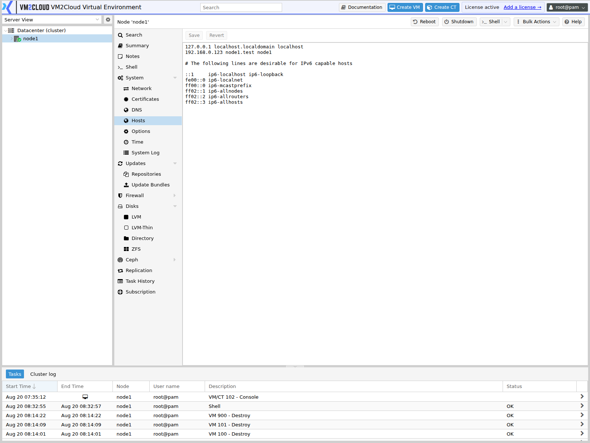

# Hosts

---

## Overview

The **Hosts** page allows administrators to manage the local hostname resolution entries for a VM2Cloud VE node. These entries are stored in the node's hosts file and are used to resolve hostnames before querying a DNS server.

Host entries are commonly used for local communication, cluster nodes, and environments where DNS is unavailable or where specific hostname-to-IP mappings are required.

---

## When to Use

Use the **Hosts** page to:

- View the current hosts configuration.
- Add hostname-to-IP address mappings.
- Modify existing host entries.
- Remove obsolete host entries.
- Troubleshoot hostname resolution issues.

---

## Prerequisites

Before modifying the Hosts configuration, ensure that:

- You are logged in to the VM2Cloud VE web interface.
- You have administrative privileges.
- The selected node is online.
- You know the correct hostname and IP address to configure.

---

# Procedure

## Step 1: Open the Hosts Page

1. Log in to the VM2Cloud VE web interface.
2. Select the node.
3. Expand **System**.
4. Select **Hosts**.

---

### Screenshot 1

**Hosts Panel**



**This panel is a plain-text editor, not a table.** It shows the node's hosts file exactly
as it is on disk, and the only two controls are **Save** and **Revert**. There is no Add,
no Edit, and no Remove — you edit lines directly in the text area.

A default file contains the loopback entry, one entry for this node, and the standard IPv6
block:

```text
127.0.0.1 localhost.localdomain localhost
192.168.0.123 node1.test node1

# The following lines are desirable for IPv6 capable hosts
::1     ip6-localhost ip6-loopback
fe00::0 ip6-localnet
ff00::0 ip6-mcastprefix
ff02::1 ip6-allnodes
ff02::2 ip6-allrouters
ff02::3 ip6-allhosts
```

The second line is the one that matters. It maps this node's own address to its fully
qualified name and its short name, and the node uses it to determine its own address.

---

## Step 2: Edit an Entry

Entries are `<address> <fully-qualified-name> <short-name>`, one per line, whitespace
separated. To add a host, type a new line. To change one, edit it in place. To remove one,
delete the line — or comment it out with `#` if you may want it back.

Give every cluster node a line carrying both its fully qualified name and its short name.
Cluster communication resolves node names locally, so a node missing here is a node the
others may fail to reach even when DNS is healthy.

> **Warning:** Do not remove or break the line for this node's own hostname. The node
> determines its own address from that entry — removing it breaks cluster communication and
> certificate generation. If you are unsure which line that is, run `hostname -i` in the
> [Shell](../Shell.md) before changing anything.

---

## Step 3: Save or Revert

* **Save** writes the file immediately. There is no confirmation dialog and no undo.
* **Revert** discards your edits and reloads the file from disk. It only helps *before* you
  save.

Changes take effect at once — nothing needs restarting.

---

## Step 4: Verify

Confirm the node still resolves its own name, and that any name you added resolves:

```bash
hostname -i
getent hosts node1
```

In a cluster, check that the other members still see this node — `pvecm status` on any
member.

---

# Keeping the Address Correct

The address on the node's own line must match the address the node actually uses. They can
drift apart: change the management address in
[Network](Network/Network-Overview.md) and this file is **not** updated for you.

That mismatch is quiet. The node keeps working locally, and the problem surfaces later as a
cluster member that cannot be reached, a certificate whose subject alternative names no
longer include the real address, or a join that fails on a name conflict.

Check the two agree whenever a node's address changes:

```bash
hostname -i
ip -4 addr show
```

# Verification

Verify the following:

- The edited line appears in the panel after saving.
- `hostname -i` returns the address you expect.
- `getent hosts <name>` resolves each name you added.
- The node's own line still carries both its fully qualified and short name.
- The address on that line matches the node's actual management address.
- In a cluster, `pvecm status` still lists every member.

---

# Common Issues

| Issue | Resolution |
|--------|------------|
| Hostname cannot be resolved | Verify the IP address and hostname are configured correctly. |
| Duplicate hostname | Ensure each hostname is unique within the hosts configuration. |
| Incorrect IP address | Edit the entry and specify the correct IP address. |
| Unable to save changes | Verify that your account has administrative privileges. |

---

# Related Documentation

- System Overview
- DNS
- Network Management
- Cluster Overview

---

# Summary

The **Hosts** page is a plain-text editor for the node's hosts file, with **Save** and
**Revert** as its only controls. There is no per-entry dialog — you edit lines directly.

Local entries are consulted before DNS, which makes this file how cluster nodes find each
other when DNS is unavailable or incomplete. Two things are worth remembering: the line for
the node's own hostname is load-bearing, because the node reads its own address from it; and
that address is **not** updated when you change the management address elsewhere, so the two
can drift apart silently.
