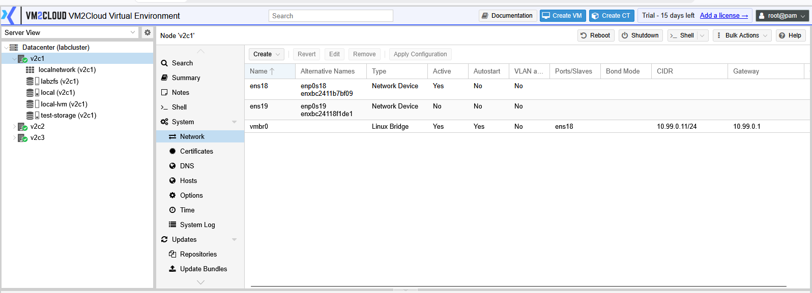
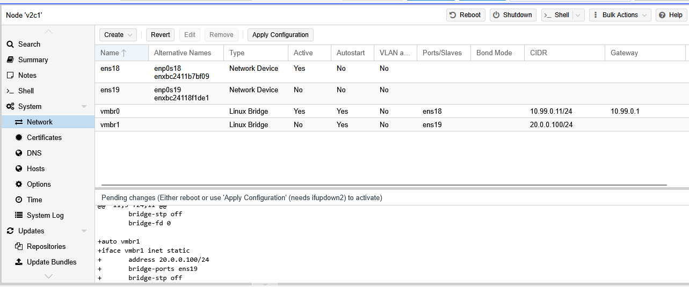
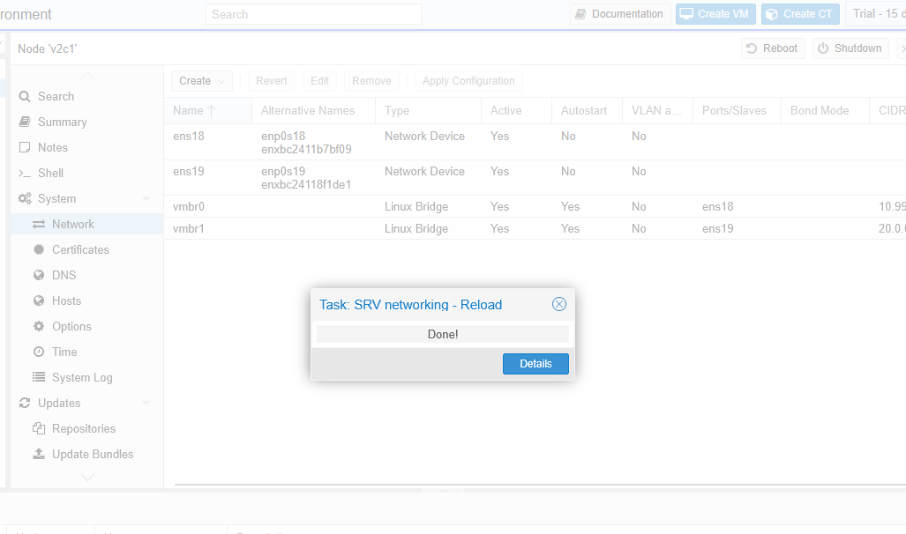
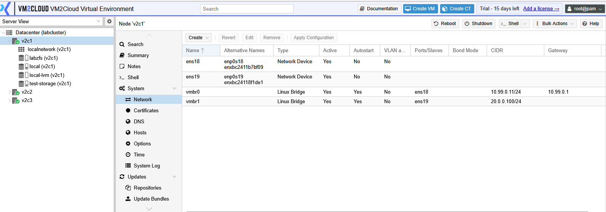
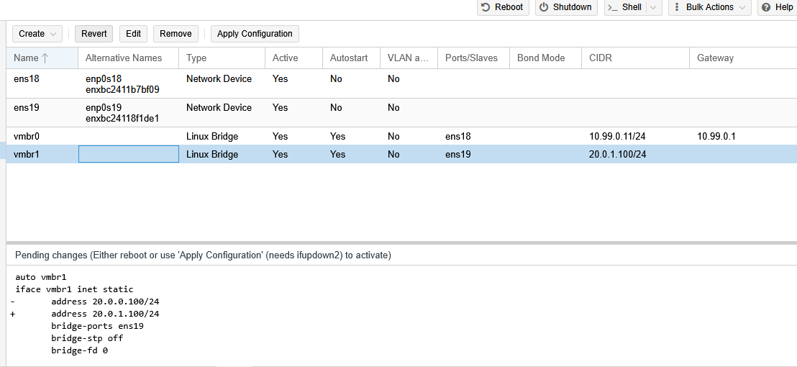
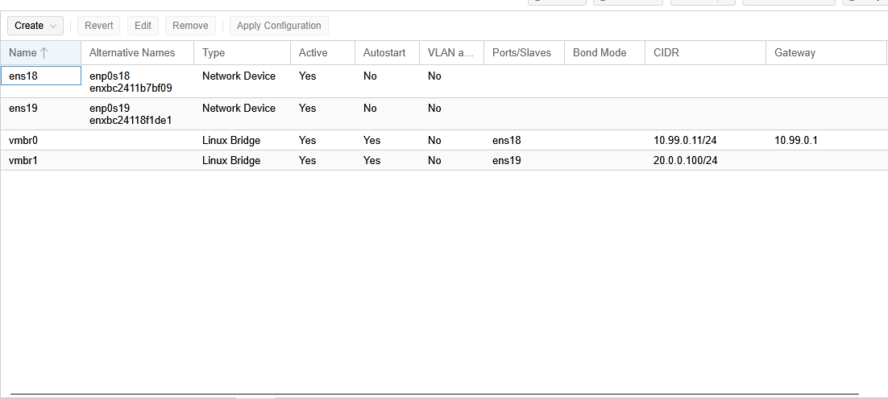

# Apply Network Configuration

---

## Overview

When you create, modify, or remove a network interface in VM2Cloud, the changes are saved as a **pending configuration**. These changes do not take effect immediately.

To activate the new configuration, you must apply the pending network changes. Applying the configuration updates the node's network settings and makes the new configuration active.

> **Important:** Applying network changes may briefly interrupt network connectivity. Perform this operation during a maintenance window whenever possible.

---

## When to Use

Apply the network configuration after:

* Creating a Linux Bridge.
* Creating a Bond.
* Creating a VLAN.
* Editing an existing network interface.
* Removing a network interface.
* Modifying IP addressing, gateway, or DNS settings.

---

## Prerequisites

Before applying the configuration, ensure that:

* The network configuration has been reviewed.
* No configuration errors are present.
* You understand the impact of the changes.
* If working remotely, ensure you have an alternative method to access the server if connectivity is interrupted.

---

# Apply the Configuration

## Step 1: Open the Network Page

1. Log in to the VM2Cloud web interface.
2. Select the required node.
3. Click **System**.
4. Select **Network**.

If there are pending network changes, an **Apply Configuration** button is displayed.

---

---

## Step 2: Review the Pending Changes

Before applying the configuration:

* Review the interfaces that were added, modified, or removed.
* Verify IP addresses.
* Verify Bridge, Bond, and VLAN settings.
* Confirm the gateway and DNS configuration.

---

---

## Step 3: Apply the Configuration

1. Click **Apply Configuration**.
2. Review the confirmation message.
3. Click **Yes** to continue.

VM2Cloud applies the updated network configuration to the selected node.

---

---

## Step 4: Wait for Completion

Wait until the operation completes successfully.

Depending on the configuration changes, network connectivity may be interrupted for a few seconds.

---

---

# Verify the Configuration

After the configuration has been applied:

* Verify that all interfaces are displayed correctly.
* Confirm that the interface status is **Active**.
* Verify that the node is still reachable.
* Test network connectivity if required.

---

---

# Revert Pending Changes

If you decide not to apply the pending configuration, you can discard the unsaved network changes before they are applied.

> **Note:** Once the configuration has been applied successfully, it cannot be reverted from the web interface. Any further changes must be made by editing the network configuration again.

---

---

# Verification

Verify the following:

* The pending configuration has been cleared.
* The updated network interfaces are visible.
* The node remains accessible through the management interface.
* Network communication is functioning normally.
* Virtual machines and containers can communicate through the updated network.

---

# Common Issues

| Issue                                               | Resolution                                                                                                                     |
| --------------------------------------------------- | ------------------------------------------------------------------------------------------------------------------------------ |
| Apply Configuration button is disabled              | No pending network changes are available to apply.                                                                             |
| Network connectivity is lost after applying changes | Verify the IP address, gateway, bridge, bond, or VLAN configuration. Access the server through the local console if necessary. |
| Configuration fails to apply                        | Review the network configuration for invalid settings and correct any errors before trying again.                              |
| Node becomes unreachable                            | Verify the management interface configuration and restore the previous network configuration using console access if required. |
| Pending changes remain after applying               | Refresh the Network page and verify that the operation completed successfully.                                                 |

---

# Summary

Network configuration changes in VM2Cloud are applied only after selecting **Apply Configuration**. Reviewing the configuration before applying it helps prevent connectivity issues and ensures that the updated network settings are activated successfully. After applying the changes, always verify that the node and connected workloads remain accessible.
