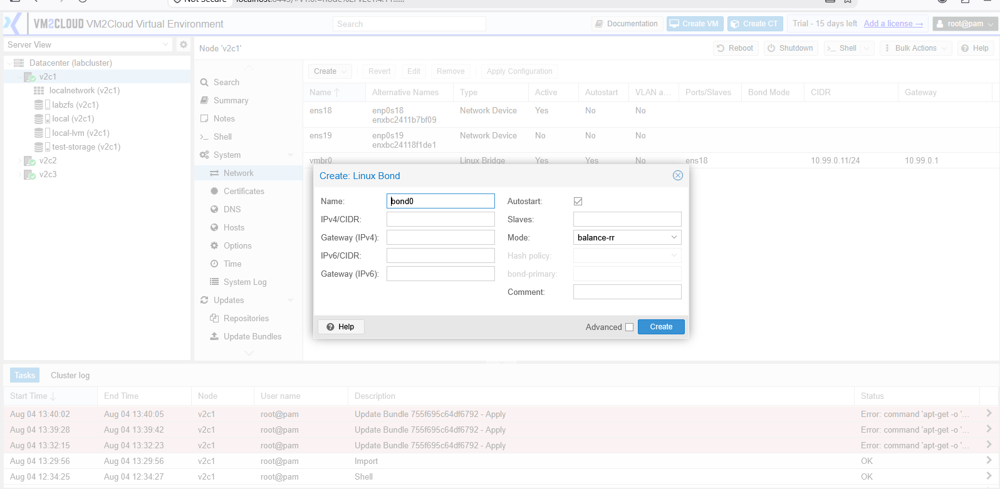
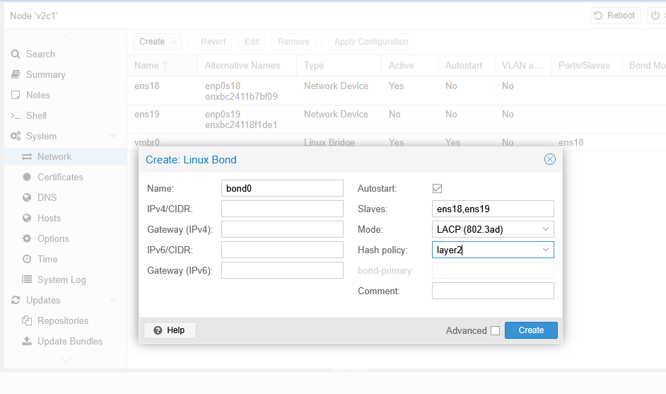
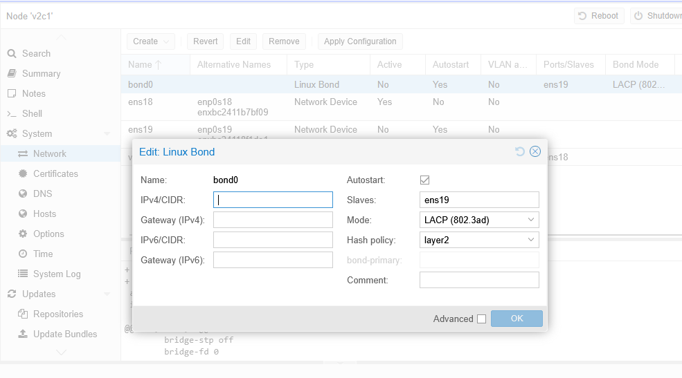
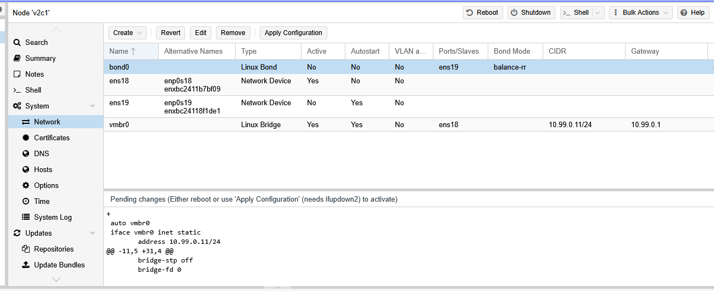
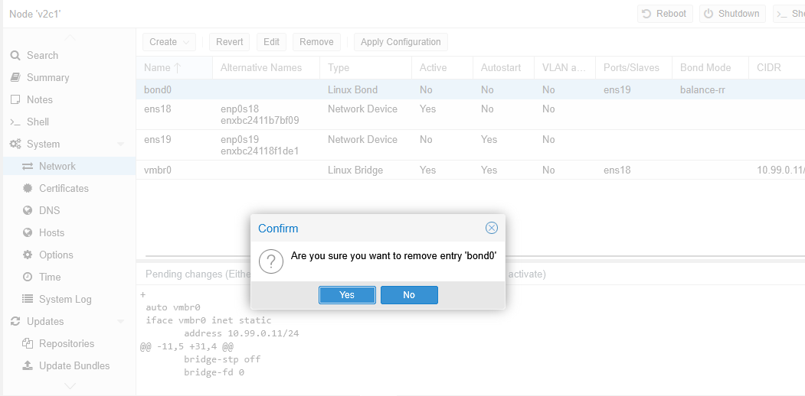

# Manage Bond

---

## Overview

A Bond combines two or more physical network interfaces into a single logical interface. Bonding is commonly used to improve network availability and, depending on the selected bonding mode, can also increase bandwidth.

If one network interface fails, traffic can continue through another interface in the bond, helping maintain network connectivity.

---

## When to Use

Create a Bond when you need to:

* Provide network redundancy.
* Increase network availability.
* Combine multiple physical interfaces.
* Prepare the network for production environments.
* Use a Bond as the parent interface for a Linux Bridge or VLAN.

---

## Prerequisites

Before creating a Bond, ensure that:

* You have administrator privileges.
* At least two physical network interfaces are available.
* The connected switch is configured correctly for the selected bonding mode (if required).
* You understand the impact of changing network settings.

> **Important:** Incorrect bond configuration may temporarily disconnect the node from the network.

---

# Bond Modes

VM2Cloud supports multiple bonding modes. The most commonly used modes are:

| Bond Mode      | Description                                                                                                          |
| -------------- | -------------------------------------------------------------------------------------------------------------------- |
| Active-Backup  | Provides redundancy. One interface is active while the other remains on standby.                                     |
| Balance-RR     | Distributes traffic across all interfaces using round-robin scheduling.                                              |
| 802.3ad (LACP) | Uses Link Aggregation Control Protocol (LACP) for redundancy and increased bandwidth. Requires switch configuration. |
| Balance-XOR    | Distributes traffic based on source and destination MAC addresses.                                                   |
| Broadcast      | Sends all traffic through every interface.                                                                           |

> **Note:** Choose the bonding mode based on your network design and switch capabilities.

---

# Create a Bond

## Step 1: Open the Network Page

1. Log in to the VM2Cloud web interface.
2. Select the required node.
3. Click **System**.
4. Select **Network**.

---

---

## Step 2: Create the Bond

1. Click **Create**.
2. Select **Linux Bond**.

---

---

## Step 3: Configure the Bond

Provide the required configuration.

Typical settings include:

* Bond Name (Example: `bond0`)
* Bond Mode
* Slave Interfaces (Example: `eno1`, `eno2`)
* MTU (Optional)
* Comments (Optional)

Review the configuration before creating the bond.

---

---

## Step 4: Save the Configuration

1. Click **Create**.
2. The new Bond appears in the Network list.

---

---

# Edit a Bond

## Step 1: Select the Bond

1. Open **Node → System → Network**.
2. Select the Bond interface.
3. Click **Edit**.

---

---

## Step 2: Modify the Configuration

Update the required settings.

Depending on your environment, you can modify:

* Bond Mode
* Slave Interfaces
* MTU
* Comments

After making the required changes, click **OK**.

---

---

# Remove a Bond

## Step 1: Verify the Bond

Before removing the bond, ensure that:

* No Linux Bridge is using the bond.
* No VLAN is configured on the bond.
* The bond is no longer required.

---

---

## Step 2: Remove the Bond

1. Select the Bond interface.
2. Click **Remove**.
3. Confirm the removal.

---

---

# Apply the Network Configuration

Creating, editing, or removing a Bond updates the pending network configuration.

To apply the changes:

1. Click **Apply Configuration**.
2. Review the confirmation message.
3. Confirm the operation.

> **Note:** Applying network changes may briefly interrupt network connectivity.

---

---

# Verification

Verify the following:

* The Bond interface appears in the Network list.
* The configured member interfaces are displayed correctly.
* The selected bonding mode is correct.
* The Bond status is active.
* Network connectivity is functioning normally.

---

# Common Issues

| Issue                             | Resolution                                                                                                    |
| --------------------------------- | ------------------------------------------------------------------------------------------------------------- |
| Bond is not created               | Verify that all selected physical interfaces are available and not already assigned to another configuration. |
| Bond remains down                 | Check the physical network connections and verify the selected interfaces are active.                         |
| LACP Bond does not work           | Confirm that LACP (802.3ad) is configured on both the VM2Cloud node and the connected network switch.         |
| Unable to remove the Bond         | Ensure that no Linux Bridge or VLAN is using the Bond interface.                                              |
| Configuration changes are pending | Click **Apply Configuration** to activate the updated network settings.                                       |

---

# Summary

Bonding combines multiple physical network interfaces into a single logical interface to improve network availability and, depending on the selected mode, increase bandwidth. After creating or modifying a Bond, apply the network configuration to make the changes active.
