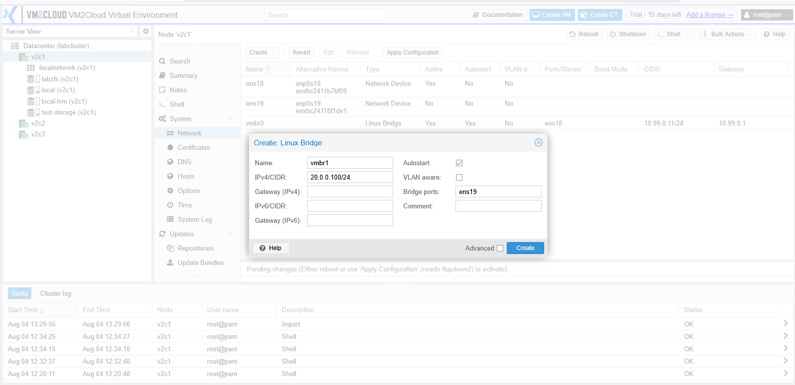
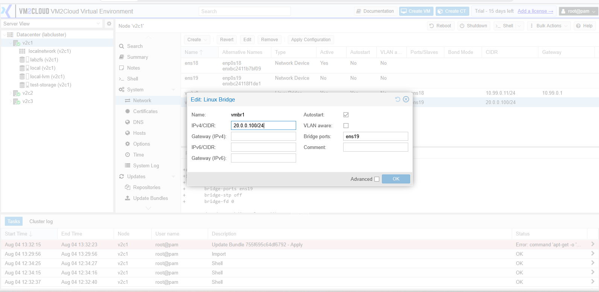
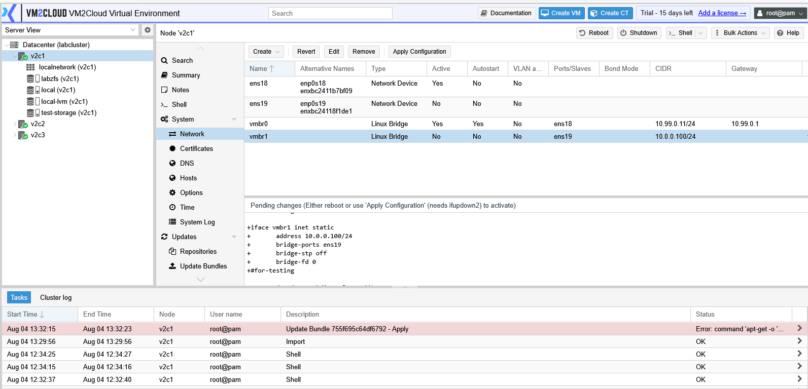
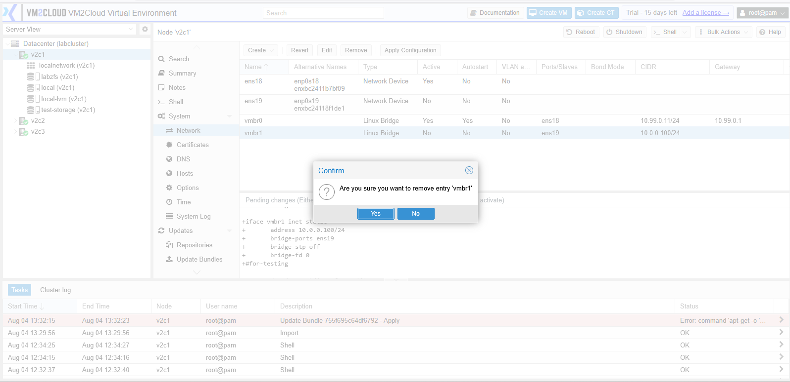

# Manage Linux Bridge

---

## Overview

A Linux Bridge is a virtual network switch that connects virtual machines and containers to the physical network. It forwards network traffic between virtual interfaces and the connected physical network interface.

A Linux Bridge is commonly used to provide network connectivity for virtual machines and is one of the most frequently configured network components in VM2Cloud VE.

---

## When to Use

Use a Linux Bridge when you need to:

* Connect virtual machines to the physical network.
* Connect containers to the network.
* Create an isolated virtual network.
* Replace or modify an existing bridge configuration.

---

## Prerequisites

Before creating a Linux Bridge, ensure that:

* You have administrator privileges.
* The required physical network interface is available.
* The IP addressing information is ready.
* You understand the impact of modifying network settings.

> **Important:** Incorrect bridge configuration may temporarily disconnect the node from the network.

---

# Create a Linux Bridge

## Step 1: Open the Network Page

1. Log in to the VM2Cloud VE web interface.
2. Select the required node.
3. Click **System**.
4. Select **Network**.

---

---

## Step 2: Create the Bridge

1. Click **Create**.
2. Select **Linux Bridge**.

---

---

## Step 3: Configure the Bridge

Configure the required settings.

Typical configuration includes:

* **Bridge Name** (Example: `vmbr1`)
* **IPv4/CIDR**
* **IPv6/CIDR** (Optional)
* **Bridge Ports** (Example: `eno1`)
* **Gateway** (Optional)
* **Autostart**
* **Comments** (Optional)

Review the configuration before saving.

---

---

## Step 4: Save the Configuration

1. Click **Create**.
2. The bridge is added to the Network configuration.

---

---

# Edit a Linux Bridge

## Step 1: Select the Bridge

1. Open **Node → System → Network**.
2. Select the Linux Bridge.
3. Click **Edit**.

---

---

## Step 2: Modify the Configuration

Update the required settings.

Depending on your environment, you can modify:

* IP Address
* Bridge Ports
* Gateway
* Autostart
* Comments

After making the required changes, click **OK**.

---

---

# Remove a Linux Bridge

## Step 1: Verify the Bridge

Before removing the bridge, ensure that:

* No virtual machines are connected to it.
* No containers are using it.
* The bridge is no longer required.

---

---

## Step 2: Remove the Bridge

> **Warning:** Removing a bridge disconnects every guest attached to it, and removing
> the management bridge makes the node unreachable — recovery then needs console
> access. Check which guests use the bridge before removing it.

1. Select the Linux Bridge.
2. Click **Remove**.
3. Confirm the removal.

---

---

# Apply the Network Configuration

Creating, editing, or removing a Linux Bridge updates the pending network configuration.

To make the changes active:

1. Click **Apply Configuration**.
2. Review the confirmation message.
3. Confirm the operation.

> **Note:** Applying network changes may briefly interrupt network connectivity.

---

---

# Verification

Verify the following:

* The Linux Bridge appears in the Network list.
* The bridge status is active.
* The correct physical interface is attached.
* Virtual machines can be connected to the bridge.
* Network connectivity is functioning as expected.

---

# Common Issues

| Issue                               | Resolution                                                                   |
| ----------------------------------- | ---------------------------------------------------------------------------- |
| Bridge is not created               | Verify that the bridge name is unique and all required fields are completed. |
| No network connectivity             | Confirm that the correct physical interface is assigned to the bridge.       |
| Virtual machines cannot communicate | Verify that the virtual machine is connected to the correct Linux Bridge.    |
| Configuration changes are pending   | Apply the network configuration to activate the changes.                     |
| Bridge removal fails                | Ensure that no virtual machines or containers are using the bridge.          |

---

# Summary

Linux Bridges provide network connectivity between virtual machines, containers, and the physical network. Administrators can create, modify, and remove bridges from the Network page to meet the networking requirements of their VM2Cloud VE environment. After making any changes, apply the network configuration to activate the updated settings.
