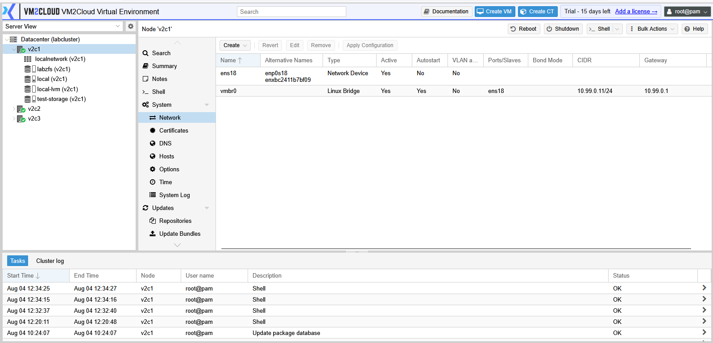
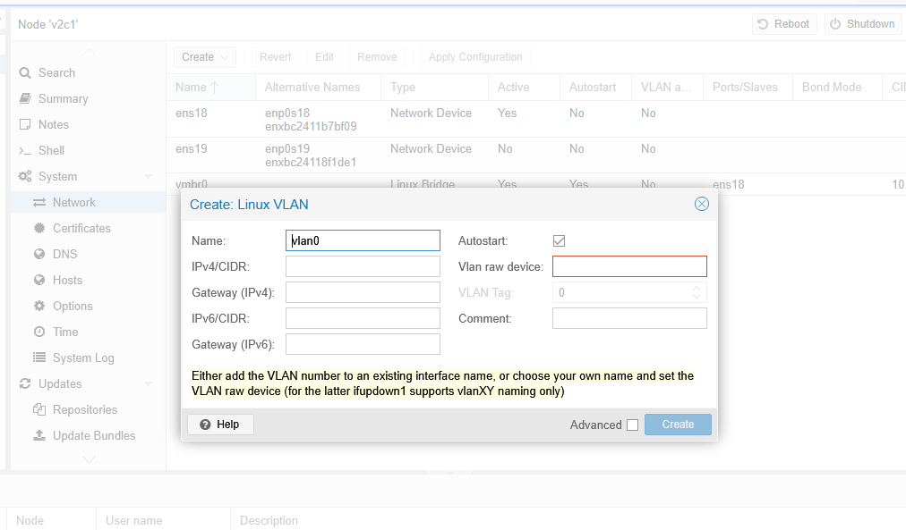
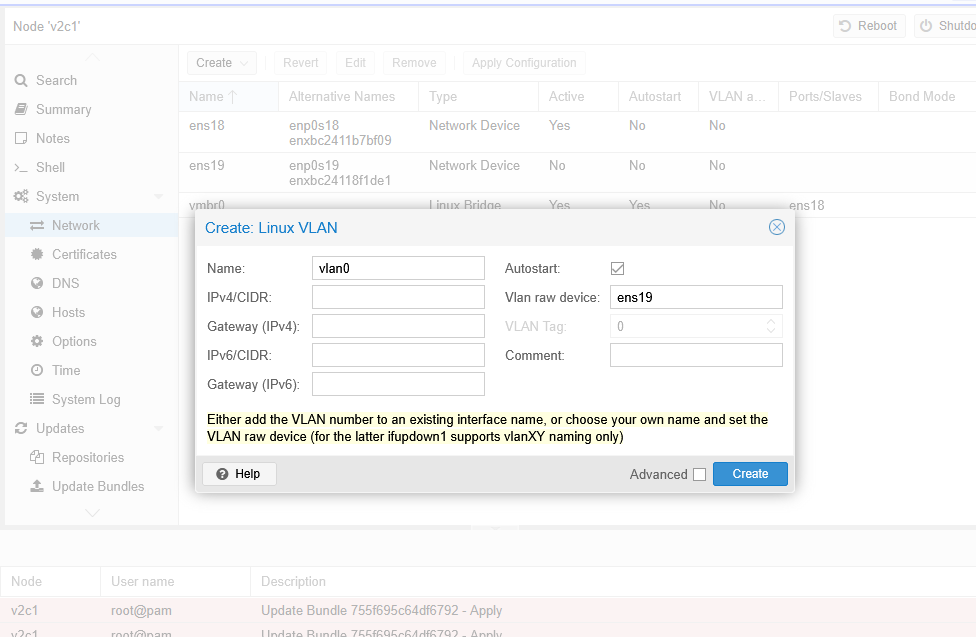
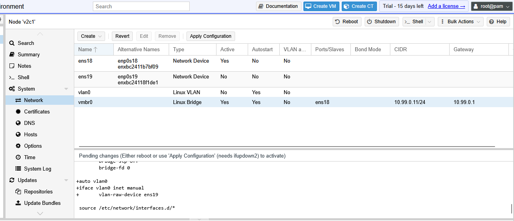
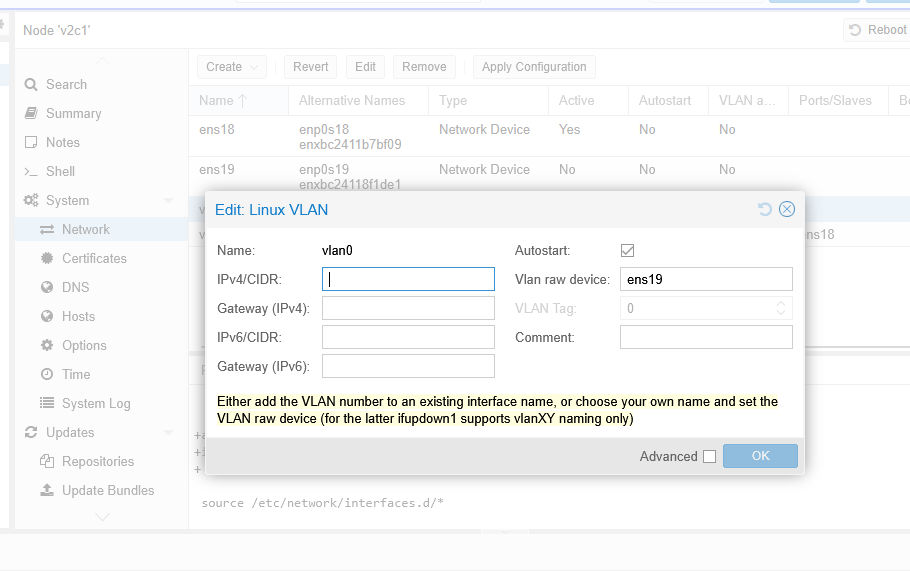
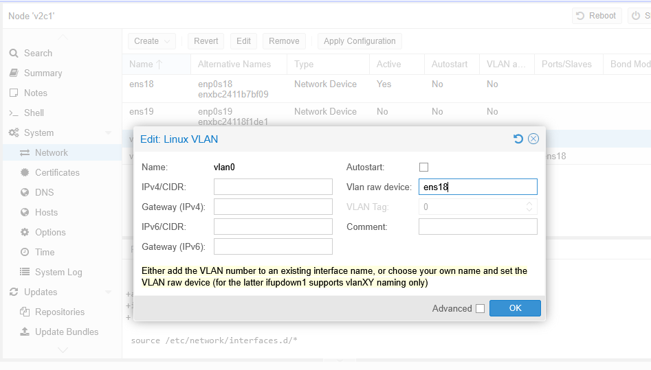
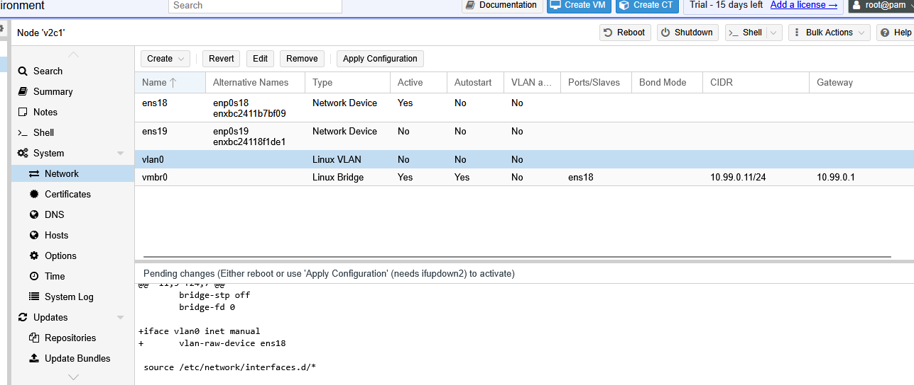
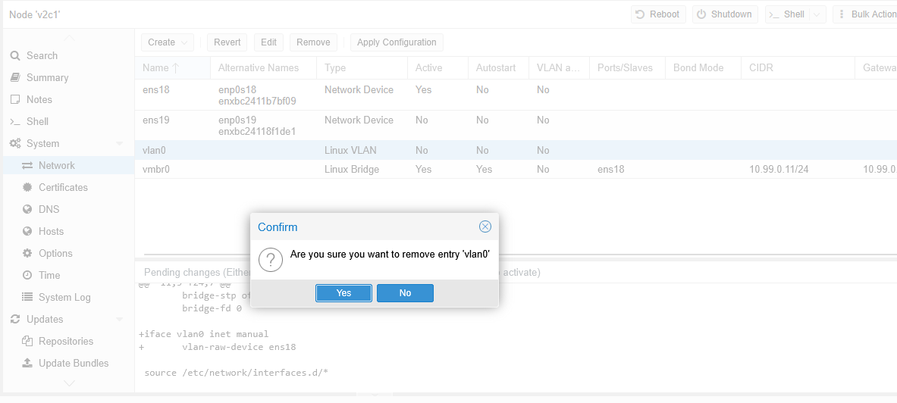
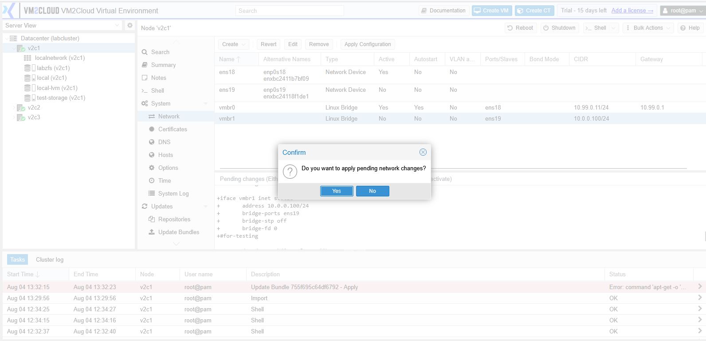

# Manage VLAN

---

## Overview

A VLAN (Virtual Local Area Network) allows multiple logical networks to operate over the same physical network infrastructure. It separates network traffic using VLAN IDs, improving security, organization, and network management.

In VM2Cloud, a VLAN is created on top of a physical interface or a Bond interface and can be connected to a Linux Bridge for use by virtual machines and containers.

---

## When to Use

Create a VLAN when you need to:

* Separate network traffic between departments or workloads.
* Isolate management, storage, and virtual machine networks.
* Connect virtual machines to a specific VLAN.
* Extend multiple logical networks over a single physical connection.

---

## Prerequisites

Before creating a VLAN, ensure that:

* You have administrator privileges.
* The parent interface (Physical NIC or Bond) already exists.
* The required VLAN ID is available.
* The connected network switch is configured to allow the VLAN.

> **Important:** If the VLAN is not configured on the connected switch, network communication through the VLAN will not function.

---

# Create a VLAN

## Step 1: Open the Network Page

1. Log in to the VM2Cloud web interface.
2. Select the required node.
3. Click **System**.
4. Select **Network**.

---

---

## Step 2: Create the VLAN

1. Click **Create**.
2. Select **Linux VLAN**.

---

---

## Step 3: Configure the VLAN

Enter the required configuration.

Typical settings include:

* Parent Interface (Example: `bond0` or `eno1`)
* VLAN ID (Example: `100`)
* VLAN Interface Name (Generated automatically)
* Comments (Optional)

Review the configuration before saving.

---

---

## Step 4: Save the Configuration

1. Click **Create**.
2. The VLAN interface is added to the Network list.

---

---

# Edit a VLAN

## Step 1: Select the VLAN

1. Open **Node → System → Network**.
2. Select the VLAN interface.
3. Click **Edit**.

---

---

## Step 2: Modify the Configuration

Update the required settings.

Depending on your environment, you can modify:

* Comments
* MTU
* VLAN configuration (where supported)

Click **OK** to save the changes.

> **Note:** Some VLAN properties, such as the parent interface and VLAN ID, may require recreating the VLAN if changes are needed.

---

---

# Remove a VLAN

## Step 1: Verify the VLAN

Before removing the VLAN, ensure that:

* No Linux Bridge is using the VLAN.
* No virtual machines or containers depend on the VLAN.
* The VLAN is no longer required.

---

---

## Step 2: Remove the VLAN

1. Select the VLAN interface.
2. Click **Remove**.
3. Confirm the removal.

---

---

# Apply the Network Configuration

Creating, editing, or removing a VLAN updates the pending network configuration.

To apply the changes:

1. Click **Apply Configuration**.
2. Review the confirmation message.
3. Confirm the operation.

> **Note:** Applying network configuration may briefly interrupt network connectivity.

---

---

# Verification

Verify the following:

* The VLAN interface appears in the Network list.
* The correct parent interface is assigned.
* The VLAN ID is displayed correctly.
* The network configuration has been applied successfully.
* Devices connected to the VLAN can communicate as expected.

---

# Common Issues

| Issue                                   | Resolution                                                                               |
| --------------------------------------- | ---------------------------------------------------------------------------------------- |
| VLAN is not created                     | Verify that the parent interface exists and the VLAN ID is valid.                        |
| VLAN has no connectivity                | Confirm that the same VLAN ID is configured and allowed on the connected switch.         |
| Virtual machines cannot access the VLAN | Verify that the virtual machine is connected to a Linux Bridge associated with the VLAN. |
| Unable to remove the VLAN               | Ensure that no Linux Bridge or virtual machine is currently using the VLAN.              |
| Configuration changes are pending       | Click **Apply Configuration** to activate the updated network settings.                  |

---

# Summary

VLANs allow administrators to separate network traffic into multiple logical networks while using the same physical infrastructure. By configuring VLAN interfaces and applying the network configuration, VM2Cloud can securely connect virtual machines and containers to different network segments.
