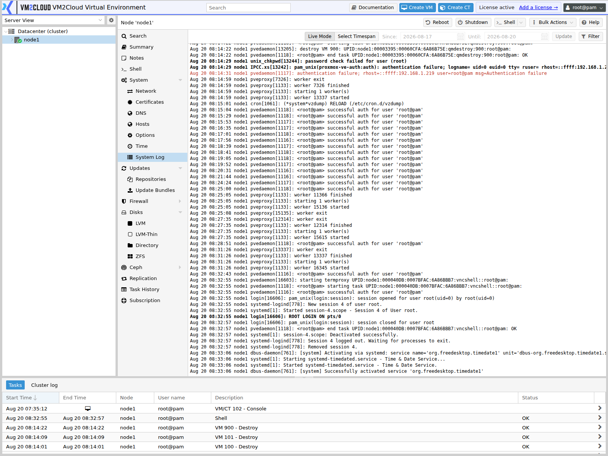

# Syslog

---

## Overview

The **Syslog** page displays system log messages generated by the VM2Cloud VE node. These logs provide valuable information about operating system events, services, hardware, networking, and other system activities.

Administrators can use the Syslog page to monitor node activity, investigate failures, and troubleshoot system-related issues without accessing the command line.

---

## When to Use

Use the **Syslog** page to:

- Monitor system events.
- Review service messages.
- Investigate hardware or software issues.
- Troubleshoot failed operations.
- Verify that system services are functioning correctly.
- Review recent operating system activity.

---

## Prerequisites

Before viewing the system logs, ensure that:

- You are logged in to the VM2Cloud VE web interface.
- You have permission to access the selected node.
- The selected node is online.

---

# View System Logs

## Step 1: Open the Syslog Page

1. Log in to the VM2Cloud VE web interface.
2. Select the required node.
3. Expand **System**.
4. Select **Syslog**.

---

### Screenshot 1

**Syslog Page**



The panel is labelled **System Log** in the node menu. It streams the node's journal, newest
entries appended as they arrive.

Each line carries its timestamp, the host, the service or process that emitted it, and the
message.
---

## Step 2: Review Log Entries

The Syslog page displays recent operating system log messages.

Typical information includes:

- Date and Time
- Service or Process
- Severity
- Log Message

Review the log entries to identify warnings, errors, or other system events.

---

## Refresh the Log View

As new events occur, additional log entries are generated.

Refresh the page to view the latest log messages.

---

### Screenshot 2

**Refreshed View**

```text
[ Place Screenshot Here ]
```

> **Capture:** The panel after new entries have arrived, ideally including a warning or
> error line.

---

## Typical Log Entries

The Syslog page may contain messages related to:

- System startup and shutdown
- User authentication
- Network events
- Storage devices
- VM2Cloud VE services
- Software updates
- Hardware events
- Kernel messages

---

## When to Review Syslog

Review the system logs when:

- A virtual machine fails to start.
- A service stops unexpectedly.
- Network communication fails.
- Storage devices report errors.
- The node behaves unexpectedly.
- Troubleshooting system problems.

---

## Best Practices

- Review system logs regularly.
- Investigate warning and error messages promptly.
- Verify timestamps when troubleshooting issues.
- Correlate log entries with recent configuration changes.
- Retain logs according to your organization's policies.

---

# Verification

Verify the following:

- The Syslog page opens successfully.
- Recent log entries are displayed.
- Log timestamps are accurate.
- New events appear after refreshing the page.

---

# Common Issues

| Issue | Resolution |
|--------|------------|
| No log entries are displayed | Verify that the node is online and the logging service is running. |
| Log messages are outdated | Refresh the page to load the latest entries. |
| Unable to access Syslog | Confirm that your account has permission to view system logs. |
| Incorrect timestamps | Verify the node's system time and Network Time (NTP) configuration. |

---

# Related Documentation

- System Overview
- Time
- Network Time (NTP)
- Services
- Node Troubleshooting

---

# Summary

The **Syslog** page provides access to operating system log messages generated by the selected VM2Cloud VE node. Regularly reviewing these logs helps administrators monitor system health, identify issues, and troubleshoot problems affecting services, networking, storage, and other components.
