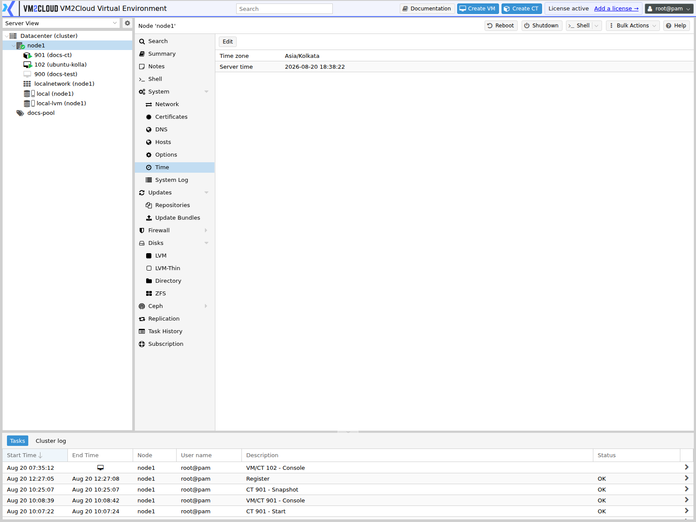
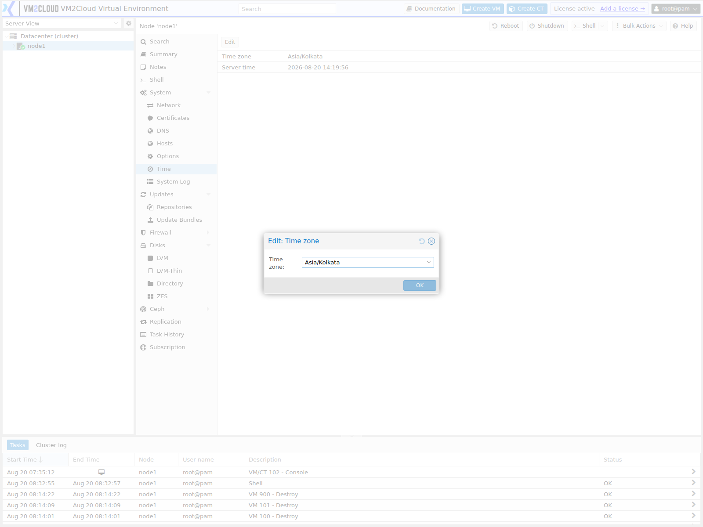

# Time and Network Time (NTP)

---

## Overview

The **Time** page displays the current system date, time, and time zone configured on the selected VM2Cloud VE node, and allows administrators to configure Network Time Protocol (NTP) synchronization.

NTP keeps the system clock synchronized with trusted time servers, ensuring accurate timestamps across all nodes. Accurate system time is essential for cluster communication, authentication, logging, backups, scheduled tasks, and High Availability (HA).

---

## When to Use

Use the **Time** page to:

- Verify the system date and time.
- View the configured time zone.
- Configure the node's time zone.
- Verify that the node is synchronizing its system time.
- Configure NTP servers.
- Review the synchronization status.
- Maintain consistent time across cluster nodes.
- Troubleshoot time-related and synchronization issues.

---

## Prerequisites

Before modifying the time settings, ensure that:

- You are logged in to the VM2Cloud VE web interface.
- You have administrative privileges.
- The selected node is online.
- The configured NTP servers are reachable.

---

# View the System Time

## Step 1: Open the Time Page

1. Log in to the VM2Cloud VE web interface.
2. Select the required node.
3. Expand **System**.
4. Select **Time**.

---

### Screenshot 1

**Time Page**



The panel shows the node's **Time zone**, its current **Local time**, and the **UTC time**,
with a single **Edit** control.

Local time and UTC are shown together deliberately — a node whose clock is wrong is easier
to spot against UTC than against a time zone you have to convert in your head.
---

## Step 2: Review the Time Information

The **Time** page displays information such as:

- Current Date
- Current Time
- Configured Time Zone

Review the displayed information to verify that the node is using the correct system time.

---

# Change the Time Zone

## Step 1: Open the Time Zone Configuration

1. On the **Time** page, click **Time Zone**.

---

### Screenshot 2

**Time Zone Control**



**Edit** is the only control on this panel, and it changes the time zone.

A single searchable **Time zone** selector. The clock itself is not set here — that is
handled by time synchronisation, which is configured outside this panel.
---

## Step 2: Select the Time Zone

1. Choose the appropriate time zone.
2. Click **OK**.

The selected time zone is applied to the node.

---

# View NTP Configuration

## Step 1: Open the Network Time Configuration

1. On the **Time** page, review the Network Time section.

The page displays the current Network Time configuration.

Typical information includes:

- NTP Service Status
- Configured NTP Servers
- Synchronization Status
- Current Time Source
- Last Synchronization Time (if available)

---

## Step 2: Review the Configuration

Review the displayed information to ensure the node is synchronizing correctly.

---

# Configure NTP Servers

## Step 1: Open the Configuration

1. On the **Time** page, click **Edit** in the Network Time section.

---

## Step 3: Verify Time Synchronization

After saving the configuration:

- Verify that the NTP service is running.
- Confirm that the node synchronizes with an NTP server.
- Ensure the displayed system time is correct.

---

## Why Accurate Time Is Important

Maintaining the correct system time and synchronization helps ensure:

- Accurate log timestamps.
- Reliable cluster communication.
- Correct Corosync operation.
- Stable High Availability (HA) operations.
- Successful authentication.
- Reliable SSL certificate validation.
- Consistent backup schedules.
- Proper execution of scheduled tasks.

---

## Best Practices

- Configure all cluster nodes to use the correct time zone.
- Configure all cluster nodes to use the same NTP source whenever possible.
- Use reliable and reachable NTP servers.
- Verify the system time after changing the time zone or NTP configuration.
- Monitor the synchronization status regularly.
- Ensure firewall rules allow communication with the configured NTP servers.
- Regularly confirm that the node time remains synchronized with other cluster members.

---

# Verification

Verify the following:

- The displayed date and time are correct.
- The configured time zone matches your deployment location.
- The NTP service is running.
- The node is synchronized with a time server.
- Time changes are reflected correctly.
- All cluster nodes report consistent system time.

---

# Common Issues

| Issue | Resolution |
|--------|------------|
| Incorrect system time | Verify the configured time zone and NTP settings. |
| Incorrect time zone | Select the appropriate time zone and apply the changes. |
| NTP service is not running | Verify that the Network Time service is enabled and operational. |
| Node is not synchronized | Confirm that the configured NTP servers are reachable and correctly configured. |
| Time differs between cluster nodes | Configure all nodes to use the same NTP source and verify synchronization. |
| Scheduled tasks execute at the wrong time | Confirm the configured time zone and system time. |

---

# Related Documentation

- [System Overview](System-Overview.md)
- [Syslog](Syslog.md)
- [Cluster Overview](../../02-Datacenter/Cluster/Cluster-Overview.md)
- [Node Troubleshooting](../Node-Troubleshooting.md)

---

# Summary

The **Time** page allows administrators to review and configure the system date, time, time zone, and NTP synchronization for a VM2Cloud VE node. Maintaining accurate, synchronized time across all nodes improves cluster stability, ensures accurate logging, and supports reliable operation of authentication, scheduling, backup, and High Availability services.

---

# Time Synchronisation

**The interface does not configure time synchronisation.** The Time panel sets the time
zone and reports the server time — nothing more. Synchronisation is handled by the system
time daemon and is configured from the shell.

Check what the node is doing:

```bash
timedatectl status
```

`System clock synchronized: yes` and `NTP service: active` are what a healthy node reports.
To change the servers, edit the time daemon's configuration and restart it:

```bash
systemctl restart systemd-timesyncd
timedatectl timesync-status
```

This matters more than its brief mention suggests. Cluster communication and certificate
validation both depend on agreeing clocks, and a skewed clock surfaces as a join failure
or a certificate error rather than as an obvious time problem.
