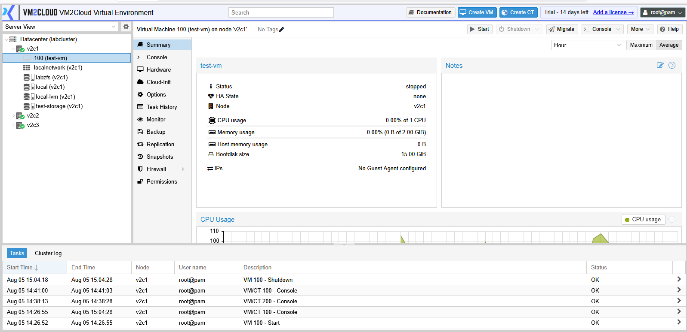
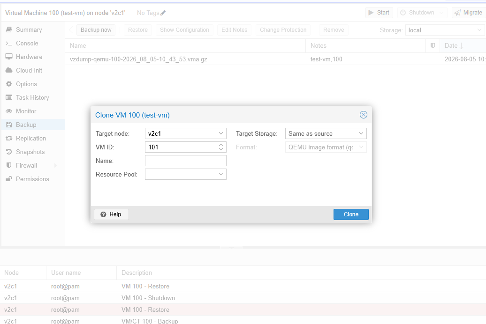
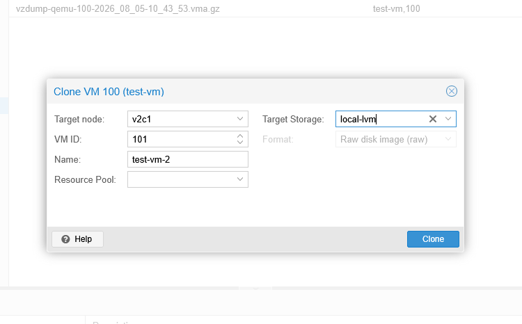
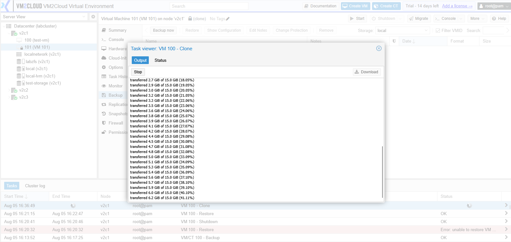
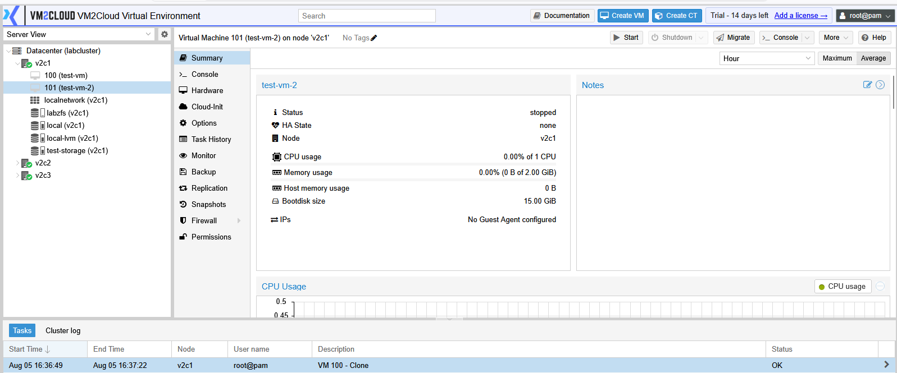

# Clone Virtual Machine

---

## Overview

Cloning creates a copy of an existing virtual machine. The cloned virtual machine includes the same hardware configuration, operating system, and disk contents as the source virtual machine.

Cloning is useful when deploying multiple virtual machines with similar configurations, reducing the time required to build each machine manually.

---

## When to Use

Clone a virtual machine when you need to:

* Deploy multiple virtual machines with the same configuration.
* Create a test environment from an existing virtual machine.
* Duplicate a configured server.
* Create development or staging environments.

---

## Prerequisites

Before cloning a virtual machine, ensure that:

* The source virtual machine exists.
* Sufficient storage space is available.
* You have permission to create virtual machines.
* The virtual machine is in a suitable state for cloning.

> **Note:** Depending on the storage type and configuration, VM2Cloud may support **Full Clone** and **Linked Clone** options.

---

# Clone a Virtual Machine

## Step 1: Select the Virtual Machine

1. Log in to the VM2Cloud web interface.
2. Select the required node.
3. Select the virtual machine that you want to clone.

---

---

## Step 2: Open the Clone Wizard

1. Click **More**.
2. Select **Clone**.

The Clone Virtual Machine window opens.

---

---

## Step 3: Configure the Clone

Provide the required information.

Typical options include:

* Target Node
* VM ID
* Name
* Target Storage
* Clone Mode (Full Clone or Linked Clone)

Review the configuration before continuing.

---

---

## Step 4: Create the Clone

1. Click **Clone**.
2. Wait for the cloning task to complete.

The duration depends on the size of the virtual machine and the selected clone type.

---

---

# Clone Types

## Full Clone

A Full Clone creates a completely independent copy of the virtual machine.

Use a Full Clone when:

* The cloned virtual machine will be used in production.
* Complete independence from the source virtual machine is required.

---

## Linked Clone

A Linked Clone shares the base disk of the source virtual machine.

Use a Linked Clone when:

* Storage usage needs to be minimized.
* The cloned virtual machine is intended for testing or temporary use.

> **Note:** Linked Clones are available only when supported by the storage configuration.

---

# Verification

Verify the following after the cloning process completes:

* The cloned virtual machine appears under the selected node.
* The VM name and VM ID are correct.
* The cloning task completed successfully.
* The cloned virtual machine can be started successfully.

---

---

# Common Issues

| Issue                              | Resolution                                                                                             |
| ---------------------------------- | ------------------------------------------------------------------------------------------------------ |
| Clone option is unavailable        | Verify that the selected virtual machine supports cloning and that you have sufficient permissions.    |
| Cloning fails                      | Check that enough storage space is available on the target storage.                                    |
| VM ID already exists               | Specify a unique VM ID before creating the clone.                                                      |
| Linked Clone option is unavailable | Verify that the selected storage supports linked clones.                                               |
| Clone task fails                   | Review the Recent Tasks for detailed error information and resolve the reported issue before retrying. |

---

# Summary

Cloning allows administrators to quickly create new virtual machines from an existing one without repeating the entire deployment process. Depending on the storage configuration, VM2Cloud supports Full Clones for independent virtual machines and Linked Clones for efficient use of storage space.
