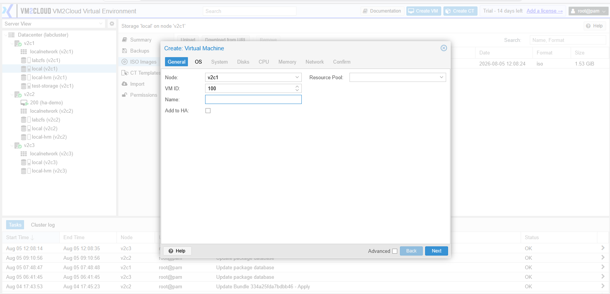
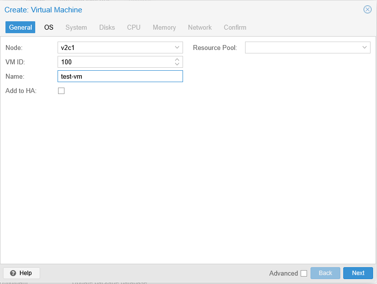
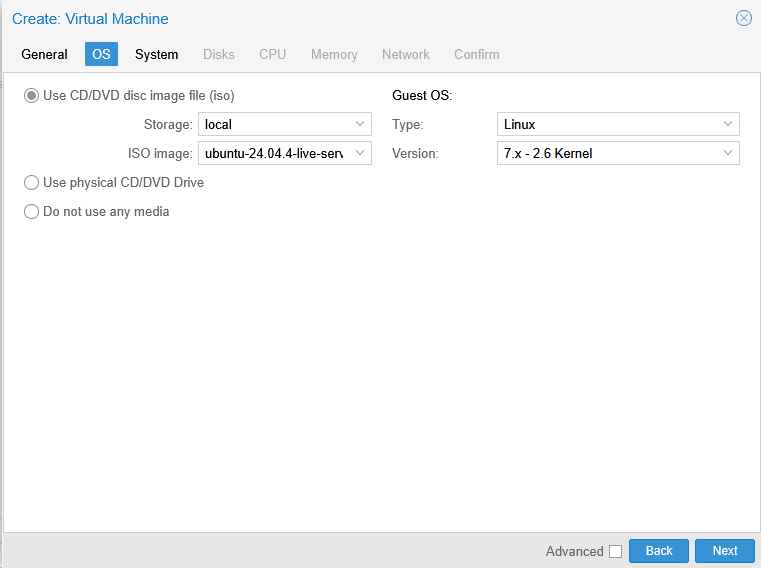
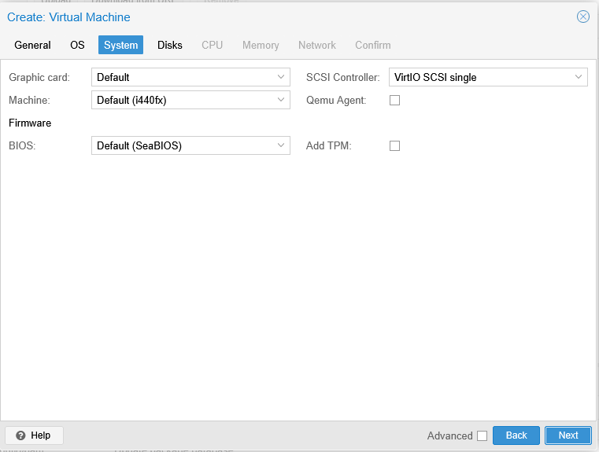
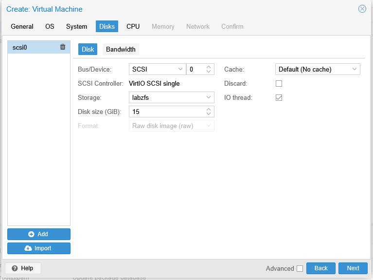
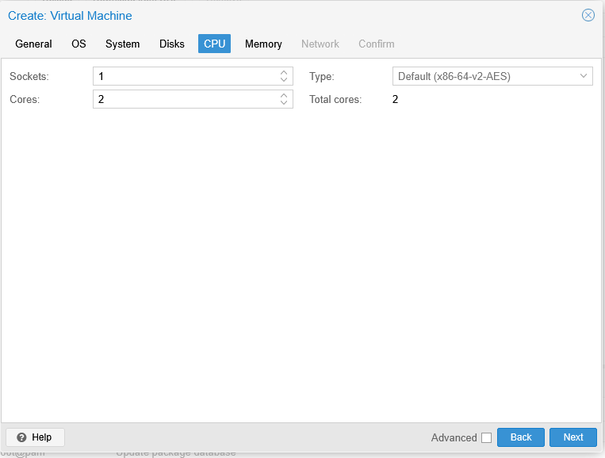
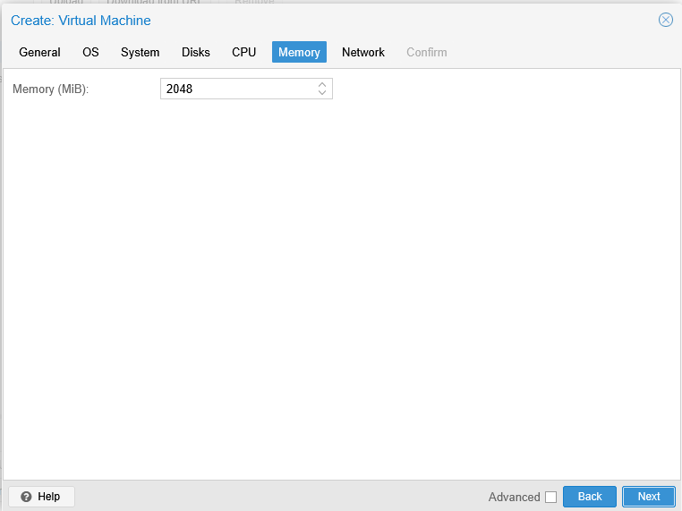
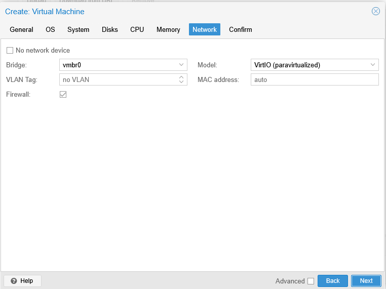
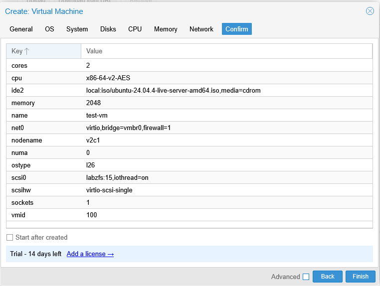

# Create Virtual Machine

---

## Overview

A Virtual Machine (VM) is a software-based computer that runs its own operating system using the resources of a VM2Cloud VE node. Before a virtual machine can be used, it must be created by defining its hardware configuration and installation source.

The **Create Virtual Machine** wizard guides you through the configuration process, including the virtual machine name, operating system, storage, CPU, memory, and network settings.

---

## When to Use

Create a virtual machine when you need to:

* Deploy a new Linux or Windows server.
* Install an operating system from an ISO image.
* Create a test or development environment.
* Host applications or services.

---

## Prerequisites

Before creating a virtual machine, ensure that:

* A VM2Cloud VE node is available.
* Storage has been configured.
* A Linux Bridge or other network configuration is available.
* The required ISO image has been uploaded to the storage.
* Sufficient CPU, memory, and storage resources are available.

---

# Create a Virtual Machine

## Step 1: Open the Create Virtual Machine Wizard

1. Log in to the VM2Cloud VE web interface.
2. Select the node where the virtual machine will be created.
3. Click **Create VM**.

---

---

## Step 2: General

Enter the basic virtual machine information.

| Field | What it does |
|---|---|
| **Node** | Which cluster node the machine is created on. It can be migrated later. |
| **VM ID** | The machine's unique numeric identifier. Shared with containers, so no container can hold the same number. The next free ID is suggested. |
| **Name** | Display name shown in the resource tree. Not the guest's hostname — set that inside the guest or through [Cloud-Init](Cloud-Init.md). |
| **Resource Pool** | Optional. Places the machine in a [pool](../02-Datacenter/Permissions/Pools.md), which is what makes permissions and pool-based backup selection apply to it. |

Set the Resource Pool here if the environment uses pools. Adding it later works, but a guest created outside a pool falls outside any pool-based backup job until someone notices.

Click **Next**.

---

---

## Step 3: OS

Select the installation media.

| Field | What it does |
|---|---|
| **Use CD/DVD disc image file (ISO)** | Boots the installer from an uploaded ISO. The usual choice. |
| **Storage** | Which storage holds the ISO. Only storages with ISO content appear. |
| **ISO image** | The installation media. Upload one first if the list is empty — see [Upload Content](../02-Datacenter/Storage/Upload-Content.md). |
| **Do not use any media** | Creates the machine with no boot media, for importing a disk later. |
| **Guest OS Type** | Operating system family. |
| **Version** | Operating system version. |

**Type and Version are not cosmetic.** They set defaults for the virtual hardware — controller types, clock behaviour, and other tuning the guest expects. Setting them wrong produces a machine that installs but performs poorly or behaves oddly, with no obvious cause.

Click **Next**.

---

---

## Step 4: System

Configure the virtual machine firmware and system settings.

Depending on your environment, options may include:

* Graphic Card
* Machine Type
* BIOS
* EFI Disk (if applicable)
* SCSI Controller
* QEMU Agent
* TPM (if applicable)

Review the settings and click **Next**.

---

---

## Step 5: Disks

Configure the virtual disk.

Typical settings include:

* Bus/Device
* Storage
* Disk Size
* Cache
* Discard
* SSD Emulation

Click **Next** after reviewing the configuration.

---

---

## Step 6: CPU

Configure the processor settings.

| Field | What it does |
|---|---|
| **Sockets** | Number of virtual CPU sockets. |
| **Cores** | Cores per socket. Total vCPUs = sockets × cores. |
| **Type** | The CPU model presented to the guest. |

Prefer **one socket with several cores** over several sockets. Multiple sockets present a NUMA topology to the guest, which most workloads do not benefit from and some schedule badly against.

The **Type** setting is a trade-off. A model that passes through more host CPU features performs better; a more generic model lets the machine migrate to nodes with different processors. In a mixed-hardware cluster, a machine set to a host-specific type may refuse to migrate.

> **Verify:** Capture the CPU Type dropdown and document which models this deployment
> offers, and which is the default.

Click **Next**.

---

---

## Step 7: Memory

Specify the memory allocation.

Typical settings include:

* Memory (MB)
* Ballooning Device (if available)

Click **Next**.

---

---

## Step 8: Network

Configure the network adapter.

Typical settings include:

* Bridge
* Model
* VLAN Tag (Optional)
* Firewall (Optional)

Click **Next**.

---

---

## Step 9: Confirm

Review all selected settings.

Verify:

* VM Name
* ISO Image
* Storage
* Disk Size
* CPU
* Memory
* Network Configuration

If everything is correct, click **Finish**.

---

---

# Verification

After the wizard completes:

* The virtual machine appears under the selected node.
* The VM status is displayed.
* The Summary page opens successfully.
* The assigned CPU, memory, storage, and network configuration are correct.

---

# Common Issues

| Issue                                | Resolution                                                                              |
| ------------------------------------ | --------------------------------------------------------------------------------------- |
| ISO image is not available           | Upload the required ISO image to ISO storage before creating the VM.                    |
| Insufficient storage                 | Verify that the selected storage has enough free space.                                 |
| Unable to create the virtual machine | Check that the VM ID is not already in use and that sufficient resources are available. |
| Network bridge is unavailable        | Verify that the required Linux Bridge exists and is active.                             |
| Finish button is unavailable         | Review the wizard for incomplete or invalid configuration fields.                       |

---

# Summary

The Create Virtual Machine wizard provides a guided process for deploying new virtual machines in VM2Cloud VE. By configuring the operating system, storage, CPU, memory, and network settings, administrators can quickly provision virtual machines ready for operating system installation and further configuration.
