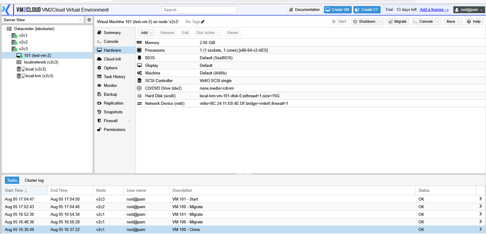
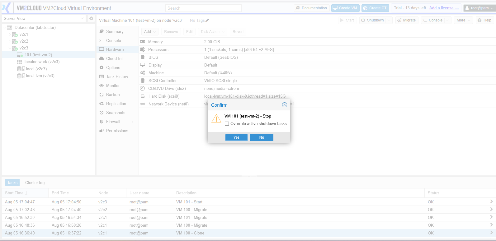
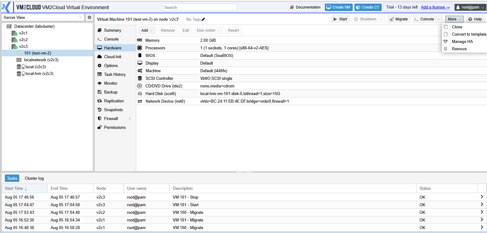
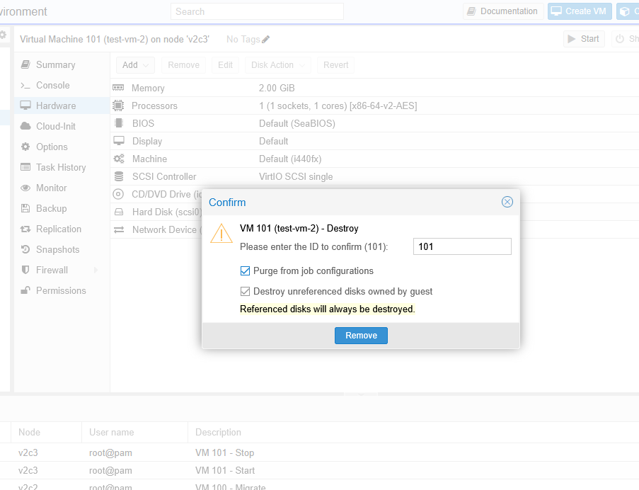
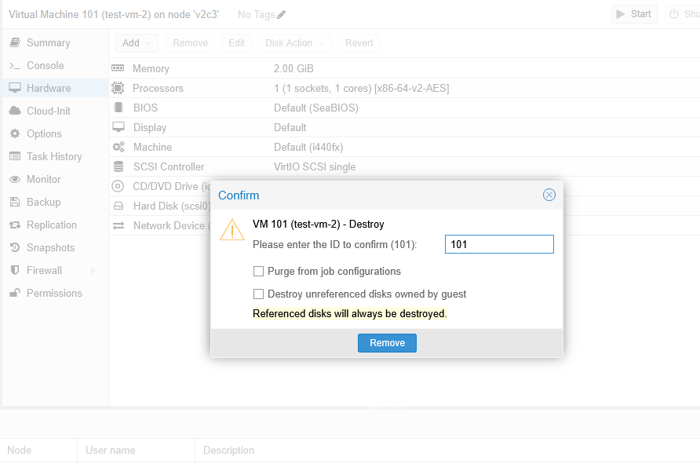
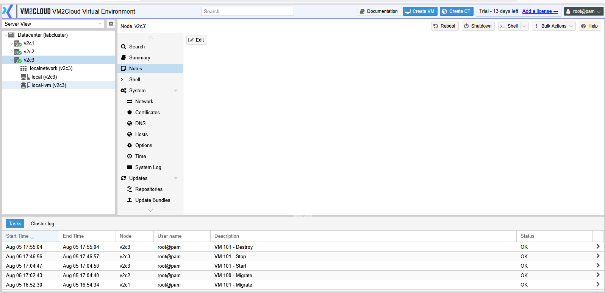

# Delete Virtual Machine

---

## Overview

Deleting a virtual machine permanently removes it from VM2Cloud VE. Depending on the selected options during the deletion process, the associated virtual disks can also be removed from storage.

This operation should be performed only when the virtual machine is no longer required.

> **Warning:** Deleting a virtual machine is a destructive operation. If the virtual disks are also removed, the data cannot be recovered unless a backup is available.

---

## When to Use

Delete a virtual machine when you need to:

* Remove unused virtual machines.
* Free storage resources.
* Clean up test or temporary environments.
* Remove virtual machines that have been replaced.

---

## Prerequisites

Before deleting a virtual machine, ensure that:

* A backup has been created if the data must be retained.
* The virtual machine is no longer required.
* You have permission to delete virtual machines.
* The virtual machine is not participating in any critical workloads.

---

# Delete a Virtual Machine

## Step 1: Select the Virtual Machine

1. Log in to the VM2Cloud VE web interface.
2. Select the required node.
3. Select the virtual machine.

---

---

## Step 2: Stop the Virtual Machine

If the virtual machine is running:

1. Click **Shutdown** or **Stop**.
2. Wait until the VM status changes to **Stopped**.

> **Note:** While some environments may allow deleting a running VM, it is recommended to stop the virtual machine first to avoid unexpected issues.

---

---

## Step 3: Delete the Virtual Machine

1. Click **More**.
2. Select **Remove**.

The Remove Virtual Machine dialog opens.

---

---

## Step 4: Review the Removal Options

Review the available options before continuing.

Depending on your VM2Cloud VE configuration, you may see options such as:

* Remove Virtual Disks
* Remove Unused Disks
* Purge VM Configuration

Select the required options.

---

---

## Step 5: Confirm the Operation

1. Review the warning message.
2. Confirm that the correct virtual machine has been selected.
3. Click **Remove**.

Wait for the task to complete.

---

---

# Verification

Verify the following:

* The virtual machine no longer appears under the node.
* The removal task completed successfully.
* The associated virtual disks have been removed if that option was selected.
* The released storage space is available for reuse.

---

# Common Issues

| Issue                                        | Resolution                                                                                      |
| -------------------------------------------- | ----------------------------------------------------------------------------------------------- |
| Remove option is unavailable                 | Verify that your account has permission to delete virtual machines.                             |
| Virtual machine cannot be removed            | Ensure that no backup, migration, snapshot, or other task is currently running.                 |
| Virtual disks were not deleted               | Verify whether the **Remove Virtual Disks** option was selected during the deletion process.    |
| Removal task fails                           | Review the **Recent Tasks** page for detailed error information and resolve the reported issue. |
| Virtual machine still appears after deletion | Refresh the interface and verify that the removal task completed successfully.                  |

---

# Summary

Deleting a virtual machine permanently removes it from VM2Cloud VE. Before proceeding, verify that the virtual machine is no longer needed and that a backup has been created if the data must be retained. Carefully review the removal options to ensure that disks and configuration files are deleted only when intended.
