# Manage VM Hardware

---

## Overview

The **Hardware** page allows administrators to view and manage the virtual hardware assigned to a virtual machine. From this page, you can add new hardware, modify existing hardware, or remove hardware that is no longer required.

Hardware changes allow you to adjust the virtual machine's resources as workload requirements change.

---

## When to Use

Use the Hardware page to:

* Increase or decrease CPU resources.
* Modify memory allocation.
* Add or remove virtual disks.
* Configure network adapters.
* Mount or change ISO images.
* Add USB or PCI devices (if supported).
* Configure TPM or EFI Disk (if required).

---

## Prerequisites

Before modifying virtual hardware, ensure that:

* You have permission to manage virtual machines.
* The virtual machine exists.
* Some hardware changes may require the virtual machine to be powered off.

---

# Access the Hardware Page

1. Log in to the VM2Cloud web interface.
2. Select the required node.
3. Select the virtual machine.
4. Click **Hardware**.

The Hardware page displays all hardware assigned to the virtual machine.

---

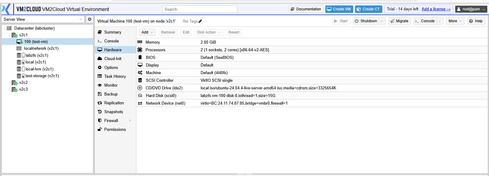

---

# Modify CPU

To change the CPU configuration:

1. Select **Processors**.
2. Click **Edit**.
3. Update the required settings.
4. Click **OK**.

Typical settings include:

* Sockets
* Cores
* CPU Type

---

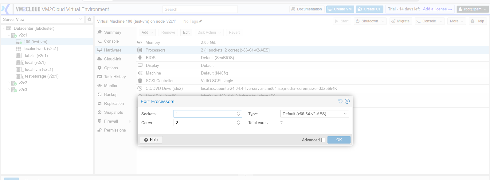
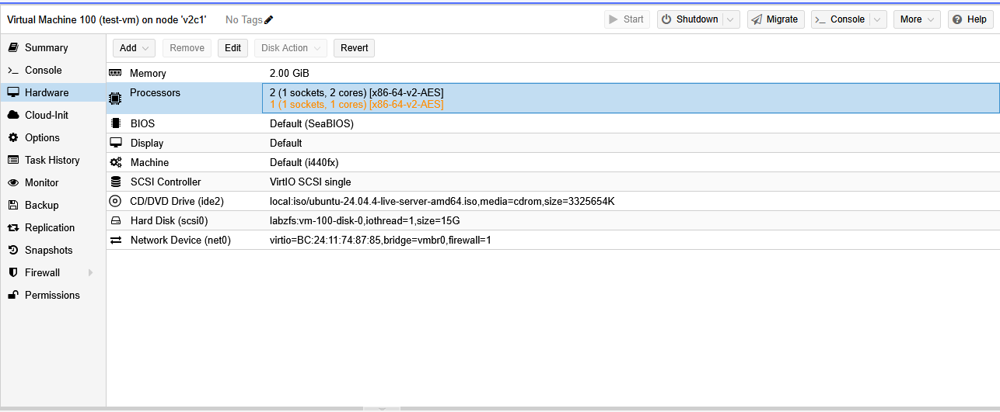

---

# Modify Memory

To change the memory allocation:

1. Select **Memory**.
2. Click **Edit**.
3. Enter the required memory size.
4. Click **OK**.

If supported, configure the **Ballooning Device** as required.

---

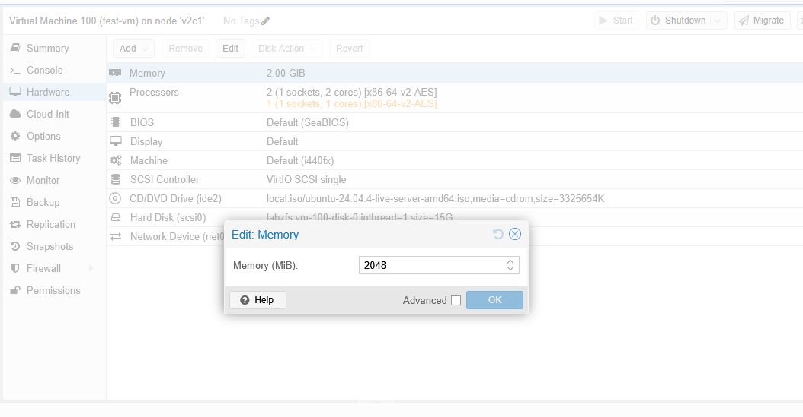
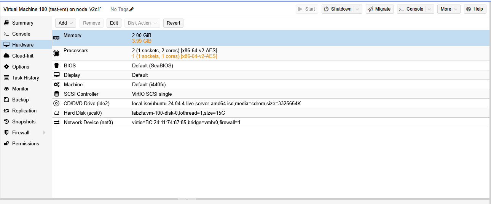

---

# Add a Hard Disk

1. Click **Add**.
2. Select **Hard Disk**.
3. Configure the required settings.
4. Click **Add**.

Typical options include:

* Bus/Device
* Storage
* Disk Size
* Cache
* SSD Emulation
* Discard

---

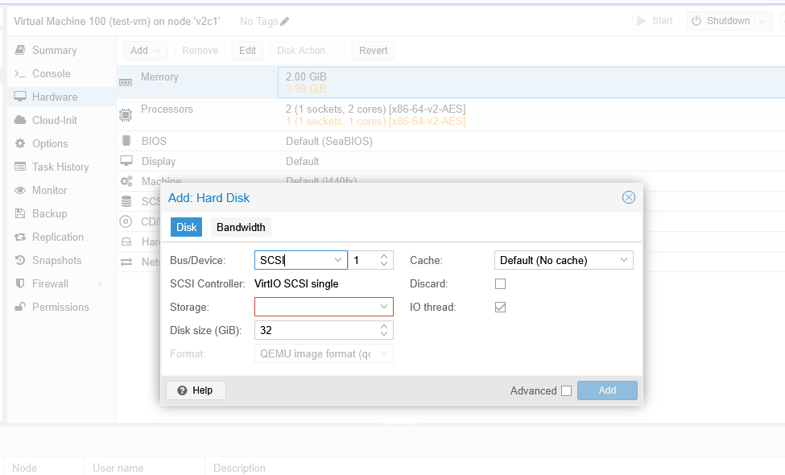
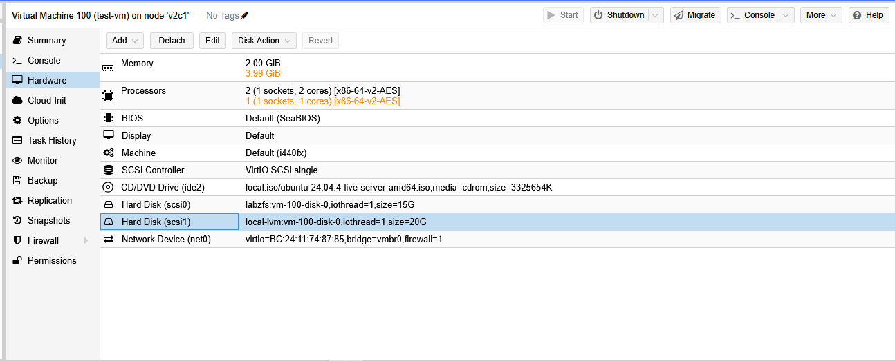

---

# Remove a Hard Disk

1. Select the required disk.
2. Click **Detach** or **Remove**, depending on your VM2Cloud configuration.
3. Confirm the operation.

> **Warning:** Removing a virtual disk may permanently delete its data.

---

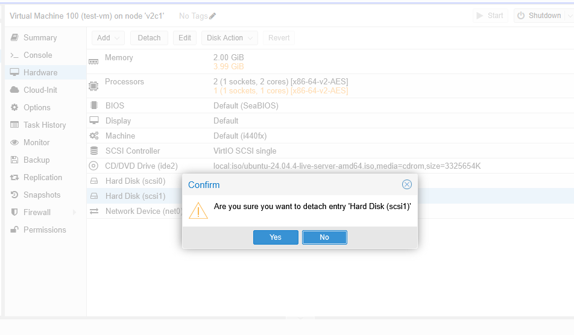

---

# Configure Network Device

To modify a network adapter:

1. Select the network device.
2. Click **Edit**.
3. Update the required settings.
4. Click **OK**.

Typical settings include:

* Bridge
* Model
* VLAN Tag
* Firewall

---

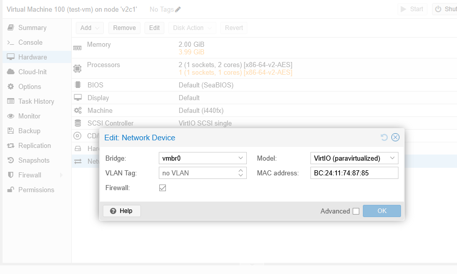
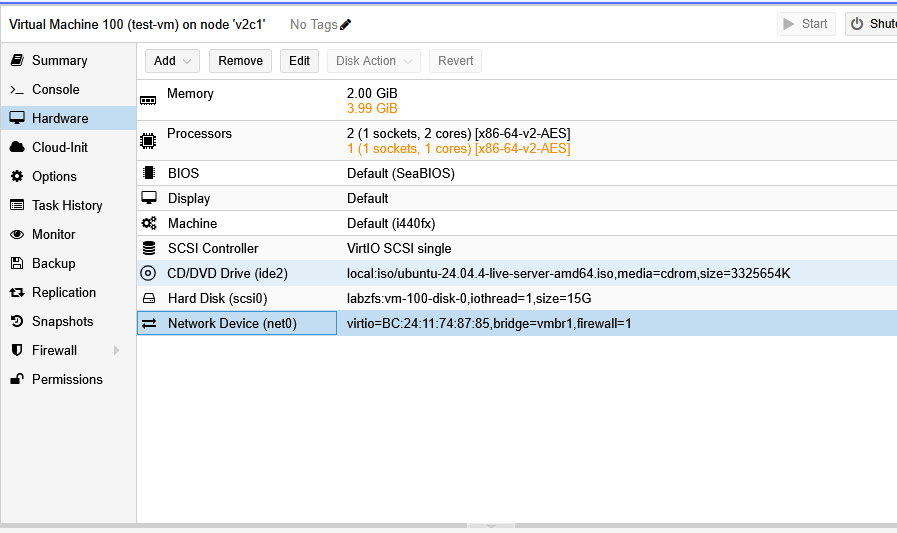

---

# Mount or Change an ISO Image

1. Select the **CD/DVD Drive**.
2. Click **Edit**.
3. Select the required ISO image.
4. Click **OK**.

The selected ISO will be available the next time the virtual machine boots from the CD/DVD drive.

---

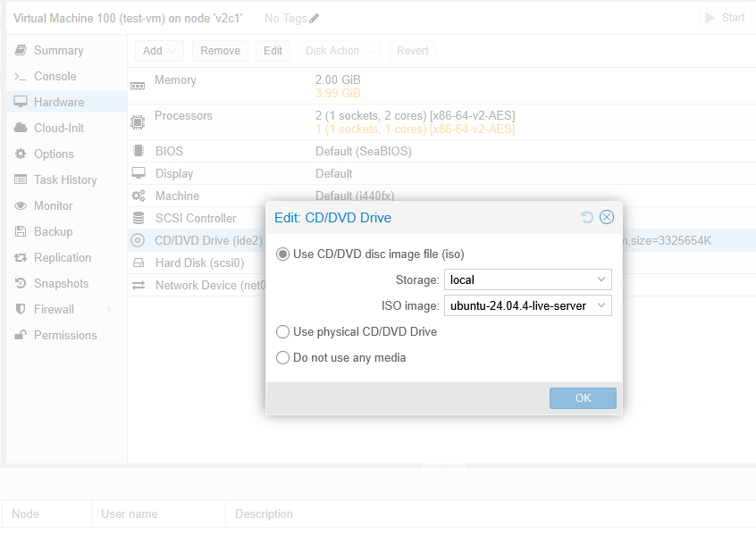
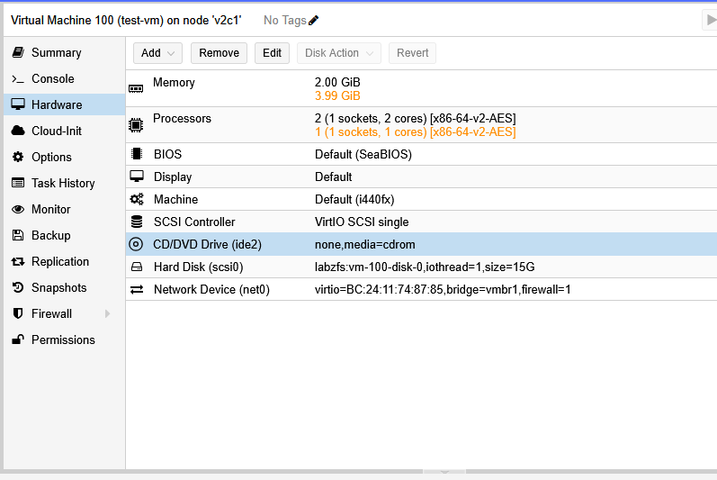

---

# Add USB Device

If supported by your environment:

1. Click **Add**.
2. Select **USB Device**.
3. Choose the required device.
4. Click **Add**.

---

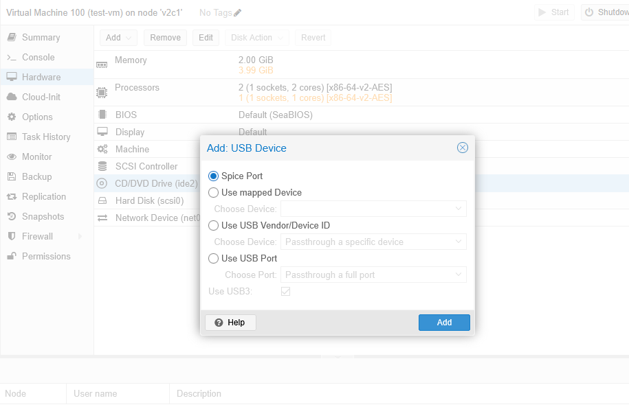
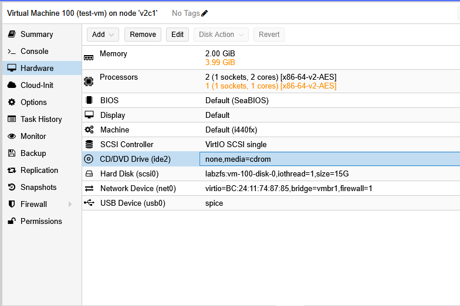

---

# Add PCI Device

If PCI Passthrough is configured:

1. Click **Add**.
2. Select **PCI Device**.
3. Select the required device.
4. Click **Add**.

---

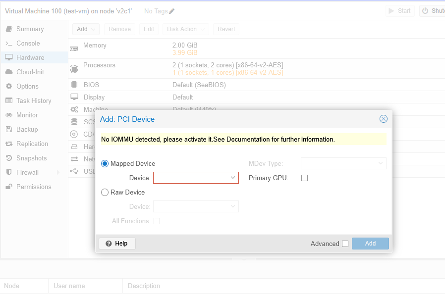
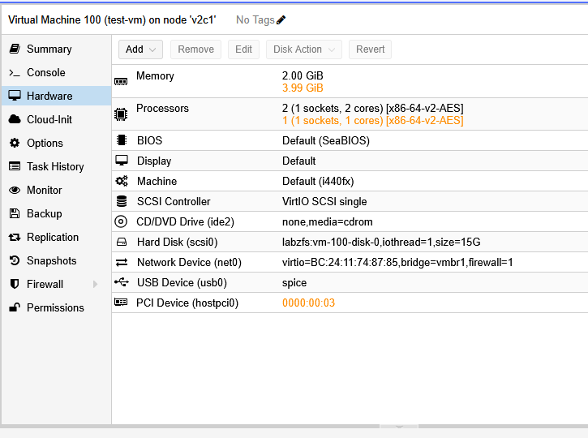

---

# Add TPM or EFI Disk

For operating systems that require TPM or UEFI boot:

1. Click **Add**.
2. Select **TPM State** or **EFI Disk**.
3. Configure the required settings.
4. Click **Add**.

---

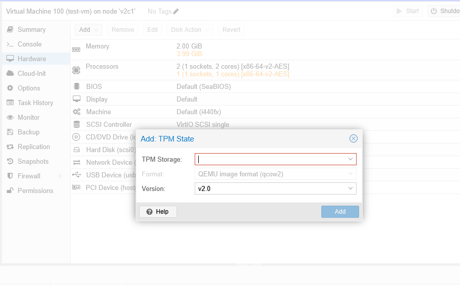
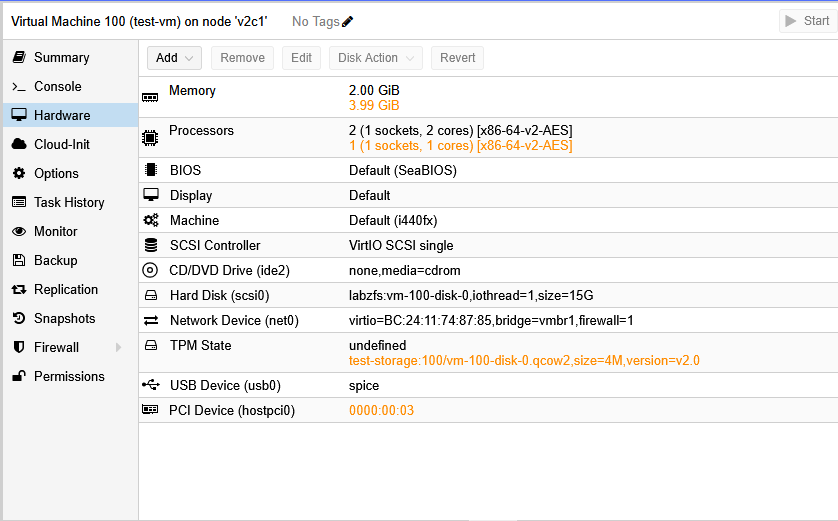

---

# Verification

Verify the following after making hardware changes:

* The updated hardware is displayed in the Hardware page.
* The virtual machine starts successfully.
* The guest operating system detects the new hardware.
* Resource changes are reflected correctly.

---

# Common Issues

| Issue                                         | Resolution                                                                                                     |
| --------------------------------------------- | -------------------------------------------------------------------------------------------------------------- |
| Unable to edit hardware                       | Verify that the virtual machine is in the required power state and that you have sufficient permissions.       |
| Hardware option is unavailable                | Some hardware types depend on the VM configuration or host capabilities. Verify that the feature is supported. |
| Added disk is not visible inside the guest OS | Verify that the operating system detects the new disk and initialize it if necessary.                          |
| PCI or USB device cannot be added             | Confirm that the host hardware supports passthrough and that the device is available.                          |
| ISO image is not listed                       | Verify that the ISO has been uploaded to storage that supports ISO images.                                     |

---

# Summary

The Hardware page provides centralized management of the virtual hardware assigned to a virtual machine. Administrators can modify CPU, memory, storage, network devices, and other supported hardware components to meet changing workload requirements while maintaining full control over the virtual machine configuration.
