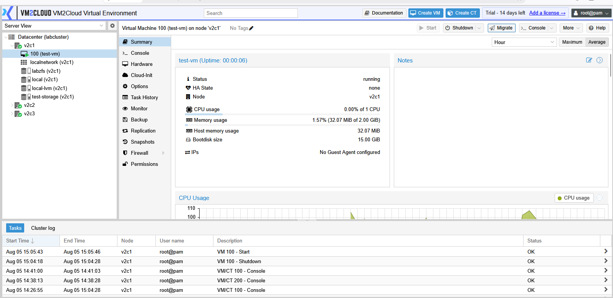
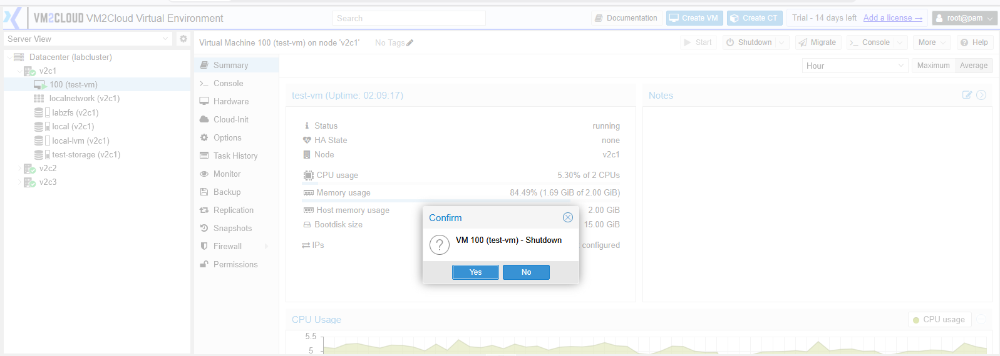
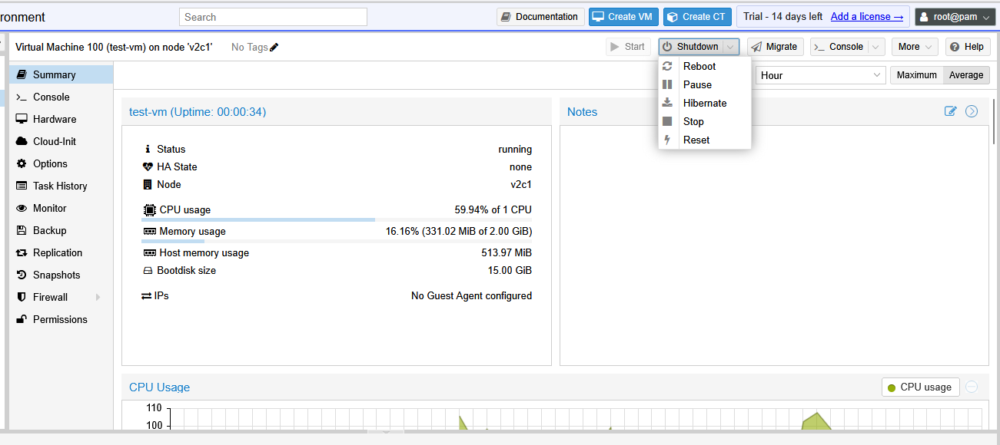
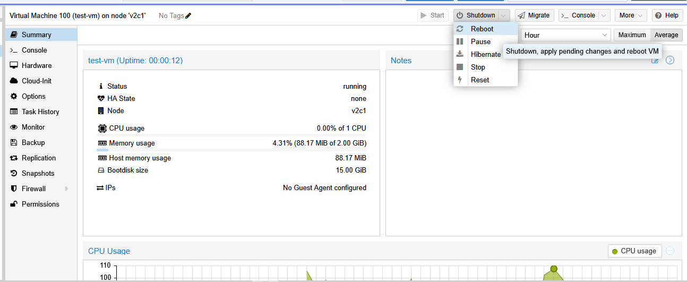
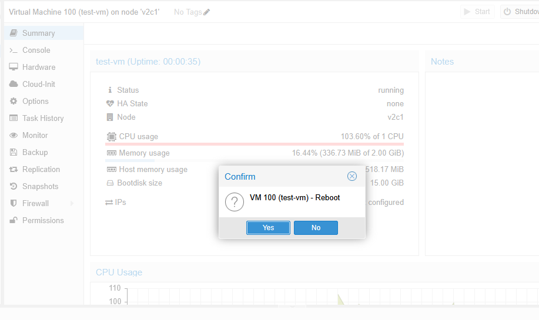
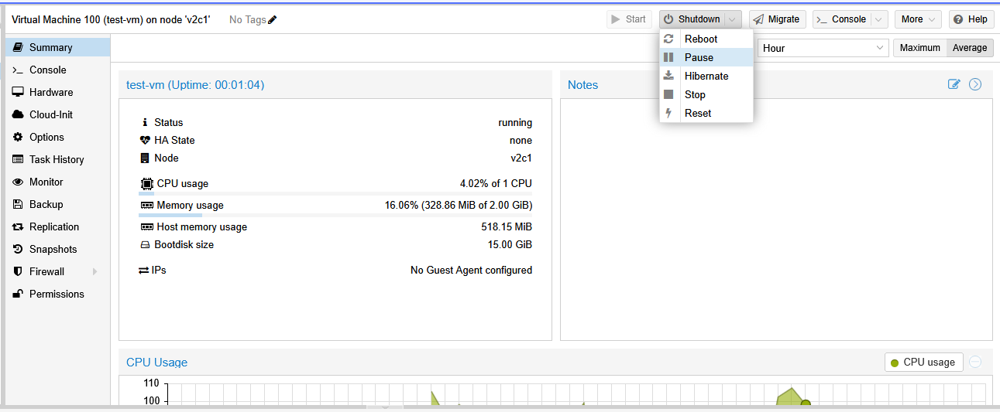
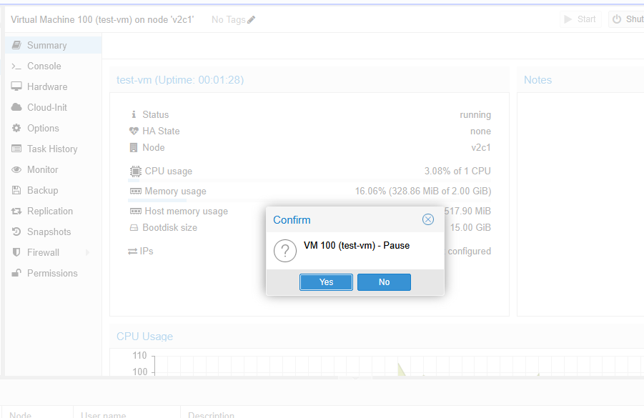
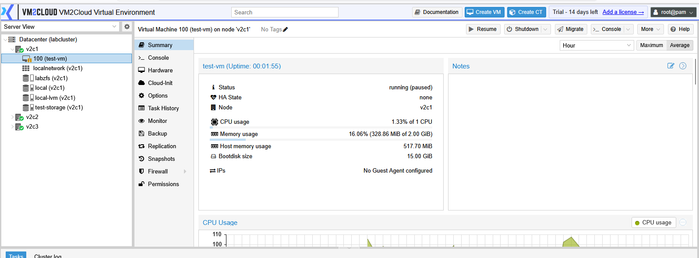
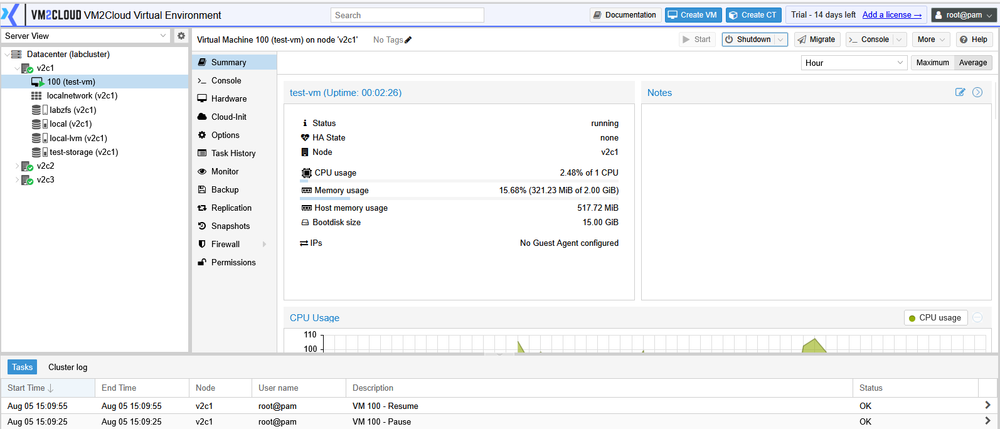

# Manage Virtual Machine

---

## Overview

After a virtual machine is created, it can be managed from the VM toolbar. VM2Cloud provides several power management options that allow administrators to start, stop, restart, pause, resume, or gracefully shut down a virtual machine.

These actions help administrators control the operational state of a virtual machine during maintenance, troubleshooting, or normal day-to-day administration.

---

## When to Use

Use the VM management options to:

* Power on a virtual machine.
* Shut down the guest operating system safely.
* Force stop an unresponsive virtual machine.
* Restart a virtual machine.
* Temporarily suspend a virtual machine.
* Resume a suspended virtual machine.

---

## Prerequisites

Before performing any operation, ensure that:

* You have permission to manage virtual machines.
* The virtual machine exists.
* The selected node is online.

---

# Start a Virtual Machine

## Step 1: Select the Virtual Machine

1. Log in to the VM2Cloud web interface.
2. Select the required node.
3. Select the virtual machine.

---

!Select the Virtual Machine](images/vm-shutdown-2.png)

---

## Step 2: Start the Virtual Machine

1. Click **Start** from the toolbar.
2. Wait for the operation to complete.

The virtual machine status changes from **Stopped** to **Running**.

---

---

# Shutdown a Virtual Machine

A shutdown sends a graceful shutdown request to the guest operating system.

> **Note:** The guest operating system must support ACPI or the QEMU Guest Agent for graceful shutdown.

## Steps

1. Select the virtual machine.
2. Click **Shutdown**.
3. Confirm the operation.

Wait until the virtual machine powers off.

---

---

# Stop a Virtual Machine

A stop operation immediately powers off the virtual machine.

> **Warning:** Unsaved data inside the guest operating system may be lost.

## Steps

1. Select the virtual machine.
2. Click **Stop**.
3. Confirm the operation.

---

---

# Reboot a Virtual Machine

A reboot restarts the virtual machine.

## Steps

1. Select the virtual machine.
2. Click **Reboot**.
3. Confirm the operation.

The virtual machine shuts down and starts again automatically.

---

---

# Pause a Virtual Machine

Pausing temporarily suspends CPU execution while preserving the virtual machine's current state in memory.

## Steps

1. Select the virtual machine.
2. Click **Pause**.
3. Confirm the operation.

The virtual machine status changes to **Paused**.

---

---

# Resume a Virtual Machine

Resume returns a paused virtual machine to the running state.

## Steps

1. Select the paused virtual machine.
2. Click **Resume**.

The virtual machine continues from where it was paused.

---

---

# Verification

After performing any power operation, verify that:

* The virtual machine status has changed as expected.
* The Summary page displays the updated status.
* The operation appears in **Recent Tasks**.
* The virtual machine is accessible if it is running.

---

# Common Issues

| Issue                          | Resolution                                                                                                   |
| ------------------------------ | ------------------------------------------------------------------------------------------------------------ |
| Virtual machine does not start | Verify that sufficient CPU, memory, and storage resources are available.                                     |
| Shutdown does not complete     | Confirm that the guest operating system supports ACPI or that the QEMU Guest Agent is installed and running. |
| Stop operation fails           | Check whether another task is currently running on the virtual machine.                                      |
| Resume option is unavailable   | Verify that the virtual machine is currently in the Paused state.                                            |
| Reboot does not complete       | Review the Recent Tasks and the guest operating system for any errors preventing the restart.                |

---

# Summary

VM2Cloud provides several power management options to control the operational state of a virtual machine. Administrators can start, shut down, stop, reboot, pause, and resume virtual machines directly from the VM management toolbar, making it easy to perform routine maintenance and operational tasks.
