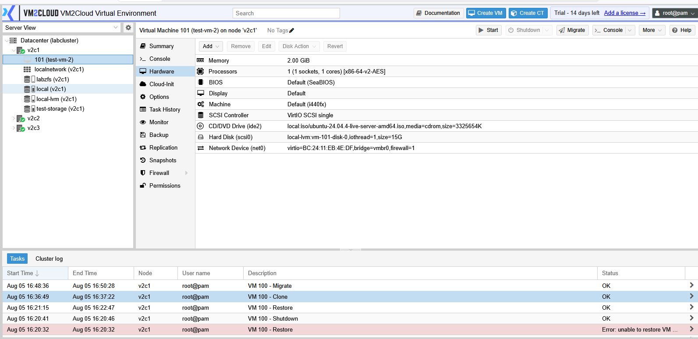
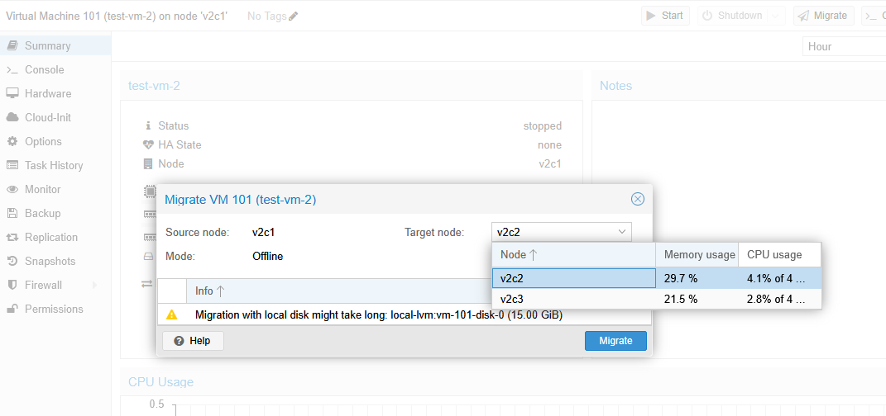
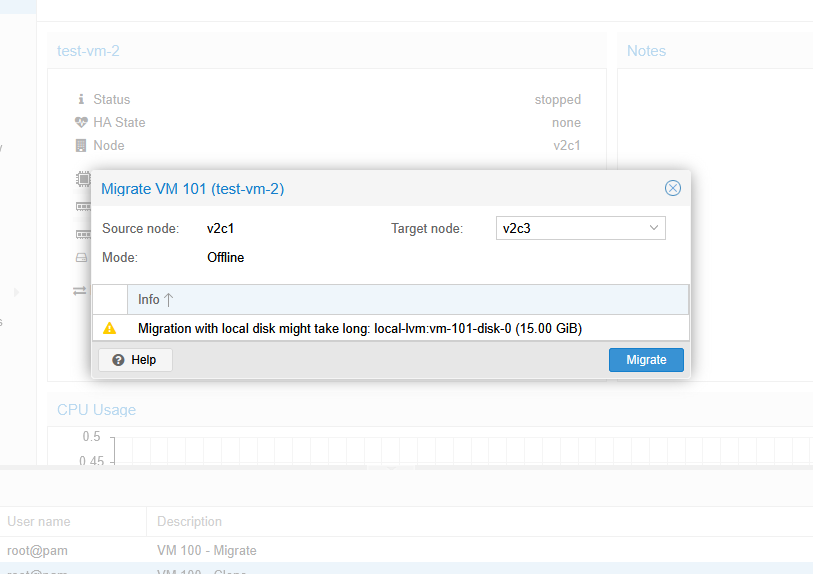
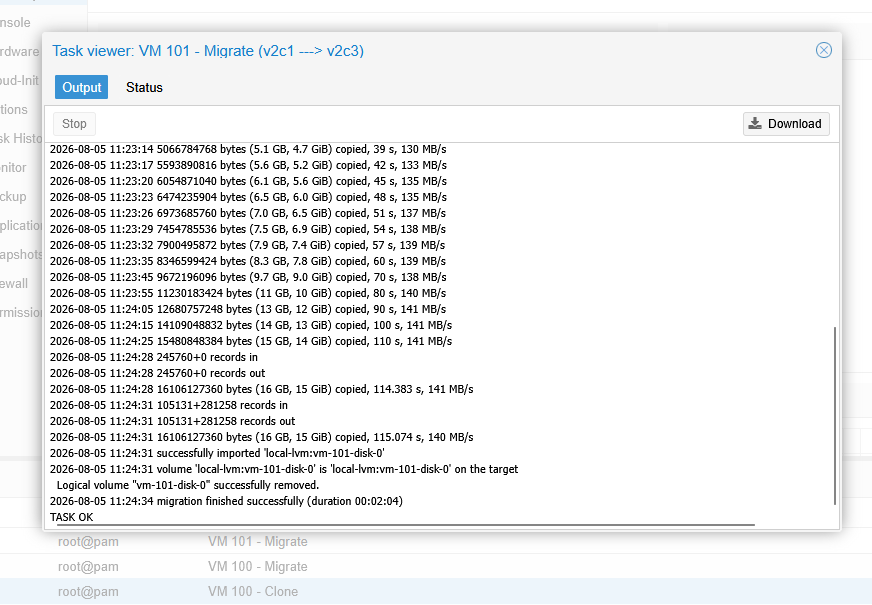
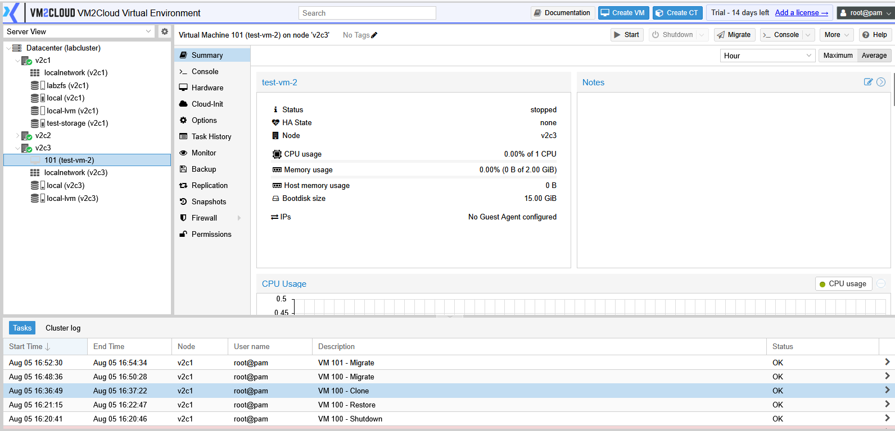

# Migrate Virtual Machine

---

## Overview

Virtual Machine Migration allows you to move a virtual machine from one node to another within the same VM2Cloud cluster. Migration helps balance workloads, perform hardware maintenance, and improve resource utilization without recreating the virtual machine.

Depending on the virtual machine state and cluster configuration, VM2Cloud supports migrating both running and stopped virtual machines.

---

## When to Use

Migrate a virtual machine when you need to:

* Move workloads to another node.
* Perform planned maintenance on a node.
* Balance resource utilization across the cluster.
* Relocate virtual machines without recreating them.

---

## Prerequisites

Before migrating a virtual machine, ensure that:

* Both source and target nodes are members of the same cluster.
* The target node is online.
* Shared storage is available, or migration with local disks is supported in your environment.
* Sufficient CPU, memory, and storage resources are available on the target node.
* You have permission to migrate virtual machines.

---

# Migrate a Virtual Machine

## Step 1: Select the Virtual Machine

1. Log in to the VM2Cloud web interface.
2. Select the node hosting the virtual machine.
3. Select the virtual machine.

---

---

## Step 2: Open the Migration Window

 Click **Migrate**. Located on the top action toolbar of the selected virtual machine, between Shutdown and Console, the Migrate button is used to move the VM to another node in the cluster.

The migration window opens.

---

---

## Step 3: Prepare the Virtual Machine for Migration

Before configuring the migration, verify that no installation media is attached to the virtual machine.

1. Select the virtual machine.
2. Click **Hardware**.
3. Select the **CD/DVD Drive** entry.
4. Click **Edit**.
5. In the **Media** field, select **Do not use any media**.
6. Click **OK** to save the changes.

> **Note:** If an ISO image stored on local storage is attached to the virtual machine, migration may fail because the target node cannot access the local ISO file. Removing the ISO before migration helps avoid this issue.

---

## Step 4: Configure the Migration

Configure the migration settings.

Typical options include:

- Target Node
- Migration Type (when available)
- Target Storage (if applicable)
- Migration with Local Disks (if supported)

Review the selected options before continuing.

---

## Step 5: Start the Migration

1. Click **Migrate**.
2. Wait for the migration task to complete.

The migration progress can be monitored from the **Recent Tasks** panel.

---

---

# Verify the Migration

After the migration completes:

* Verify that the virtual machine appears under the target node.
* Confirm that the migration task completed successfully.
* If the virtual machine was running, verify that it is still operational.
* Open the virtual machine Summary page to confirm the assigned node.

---

---

# Common Issues

| Issue                                         | Resolution                                                                                                                    |
| --------------------------------------------- | ----------------------------------------------------------------------------------------------------------------------------- |
| Target node is unavailable                    | Verify that the destination node is online and part of the same cluster.                                                      |
| Migration option is unavailable               | Confirm that the virtual machine is located on a clustered node and that your account has permission to perform migrations.   |
| Migration fails due to insufficient resources | Verify that the target node has enough available CPU, memory, and storage resources.                                          |
| Local storage cannot be migrated              | Verify that your environment supports migration with local disks or move the virtual disk to shared storage before migrating. |
| Migration task fails                          | Review the Recent Tasks for detailed error information and resolve the reported issue before retrying.                        |

---

# Verification

Verify the following:

* The migration task completed successfully.
* The virtual machine is displayed under the target node.
* The virtual machine status is correct.
* Applications and network connectivity are functioning normally after migration.

---

# Summary

Virtual Machine Migration enables administrators to move workloads between nodes in a VM2Cloud cluster with minimal disruption. It is commonly used for maintenance, resource balancing, and workload distribution while maintaining the virtual machine's configuration and data.
