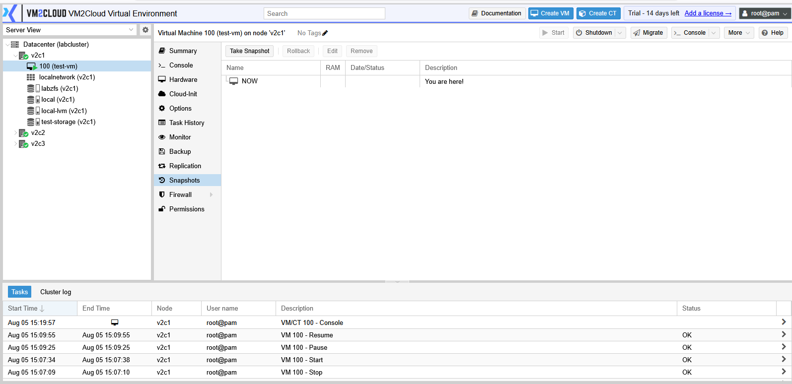
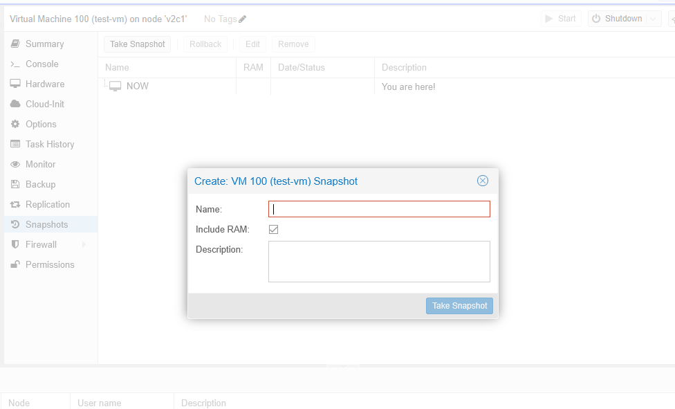
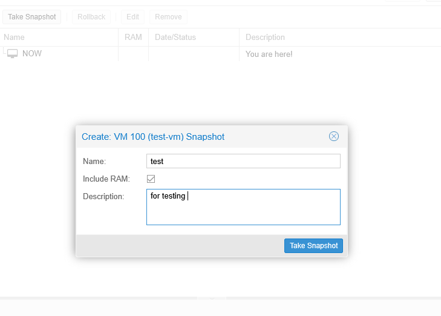
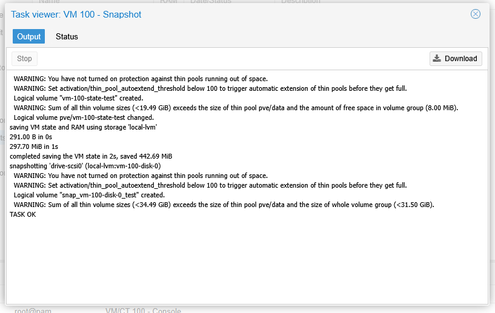
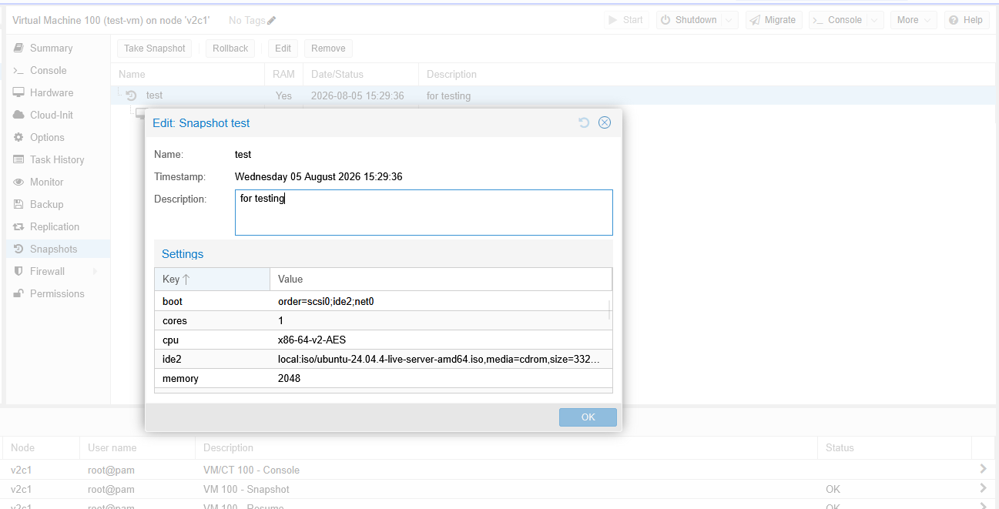
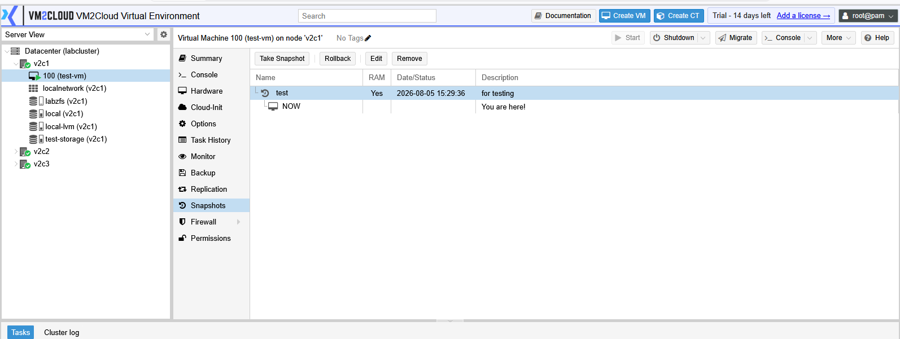
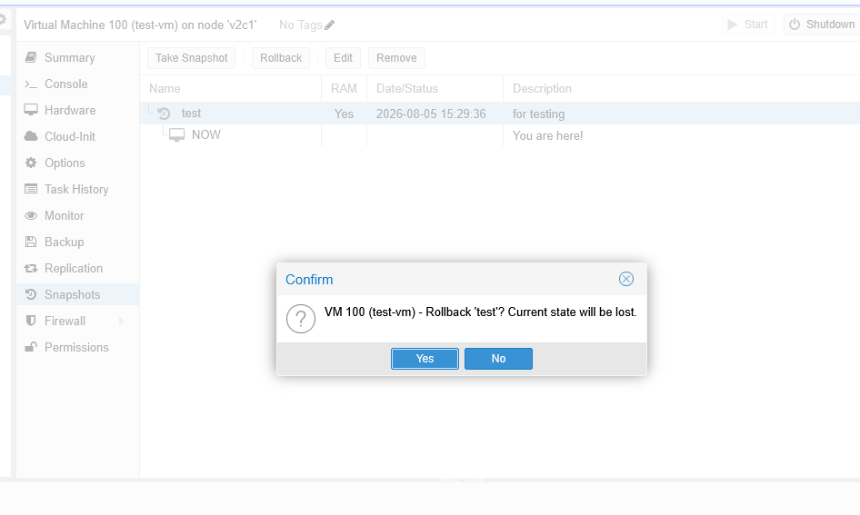
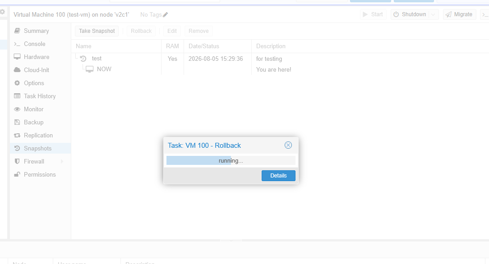
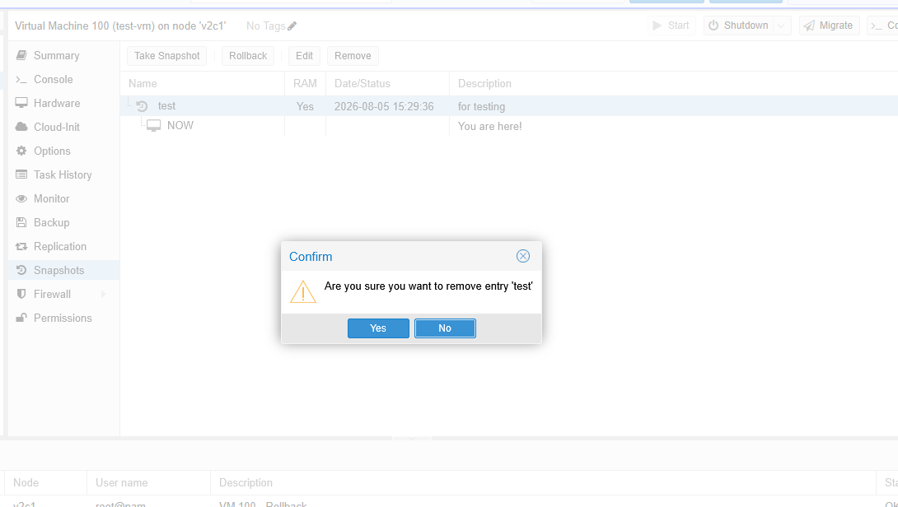

# VM Snapshots

---

## Overview

A snapshot captures the current state of a virtual machine at a specific point in time. It allows administrators to preserve the virtual machine's configuration and disk state before making changes.

Snapshots are commonly used before software upgrades, operating system updates, application installation, or configuration changes. If required, the virtual machine can be restored to the captured snapshot.

> **Note:** Snapshot support depends on the storage type used by the virtual machine.

---

## When to Use

Create a snapshot when you need to:

* Perform operating system updates.
* Install or upgrade applications.
* Test software changes.
* Modify the virtual machine configuration.
* Create a recovery point before maintenance.

---

## Prerequisites

Before creating a snapshot, ensure that:

* The virtual machine exists.
* The storage used by the virtual machine supports snapshots.
* Sufficient storage space is available.
* You have permission to manage virtual machines.

---

# Access the Snapshot Page

1. Log in to the VM2Cloud VE web interface.
2. Select the required node.
3. Select the virtual machine.
4. Click **Snapshots**.

The Snapshots page displays all snapshots available for the selected virtual machine.

---

---

# Create a Snapshot

## Step 1: Open the Snapshot Window

1. Click **Take Snapshot**.

---

---

## Step 2: Configure the Snapshot

Enter the required information.

Typical fields include:

* Name
* Description (Optional)

If available, select whether to include the virtual machine's memory state.

Click **Take Snapshot**.

---

---

# View Snapshot Information

Select a snapshot to view its details.

Information typically includes:

* Snapshot Name
* Description
* Creation Date
* Parent Snapshot (if applicable)

---

---

# Restore a Snapshot

> **Important:** Restoring a snapshot returns the virtual machine to the state captured when the snapshot was created. Any changes made after the snapshot was taken may be lost.

## Steps

1. Select the required snapshot.
2. Click **Rollback**.
3. Review the warning message.
4. Confirm the rollback.

Wait for the restore operation to complete.

---

---

# Delete a Snapshot

When a snapshot is no longer required, it can be removed.

## Steps

1. Select the snapshot.
2. Click **Delete**.
3. Confirm the operation.

Wait for the deletion task to complete.

---

---

# Verification

Verify the following:

* The snapshot appears in the Snapshots list.
* Snapshot details are displayed correctly.
* Rollback completes successfully when performed.
* Deleted snapshots are removed from the list.
* Related tasks complete successfully.

---

# Common Issues

| Issue                          | Resolution                                                              |
| ------------------------------ | ----------------------------------------------------------------------- |
| Unable to create a snapshot    | Verify that the storage used by the virtual machine supports snapshots. |
| Snapshot creation fails        | Confirm that sufficient storage space is available.                     |
| Rollback option is unavailable | Verify that a valid snapshot has been selected.                         |
| Snapshot deletion fails        | Ensure that no snapshot-related task is currently running.              |
| Snapshot operation fails       | Review the **Recent Tasks** page for detailed error information.        |

---

# Summary

Snapshots provide a quick way to preserve the state of a virtual machine before making changes. They simplify testing, maintenance, and recovery by allowing administrators to create, restore, and delete recovery points directly from the Snapshots page.
