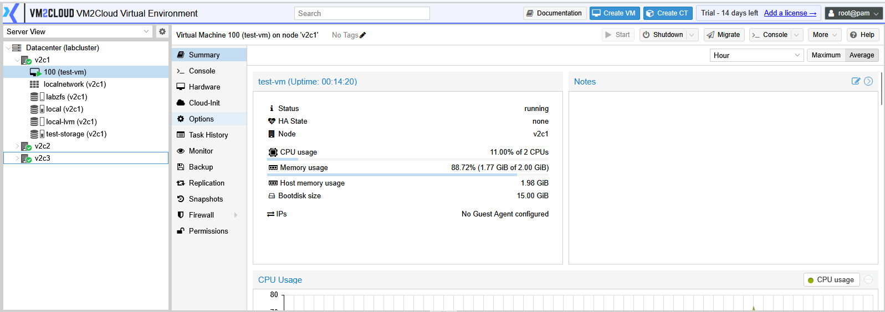
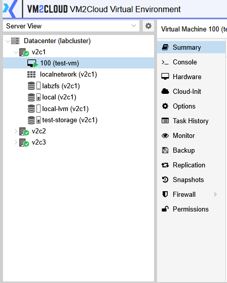
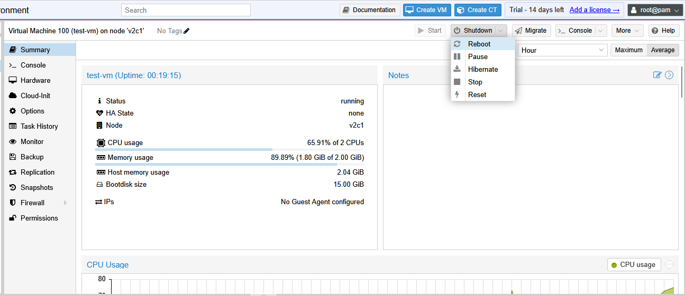
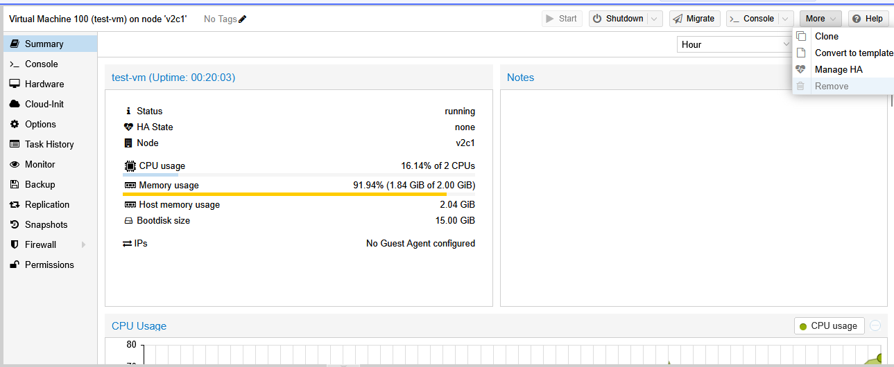
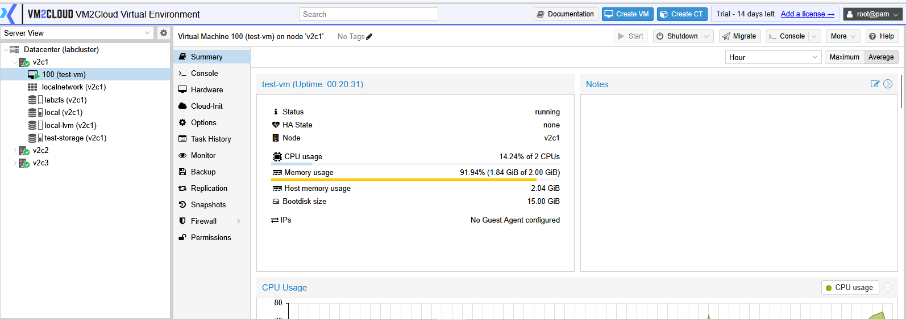

# Virtual Machine Overview

---

## Overview

A Virtual Machine (VM) is a software-based computer that runs its own operating system and applications using the physical resources of a VM2Cloud node. Each virtual machine operates independently, allowing multiple workloads to run on the same physical server while remaining isolated from one another.

Virtual machines can be created with different operating systems, such as Windows or Linux, and can be configured with dedicated CPU, memory, storage, and network resources based on workload requirements.

---

## When to Use

Use a Virtual Machine when you need to:

* Deploy a new server or workstation.
* Host business applications.
* Run Windows or Linux operating systems.
* Test software in an isolated environment.
* Consolidate multiple workloads on a single physical server.

---

## Prerequisites

Before creating or managing a virtual machine, ensure that:

* A VM2Cloud node is available.
* Storage has been configured.
* Network configuration is available.
* Installation media (ISO image) or a virtual machine template is available.
* You have sufficient permissions to manage virtual machines.

---

# Access Virtual Machines

To view existing virtual machines:

1. Log in to the VM2Cloud web interface.
2. In the navigation panel, expand the required node.
3. Select the virtual machine.

If no virtual machines exist, create one before continuing.

---

---

# Virtual Machine Management Page

Selecting a virtual machine opens its management page.

Depending on your VM2Cloud configuration, the page provides tabs for viewing information, monitoring resource usage, managing hardware, configuring network devices, accessing the console, creating snapshots, performing backups, and changing virtual machine settings.

---

---

# Common Virtual Machine Information

The virtual machine management page displays general information such as:

* Virtual Machine ID (VM ID)
* Virtual Machine Name
* Operating System
* Current Status
* Assigned Node
* CPU Configuration
* Memory Allocation
* Storage Configuration
* Network Configuration
* Uptime

This information helps administrators quickly identify the virtual machine and review its current configuration.

---

---

# Available Actions

The toolbar at the top of the virtual machine page provides the actions available for managing the virtual machine.

Depending on the current state of the virtual machine, available actions may include:

* Start
* Shutdown
* Stop
* Reboot
* Suspend
* Resume
* Console
* Clone
* Migrate
* Backup
* Snapshot
* Remove

The available actions may vary depending on the virtual machine status and your user permissions.

---

---

# Virtual Machine Tabs

A virtual machine is managed through multiple tabs. Common tabs include:

| Tab         | Description                                                            |
| ----------- | ---------------------------------------------------------------------- |
| Summary     | Displays the current status and resource usage of the virtual machine. |
| Console     | Opens the virtual machine console.                                     |
| Hardware    | Displays the virtual hardware assigned to the virtual machine.         |
| Network     | Displays the configured virtual network interfaces.                    |
| Snapshots   | Used to create and manage snapshots.                                   |
| Backup      | Displays backup information and allows backup-related operations.      |
| Permissions | Displays user and permission settings for the virtual machine.         |

> **Note:** The available tabs may vary depending on your VM2Cloud version and configuration.

---

---

# Verification

Verify the following:

* The virtual machine appears in the navigation panel.
* The virtual machine management page opens successfully.
* The Summary page displays the virtual machine information.
* The available management tabs are visible.
* The management toolbar displays the available actions.

---

# Common Issues

| Issue                                   | Resolution                                                                     |
| --------------------------------------- | ------------------------------------------------------------------------------ |
| Virtual machine is not visible          | Verify that the VM exists and that your account has permission to access it.   |
| Unable to open the virtual machine      | Confirm that the selected node is online and accessible.                       |
| Some management options are unavailable | Verify the current state of the virtual machine and your user permissions.     |
| Console cannot be opened                | Ensure the virtual machine is running before attempting to access the console. |
| Resource information is missing         | Refresh the page and verify that the node is communicating normally.           |

---

# Summary

Virtual machines are the primary workloads managed in VM2Cloud. Each virtual machine has its own operating system, virtual hardware, and network configuration. The virtual machine management page provides centralized access to monitoring, configuration, console access, backups, snapshots, and other day-to-day administrative operations.
