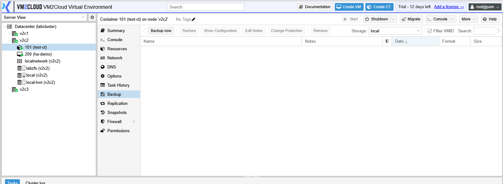
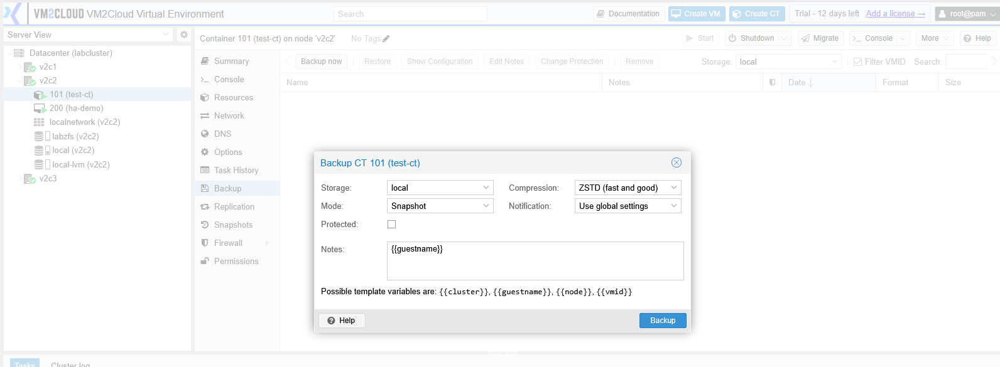
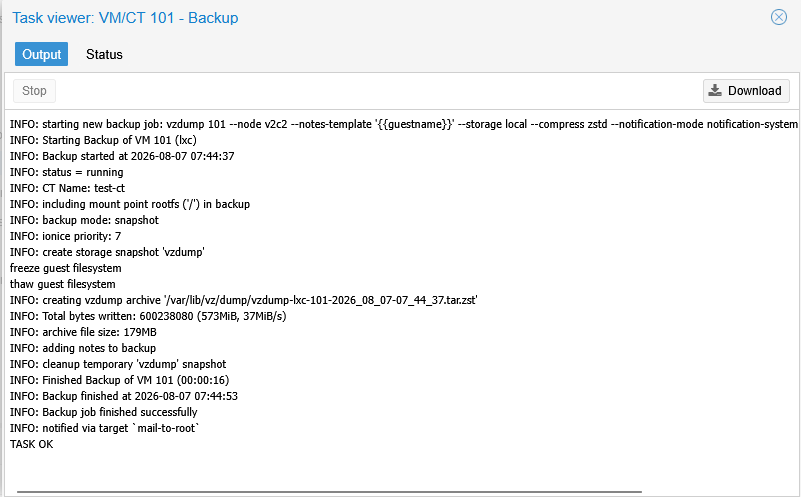
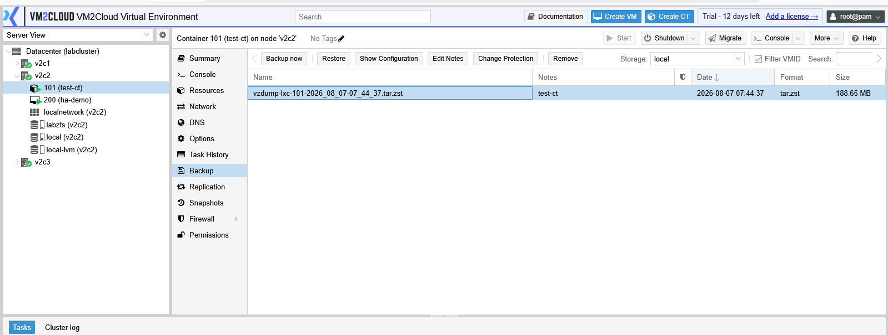
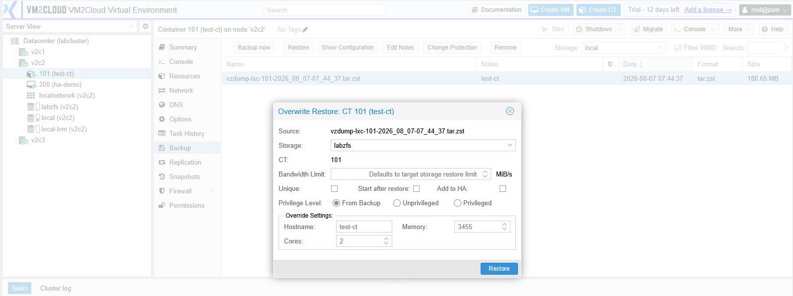
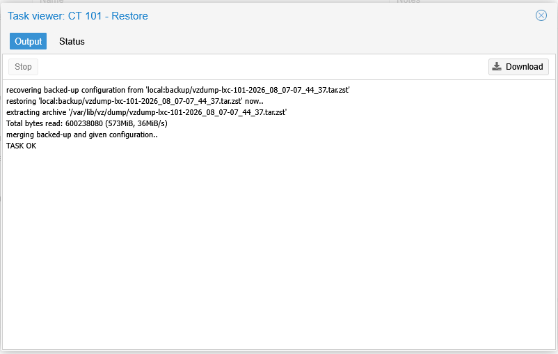

# Backup and Restore Container

---

## Overview

Creating a backup protects a container by saving its data and configuration. The backup can be restored later if the container is accidentally deleted, becomes corrupted, or needs to be recovered.

VM2Cloud allows administrators to create manual backups and restore containers from existing backup files.

---

## When to Use

Create a backup when you need to:

* Protect important containers.
* Create a recovery point before making changes.
* Prepare for maintenance.
* Migrate a container to another environment.

Restore a backup when you need to:

* Recover a deleted container.
* Restore a damaged container.
* Recover a previous version of a container.

---

## Prerequisites

Before creating or restoring a backup, ensure that:

* Backup storage is available.
* Sufficient free space exists on the backup storage.
* The container exists (for backup operations).
* You have permission to perform backup and restore operations.

---

# Create a Manual Backup

## Step 1: Select the Container

1. Log in to the VM2Cloud web interface.
2. Select the required node.
3. Select the container.
4. Click **Backup**.

---

---

## Step 2: Start the Backup

1. Click **Backup Now**.

The backup window opens.

---

---

## Step 3: Configure the Backup

Configure the required options.

Typical options include:

* Storage
* Mode
* Compression
* Protection (if available)

Review the settings.

Click **Backup**.

---

---

## Step 4: Monitor the Backup

The backup task starts immediately.

Monitor the progress from:

* Recent Tasks
* Task Viewer

Wait until the backup completes successfully.

---

---

# Restore a Container

## Step 1: Open Backup Storage

1. Select the node that contains the backup storage.
2. Select the backup storage.
3. Open **Backups**.

The available container backup files are displayed.

---

---

## Step 2: Select the Backup

1. Select the required container backup.
2. Click **Restore**.

The restore window opens.

---

---

## Step 3: Configure the Restore

Configure the required options.

Typical options include:

* Target Node
* CT ID
* Storage
* Restore as a New Container (if available)

Review the settings.

Click **Restore**.

---

---

## Step 4: Wait for Completion

Monitor the restore task until it completes successfully.

After the restore finishes, the container appears under the selected node.

---

---

# Verification

Verify the following after the backup or restore operation:

### After Backup

* The backup task completed successfully.
* The backup file appears in the backup storage.
* No errors are reported in the task log.

### After Restore

* The container appears under the selected node.
* The container starts successfully.
* Applications and services inside the container are accessible.
* Network connectivity is functioning correctly.

---

# Common Issues

| Issue                         | Resolution                                                                                                  |
| ----------------------------- | ----------------------------------------------------------------------------------------------------------- |
| Backup fails                  | Verify that sufficient free space is available on the selected backup storage.                              |
| Backup storage is unavailable | Confirm that the storage is online and accessible.                                                          |
| Restore option is unavailable | Verify that a valid container backup has been selected.                                                     |
| Restore fails                 | Ensure that the target storage has sufficient free space and that the selected CT ID is not already in use. |
| Backup task reports an error  | Review the **Recent Tasks** for detailed error information before retrying the operation.                   |

---

# Summary

The Backup page allows administrators to create manual backups of containers and restore them whenever required. Regular backups help protect container data and simplify recovery in the event of hardware failures, accidental deletion, or configuration issues.
