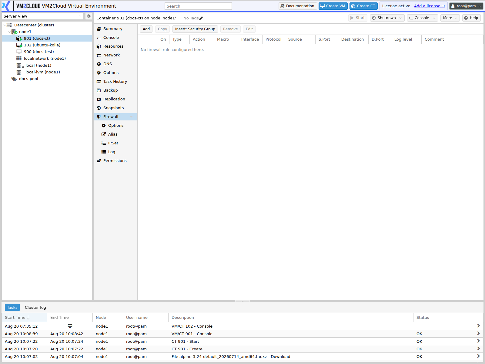

# Container Firewall

---

## Overview

The **Firewall** tab on a container filters traffic to and from that container only.

Container firewall rules apply in addition to the node and datacenter rules. Traffic must be permitted at every applicable level to reach the container.

For the rule model, direction, actions, and evaluation order, see [Firewall Overview](../02-Datacenter/Firewall/Firewall-Overview.md). This page covers the container firewall panel only.

### Enabling requires two steps

A container is only filtered when **both** of these are true:

1. The firewall is enabled on the container's **Firewall → Options** panel.
2. The firewall checkbox is ticked on the container's **network interface**, under **Network**.

This catches people out constantly. Rules exist, the option says enabled, and nothing is filtered — because the network interface checkbox was never ticked.

Note the difference from virtual machines: a container's network interfaces are configured on its own **Network** tab, not under Hardware.

The datacenter-level firewall must also be enabled.

---

## When to Use

Configure the container firewall when:

* A container should only accept traffic on specific ports.
* A container must be isolated from other guests on the same bridge.
* A public-facing container needs its exposure restricted.
* You want filtering enforced outside the container, where its own root user cannot change it.
* A group of containers sharing a role needs one consistent policy, applied with a [security group](../02-Datacenter/Firewall/Security-Groups.md).

Filtering at this level is particularly useful for containers, because it is enforced by the host rather than inside the container where a compromised process could disable it.

---

## Prerequisites

Before configuring the container firewall, ensure that:

* You have administrator privileges, or permissions on the container.
* The datacenter-level firewall is enabled.
* You know which ports and sources the container must accept.
* You have console access to the container.
* Any alias, IPSet, or security group the rules reference already exists.

---

# Procedure

## Step 1: Open the Container Firewall Panel

1. Log in to the VM2Cloud VE web interface.
2. Expand the node in the resource tree.
3. Select the container.
4. Expand **Firewall**.
5. Click **Rules**.

---

### Screenshot 1

**Container Firewall Rules Panel**



Rules applying to this container only.

---

## Step 2: Add the Required Rules

1. Click **Add**.
2. Set **Direction** to **in** for traffic arriving at the container.
3. Set **Action** to **ACCEPT**.
4. Select a **Macro** for a standard service, or set **Protocol** and **Dest. port** manually.
5. Set **Source** to restrict who may connect.
6. Add a **Comment** explaining the rule.
7. Click **Add**.

Repeat for each service the container must expose.

---

### Screenshot 2

**Adding a Container Firewall Rule**

```text
[ Place Screenshot Here ]
```

> **Capture:** The Add Rule dialog on a container, filled in for an inbound rule
> permitting a specific service port from a specific source.

---

## Step 3: Insert a Security Group (Optional)

1. Click **Insert: Security Group**.
2. Select the group.
3. Confirm.

---

## Step 4: Enable the Firewall on the Network Interface

The step most often missed.

1. Select the container.
2. Click **Network**.
3. Select the network interface.
4. Click **Edit**.
5. Tick the firewall checkbox.
6. Click **OK**.

Repeat for every interface that should be filtered.

> **Verify:** Confirm the exact label of the firewall checkbox in the container network
> interface edit dialog.

---

### Screenshot 3

**Firewall Enabled on the Container Network Interface**

```text
[ Place Screenshot Here ]
```

> **Capture:** Container → Network → interface edit dialog, showing the firewall
> checkbox ticked.

---

## Step 5: Enable the Firewall on the Container

1. Click **Options** under the container's **Firewall**.
2. Select the firewall enable setting.
3. Click **Edit**.
4. Enable it.
5. Click **OK**.

---

### Screenshot 4

**Container Firewall Options**

```text
[ Place Screenshot Here ]
```

> **Capture:** A container → Firewall → Options, showing the full settings list including
> the enable setting and default policies.

---

## Step 6: Verify From Outside

1. From another machine, connect to a service the rules permit. It should succeed.
2. Connect to a port the rules do not permit. It should fail.
3. Confirm the container still reaches outbound services it needs.
4. Confirm the container console still works — console access does not depend on container networking.

---

# Configuration / Options

The container **Firewall → Options** panel controls filtering for this container.

| Option | Description |
|---|---|
| **Firewall** | Enables filtering for this container. Requires the network interface checkbox as well. |
| **Input Policy** | Action for inbound traffic no rule matches. Normally **DROP**. |
| **Output Policy** | Action for outbound traffic no rule matches. Normally **ACCEPT**. |
| **DHCP** | Permits DHCP so the container can obtain an address. Required if it uses DHCP. |
| **NDP** | Neighbor Discovery Protocol, used by IPv6. |
| **Router Advertisement** | Controls whether the container may send router advertisements. |
| **MAC filter** | Restricts the container to its configured MAC address, preventing spoofing. |
| **IP filter** | Restricts the container to its configured addresses. |
| **Log level (in)** | Logging detail for inbound traffic. |
| **Log level (out)** | Logging detail for outbound traffic. |

Rule fields are identical to the datacenter level — see [Firewall Rules](../02-Datacenter/Firewall/Firewall-Rules.md).

> **Verify:** Capture the complete container Firewall → Options list and confirm the
> exact setting names, defaults, and which of the above are present in this deployment.

---

# Verification

Verify the following:

* The firewall is enabled on the container's Options panel.
* The firewall checkbox is ticked on every relevant network interface.
* Permitted services accept connections from permitted sources.
* Connections from other sources are refused.
* Ports with no rule are not reachable.
* The container still reaches DNS, package repositories, and other outbound services.
* The container obtains an address if it uses DHCP.
* The console still works.
* Matching traffic appears in the firewall log if logging is enabled.

---

# Common Issues

| Issue | Resolution |
|-------|------------|
| Rules have no effect | The firewall checkbox on the network interface is not ticked. Most common cause. |
| Rules still have no effect | The datacenter firewall is disabled, or the container Options enable setting is off. All three are required. |
| Container loses all network access | The input policy is **DROP** and no rule permits the required traffic. Use the console to investigate. |
| Container cannot get an IP address | DHCP is being blocked. Enable the DHCP option. |
| Package updates fail inside the container | Outbound traffic or DNS is blocked. Check the output policy and DNS rules. |
| IPv6 stops working | NDP is being blocked. Enable the NDP option. |
| A rule is ignored | An earlier rule matched first. Reorder so narrower rules sit above broader ones. |
| Rules lost after cloning | Firewall configuration is per container. Check the clone's own settings. |
| Settings not found under Hardware | Containers configure networking on their own **Network** tab, not under Hardware. |

---

# Best Practices

- Tick the network interface checkbox and enable the Options setting together.
- Restrict inbound rules by source rather than accepting from anywhere.
- Use a [security group](../02-Datacenter/Firewall/Security-Groups.md) for policy shared across containers.
- Prefer host-level filtering over the container's internal firewall — it cannot be disabled from inside the container.
- Enable **MAC filter** and **IP filter** for containers you do not fully control.
- Verify console access works before enabling.
- Test on a non-production container first.
- Comment every rule with why it exists.
- Review firewall settings after cloning or migrating a container.

---

# Related Documentation

- [Firewall Overview](../02-Datacenter/Firewall/Firewall-Overview.md)
- [Firewall Rules](../02-Datacenter/Firewall/Firewall-Rules.md)
- [Security Groups](../02-Datacenter/Firewall/Security-Groups.md)
- [Aliases](../02-Datacenter/Firewall/Aliases.md)
- [IPSets](../02-Datacenter/Firewall/IPSets.md)
- [Container Console](Container-Console.md)
- [Container Troubleshooting](Container-Troubleshooting.md)
- [VM Firewall](../04-Virtual-Machines/VM-Firewall.md)

---

# Summary

The container firewall filters traffic for one container, on top of the node and datacenter rules, and is enforced by the host rather than inside the container. Enabling it takes two steps: the firewall must be enabled on the container's Firewall → Options panel **and** the firewall checkbox must be ticked on its network interface under the **Network** tab — not under Hardware, as it would be for a virtual machine. Rules that appear configured but do nothing are almost always missing that second step.
