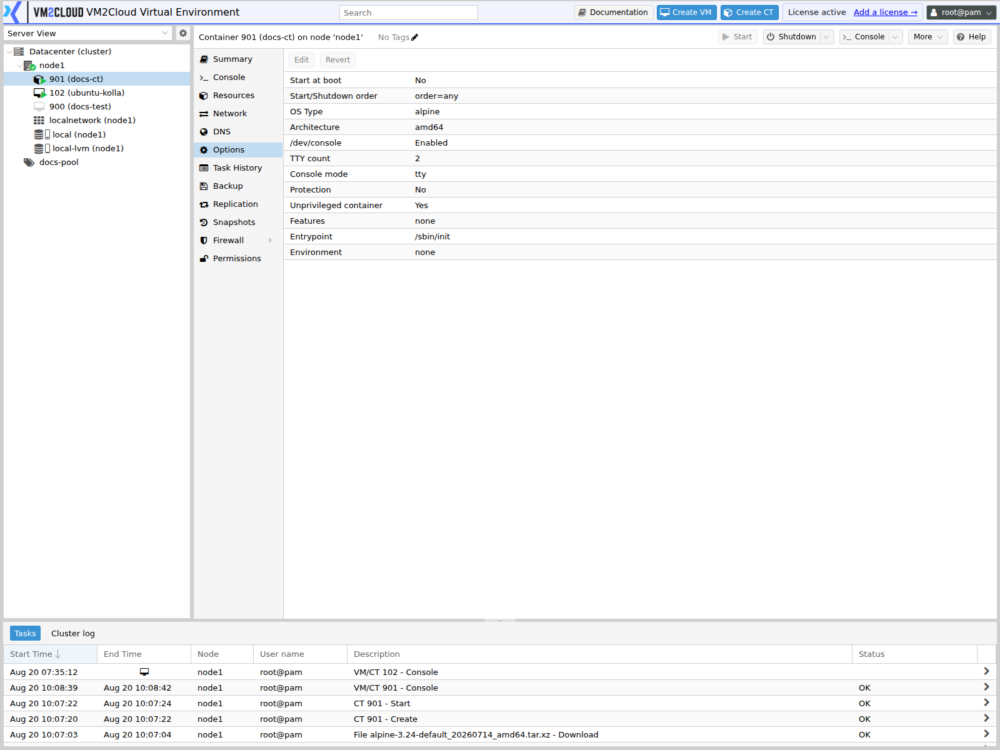
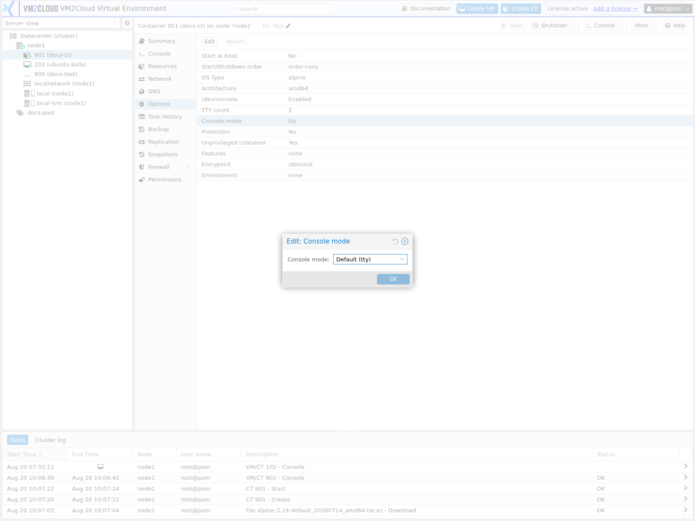

# Container Options

---

## Overview

The **Options** tab holds per-container settings that control how a container behaves — whether it starts with the node, how it is sequenced against other guests, its console mode, and its privilege and feature settings.

These are distinct from **Resources**, which defines how much CPU, memory, and disk the container has. Options define how it behaves.

Containers share fewer settings with virtual machines than their tab lists suggest. There is no BIOS, no boot device order, and no guest agent — a container has no separate operating system to run one. In exchange, containers expose privilege and feature settings that virtual machines do not need.

For the virtual machine equivalent, see [VM Options](../04-Virtual-Machines/VM-Options.md).

---

## When to Use

Open the Options tab when you need to:

* Make a container start automatically when its node boots.
* Control startup and shutdown ordering against other guests.
* Protect a container from accidental deletion.
* Change the hostname.
* Enable features such as nesting or specific mount types.
* Change the console mode.
* Check whether a container is privileged or unprivileged.

---

## Prerequisites

Before changing options, ensure that:

* You have administrator privileges, or permissions on the container.
* You know whether the setting requires a restart.
* You understand the security implications of any feature you enable.
* You have a maintenance window if a restart is needed.

---

# Procedure

## Step 1: Open the Options Tab

1. Log in to the VM2Cloud VE web interface.
2. Expand the node in the resource tree.
3. Select the container.
4. Click **Options**.

The settings are listed with their current values.

---

### Screenshot 1

**Container Options Tab**



A **Key / Value** table with a single **Edit** control — hostname, start at boot, OS type,
console mode, protection, unprivileged flag, and features.

---

## Step 2: Edit a Setting

1. Select the setting.
2. Click **Edit**.
3. Change the value.
4. Click **OK**.

---

### Screenshot 2

**Editing a Container Option**



As with machines, each option opens its own dialog.

---

## Step 3: Configure Start at Boot

1. Select **Start at boot**.
2. Click **Edit**.
3. Tick to enable.
4. Click **OK**.

Without this, the container stays stopped after a node restart until someone starts it manually.

---

## Step 4: Configure Start/Shutdown Order

1. Select **Start/Shutdown order**.
2. Click **Edit**.
3. Set:
   - **Order** — lower numbers start first and shut down last.
   - **Startup delay** — seconds to wait before starting the next guest.
   - **Shutdown timeout** — seconds to wait for a clean shutdown before forcing it.
4. Click **OK**.

Ordering is shared between containers and virtual machines on the same node — they are sequenced together, not separately. A container running a database and a VM running the application that uses it will be ordered against each other by these numbers.

---

### Screenshot 3

**Start and Shutdown Order**

```text
[ Place Screenshot Here ]
```

> **Capture:** The Start/Shutdown order edit dialog on a container, showing Order,
> Startup delay, and Shutdown timeout.

---

## Step 5: Review the Privilege Setting

Whether a container is **unprivileged** is decided at creation and shown here.

An unprivileged container maps its root user to an unprivileged user on the host, so a process escaping the container does not gain host root. A privileged container does not have that protection.

> **Warning:** Privileged containers offer substantially weaker isolation from the host than unprivileged ones. Use unprivileged containers unless a specific workload genuinely requires privilege, and never run untrusted workloads in a privileged container.

This setting cannot normally be changed after creation. To convert, back up the container, create a new one with the desired setting, and restore into it.

> **Verify:** Confirm whether the unprivileged setting is displayed as read-only on the
> Options tab in this deployment.

---

## Step 6: Configure Features

Features grant capabilities the container would not otherwise have.

1. Select **Features**.
2. Click **Edit**.
3. Enable only what the workload requires.
4. Click **OK**.
5. Restart the container.

| Feature | Purpose | Consideration |
|---|---|---|
| **Nesting** | Allows containers or similar workloads to run inside this container. | Needed for some workloads; increases attack surface. |
| **NFS** | Allows mounting NFS shares from inside the container. | |
| **CIFS** | Allows mounting CIFS/SMB shares from inside the container. | |
| **FUSE** | Allows FUSE filesystems inside the container. | |
| **Create Device Nodes** | Allows the container to create device nodes. | Weakens isolation. |

> **Warning:** Each enabled feature widens what a process inside the container can do. Enable only what is required, and be more conservative with privileged containers, where the isolation boundary is already weaker.

---

### Screenshot 4

**Container Features**

```text
[ Place Screenshot Here ]
```

> **Capture:** The Features edit dialog on a container, showing all available feature
> checkboxes.

---

## Step 7: Enable Protection

1. Select **Protection**.
2. Click **Edit**.
3. Tick to enable.
4. Click **OK**.

The container and its disks cannot be removed while protection is on.

---

# Configuration / Options

| Option | Description | Applies |
|---|---|---|
| **Hostname** | The container's hostname. | Next start |
| **Start at boot** | Start automatically when the node boots. | Next node boot |
| **Start/Shutdown order** | Order, startup delay, and shutdown timeout. Shared sequencing with VMs on the node. | Next node boot or shutdown |
| **OS Type** | Guest distribution type. Set at creation from the template. | Next start |
| **Architecture** | Container architecture. | Next start |
| **/dev/console** | Whether a console device is provided. | Next start |
| **TTY count** | Number of terminals available to the container. | Next start |
| **Console mode** | How console access is presented — for example shell or tty. | Next start |
| **Protection** | Blocks deletion of the container and its disks. | Immediately |
| **Unprivileged container** | Whether root inside the container maps to an unprivileged host user. Set at creation. | Read-only |
| **Features** | Nesting, NFS, CIFS, FUSE, device node creation. | Next start |

> **Verify:** Capture the complete container Options list and confirm the exact setting
> names, defaults, and which are present in this deployment.

---

# How This Differs From VM Options

| | Container | Virtual Machine |
|---|---|---|
| Boot device order | Not applicable | Configurable |
| BIOS / UEFI | Not applicable | Configurable |
| Guest agent | Not applicable | QEMU Guest Agent |
| Privilege model | Privileged or unprivileged | Not applicable |
| Features | Nesting, NFS, CIFS, FUSE | Not applicable |
| Hotplug | Not applicable | Configurable |
| Start at boot | Yes | Yes |
| Start/shutdown order | Yes, shared sequencing | Yes, shared sequencing |
| Protection | Yes | Yes |

A container boots by starting a process, not by running firmware, which is why there is nothing to configure about boot devices.

---

# Verification

Verify the following:

* The Options list shows the intended values.
* After a node reboot, containers with **Start at boot** enabled came up.
* Guests started in the intended order, with dependencies available first.
* The hostname inside the container matches the setting after a restart.
* A protected container cannot be deleted while protection is on.
* Enabled features work as required inside the container.
* Console access works after any console mode change.

Test start ordering with a real node reboot during a maintenance window.

---

# Common Issues

| Issue | Resolution |
|-------|------------|
| Change had no effect | Most options apply at next start. Restart the container. |
| Container did not start after node reboot | **Start at boot** is disabled. |
| Guests started in the wrong order | Check order numbers and delays. Containers and VMs share one sequence on the node. |
| Cannot mount an NFS or CIFS share inside | The matching feature is not enabled. Enable it and restart. |
| Nested workload will not run | **Nesting** is not enabled. |
| Cannot delete the container | **Protection** is enabled. Disable it first. |
| Cannot change unprivileged setting | It is fixed at creation. Back up, create a new container, and restore into it. |
| Hostname unchanged inside the container | Restart required, or the guest is overriding it internally. |
| Console unusable after a change | Check the console mode and TTY count settings. |
| A feature will not enable | Some features are restricted on unprivileged containers. Check the requirement against the privilege model. |

---

# Best Practices

- Enable **Start at boot** on every production container.
- Set start order deliberately, remembering containers and VMs share one sequence per node.
- Give dependencies a startup delay long enough to become *ready*, not merely started.
- Use **unprivileged** containers by default. Choose privileged only for a specific, justified requirement.
- Enable the minimum set of features the workload needs, and no more.
- Enable **Protection** on containers that would be painful to lose.
- Restart after changing features, and verify the workload still behaves.
- Never run untrusted workloads in a privileged container.
- Record why any non-default feature or privilege setting was chosen.

---

# Related Documentation

- [Manage Container](Manage-Container.md)
- [Manage Container Resources](Manage-Container-Resources.md)
- [Create Container](Create-Container.md)
- [Container Console](Container-Console.md)
- [CT Snapshots](CT-Snapshots.md)
- [Container Firewall](CT-Firewall.md)
- [Backup and Restore Container](Backup-and-Restore-Container.md)
- [Container Troubleshooting](Container-Troubleshooting.md)
- [VM Options](../04-Virtual-Machines/VM-Options.md)

---

# Summary

The container Options tab controls behaviour rather than resources — automatic startup, start and shutdown sequencing, hostname, console, protection, and the feature set. Most settings apply at the next start.

Two are security decisions rather than convenience ones. The **unprivileged** setting determines whether root inside the container maps to an unprivileged user on the host, and it is fixed at creation — converting requires a backup and restore into a new container. **Features** each widen what a process inside the container can do, so enable only what the workload genuinely needs.
