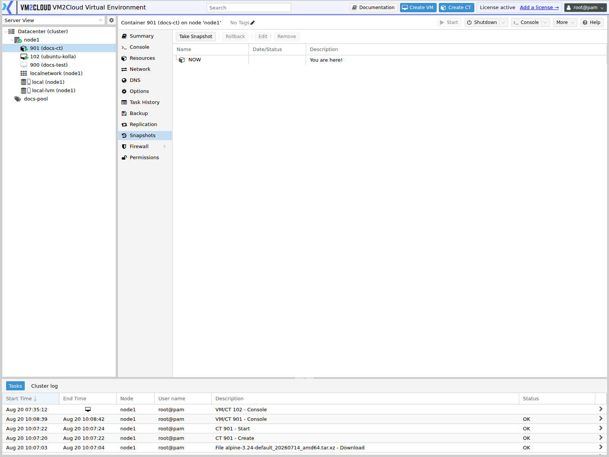

# Container Snapshots

---

## Overview

A **snapshot** captures the state of a container at a point in time so you can return to it later.

Snapshots are the fastest way to make a change reversible. Take one before an upgrade or a configuration change, and if it goes wrong, roll back in seconds rather than restoring from backup.

The Snapshots tab is available on every container, alongside the equivalent for virtual machines. See [VM Snapshots](../04-Virtual-Machines/VM-Snapshots.md).

### Snapshots are not backups

This distinction matters, and getting it wrong loses data.

| | Snapshot | [Backup](Backup-and-Restore-Container.md) |
|---|---|---|
| Stored | On the same storage as the container | On separate backup storage |
| Survives storage failure | **No** | Yes |
| Survives container deletion | **No** | Yes |
| Speed | Seconds | Minutes to hours |
| Intended for | Short-term, reversible changes | Long-term recovery |

A snapshot depends on the container's own disk. If that storage fails, the container and all its snapshots are lost together. Snapshots are a convenience for change management, not a protection strategy.

> **Warning:** Never rely on snapshots as your only protection. Use scheduled [backup jobs](../02-Datacenter/Backup/Backup-Jobs-Overview.md) for recovery.

### How container snapshots differ from VM snapshots

Containers have no RAM-state option. A virtual machine snapshot can optionally include memory, allowing a rollback to a running state. A container snapshot captures the filesystem and configuration only — rolling back always returns the container to a stopped or freshly started state rather than to a running process state.

---

## When to Use

Take a snapshot before:

* Upgrading packages or the application inside the container.
* Editing configuration you might need to undo.
* Testing a change you expect to reverse.
* Any operation where "undo" would be valuable.

Do **not** use snapshots for:

* Long-term retention — use backups.
* Protection against storage failure — use backups.
* Keeping many restore points indefinitely — snapshots consume space and degrade performance.

---

## Prerequisites

Before taking a snapshot, ensure that:

* You have administrator privileges, or permissions on the container.
* The container's storage supports snapshots. ZFS and LVM-Thin do; plain directory storage generally does not.
* Sufficient free space exists on that storage — a snapshot grows as the container's data diverges from it.
* You know whether the container should be running or stopped.

> **Verify:** Confirm which storage types in this deployment support container snapshots.

---

# Procedure

## Step 1: Open the Snapshots Tab

1. Log in to the VM2Cloud VE web interface.
2. Expand the node in the resource tree.
3. Select the container.
4. Click **Snapshots**.

Existing snapshots are listed, with the current state shown at the bottom of the tree.

---

### Screenshot 1

**Container Snapshots Tab**



Snapshots taken of this container, with **Take Snapshot**, **Rollback**, and **Remove**.
Empty until the first snapshot.

---

## Step 2: Take a Snapshot

1. Click **Take Snapshot**.
2. In **Name**, enter a descriptive identifier such as `before-php8-upgrade`.
3. In **Description**, record what you are about to change and why.
4. Click **Take Snapshot**.

The task runs and the snapshot appears in the list.

Name snapshots after the change you are about to make, not the date. `before-php8-upgrade` tells you what it is; `snapshot-3` does not.

---

### Screenshot 2

**Take Snapshot Dialog**

```text
[ Place Screenshot Here ]
```

> **Capture:** The Take Snapshot dialog on a container, showing the Name and Description
> fields.

---

### Screenshot 3

**Snapshot Created**

```text
[ Place Screenshot Here ]
```

> **Capture:** The container Snapshots tab showing a created snapshot in the list
> alongside the NOW state.

---

## Step 3: Make Your Change

Perform the upgrade or configuration change. Verify whether it worked.

If it succeeded, remove the snapshot once you are confident — see Step 5. If it failed, roll back.

---

## Step 4: Roll Back

Returns the container to the captured state.

1. Select the snapshot.
2. Click **Rollback**.
3. Review the confirmation.
4. Confirm.

The container is restored to the snapshot's state.

> **Warning:** Rolling back discards **every change made since the snapshot was taken** — files written, database rows added, log entries, package updates. This cannot be undone. If the container has been in use since the snapshot, that work is lost. Take a fresh snapshot or a backup before rolling back if you may need the current state.

> **Verify:** Confirm whether the container must be stopped before rollback, or whether
> VM2Cloud VE stops it automatically as part of the operation.

---

### Screenshot 4

**Rollback Confirmation**

```text
[ Place Screenshot Here ]
```

> **Capture:** The rollback confirmation dialog, showing the warning text presented to
> the administrator.

---

### Screenshot 5

**Rollback Complete**

```text
[ Place Screenshot Here ]
```

> **Capture:** The task output of a completed container snapshot rollback.

---

## Step 5: Remove a Snapshot

1. Select the snapshot.
2. Click **Remove**.
3. Confirm.

Removing a snapshot does not affect the container's current state. It only discards the ability to return to that point, and frees the space the snapshot was consuming.

Delete snapshots once the change they protected is confirmed good. Snapshots left indefinitely consume increasing space and can slow storage performance.

---

### Screenshot 6

**Removing a Snapshot**

```text
[ Place Screenshot Here ]
```

> **Capture:** The confirmation dialog when removing a container snapshot.

---

# Configuration / Options

| Option | Description |
|---|---|
| **Name** | Identifier for the snapshot. Use the change it protects, not a date. |
| **Description** | Free text. Record what you were about to change and why. |

Containers have no RAM-state option; see the comparison above.

> **Verify:** Confirm the exact field labels in the Take Snapshot dialog for containers,
> and whether any options exist beyond Name and Description.

---

# How Snapshots Consume Space

A snapshot does not copy the container's disk. It records the state at that moment, and as the container writes new data, the storage keeps both the old blocks the snapshot needs and the new ones.

The practical consequences:

* A fresh snapshot takes almost no space.
* It grows as the container diverges from it.
* A snapshot on a busy container can grow quickly.
* Several snapshots on one container multiply the effect.
* Deleting a snapshot frees the blocks only it was holding.

This is why old snapshots are a storage risk. A snapshot taken "just in case" six months ago on an active container may now be holding a large amount of superseded data.

---

# Verification

Verify the following:

* The snapshot appears in the Snapshots list with the intended name.
* The description records what the snapshot protects.
* The container continues running normally after the snapshot.
* Free space on the container's storage is sufficient.
* After a rollback, the container starts and the application behaves as it did at snapshot time.
* After removing a snapshot, storage space is released.

Test rollback on a non-production container before relying on it.

---

# Common Issues

| Issue | Resolution |
|-------|------------|
| **Take Snapshot** unavailable | The container's storage does not support snapshots. Directory storage generally cannot. Move the container to ZFS or LVM-Thin. |
| Snapshot fails for space | Insufficient free space on the container's storage. Free space or remove old snapshots. |
| Storage filling unexpectedly | Old snapshots are holding superseded data. Review and remove ones no longer needed. |
| Rollback lost recent work | Expected. Rollback discards everything since the snapshot. Take a backup before rolling back. |
| Container will not start after rollback | Check the task log. The snapshot may predate a configuration change the container now depends on. |
| Snapshots gone after migration | Snapshot support depends on the target storage. Confirm the destination supports them before migrating. |
| Cannot remove a snapshot | Another operation may be running on the container. Wait and retry. |
| Performance degraded | Too many snapshots retained. Remove ones no longer needed. |

---

# Best Practices

- Take a snapshot immediately before any risky change, and remove it once the change is confirmed.
- Name snapshots after the change, not the date.
- Use the description field. Future you will not remember.
- Keep few snapshots and keep them briefly. They are a short-term tool.
- Review snapshots monthly and remove ones that are no longer needed.
- Never substitute snapshots for [backup jobs](../02-Datacenter/Backup/Backup-Jobs-Overview.md).
- Take a backup before rolling back if the container has been in use since the snapshot.
- Watch free space on snapshot-capable storage.
- Confirm the target storage supports snapshots before migrating a container that has them.
- Test rollback on a non-production container first.

---

# Related Documentation

- [VM Snapshots](../04-Virtual-Machines/VM-Snapshots.md)
- [Backup and Restore Container](Backup-and-Restore-Container.md)
- [Backup Jobs Overview](../02-Datacenter/Backup/Backup-Jobs-Overview.md)
- [Manage Container](Manage-Container.md)
- [Manage Container Resources](Manage-Container-Resources.md)
- [Migrate Container](Migrate-Container.md)
- [Container Troubleshooting](Container-Troubleshooting.md)
- [Storage Types](../02-Datacenter/Storage/Storage-Types.md)

---

# Summary

Container snapshots capture the filesystem and configuration at a point in time, making a change reversible in seconds. Unlike virtual machine snapshots, they never include RAM state, so a rollback returns the container to a stopped or freshly started state rather than a running one.

Snapshots live on the same storage as the container, so they do not survive storage failure or container deletion — they are a change-management convenience, not a protection strategy. Take one before a risky change, remove it once the change is confirmed, and rely on scheduled backup jobs for actual recovery.
