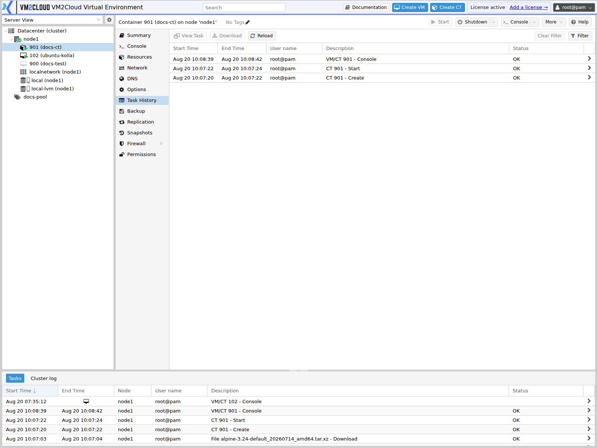

# Container Task History

---

## Overview

The **Task History** tab lists operations performed on this container — starts, stops, migrations, backups, snapshots, configuration changes — with who ran each one, when, and whether it succeeded.

It is the first place to look when something happened to a container and you need to know what, when, and who.

The node-level [Task History](../03-Nodes/Task-History.md) shows the same information for everything on a node. This tab filters it to one container.

For the virtual machine equivalent, see [VM Task History](../04-Virtual-Machines/VM-Task-History.md). The two behave identically; only the scope differs.

---

## When to Use

Open Task History when you need to:

* Find out why a container stopped or restarted.
* Confirm a backup or snapshot ran.
* See who performed an operation.
* Read the output of a failed task.
* Confirm a migration completed.
* Establish a timeline after an incident.

---

## Prerequisites

* You have permission to view the container.
* The container exists on a node that is online. Task history is stored per node.

---

# Procedure

## Step 1: Open the Task History Tab

1. Log in to the VM2Cloud VE web interface.
2. Expand the node in the resource tree.
3. Select the container.
4. Click **Task History**.

Tasks are listed with the most recent first.

---

### Screenshot 1

**Container Task History Tab**



The task list filtered to this container.

---

## Step 2: Read the Task List

| Column | Meaning |
|---|---|
| **Start Time** | When the task began. |
| **End Time** | When it finished. Empty while still running. |
| **Node** | The node the task ran on. |
| **User name** | The account that initiated it. |
| **Description** | What the task did, for example `CT 101 - Start`. |
| **Status** | `OK` for success, or an error message. |

---

## Step 3: Open a Task to See Its Output

1. Double-click the task, or select it and open it.
2. Read the **Output** tab for the full log.
3. Check the **Status** tab for the result.

The status column tells you a task failed. The output tells you why.

---

### Screenshot 2

**Task Output**

```text
[ Place Screenshot Here ]
```

> **Capture:** A task detail window opened from container Task History, showing the
> Output tab with log lines.

---

## Step 4: Investigate a Timeline

1. Find the last known-good point.
2. Read forward through the tasks in order.
3. Note who ran each one.
4. Look for a failed task immediately before the symptom appeared.
5. Cross-check the node-level [Task History](../03-Nodes/Task-History.md) for events affecting the whole node.

A container that stopped with no corresponding stop task was not stopped through the interface. Look at the node — a reboot, an HA action, or a host problem will not appear here as a deliberate stop.

Containers can also be stopped by the host for exceeding resource limits. If a container stops repeatedly with nothing in its task history, check its memory limit and swap usage on [CT Summary](CT-Summary.md) and the node's system log.

---

# Configuration / Options

Task History is a read-only view.

| Control | Purpose |
|---|---|
| **Task filter** | Narrow the list by task type or status. |
| **Refresh** | Reload the list. |
| Opening a task | Show its full output and result. |

> **Verify:** Capture the container Task History tab and confirm the available filter
> controls and the retention period in this deployment.

---

# Verification

Verify the following:

* Recent operations you performed appear in the list.
* Scheduled backups affecting this container appear.
* Task status matches what you expect.
* Failed tasks show usable output.
* The user shown matches who performed the operation.
* Timestamps align with when events occurred.

---

# Common Issues

| Issue | Resolution |
|-------|------------|
| A task is missing | It may have run against the node. Check the node's [Task History](../03-Nodes/Task-History.md). |
| History is shorter than expected | Task history is retained per node and rotates. |
| Container stopped with no stop task | Not stopped through the interface. Check the node history, and check whether it exceeded a resource limit. |
| Container restarts repeatedly with no tasks | Likely a resource limit or a failing process inside. Check [CT Summary](CT-Summary.md) and the node system log. |
| Task shows an error with no detail | Open the task and read the Output tab. |
| Timestamps look wrong | Node time may be out of sync. See [Time and NTP](../03-Nodes/System/Time-and-NTP.md). |
| History empty after migration | Task history stays on the node the task ran on. Check the previous node. |
| Cannot see the tab | Confirm you have permission to view the container. |

---

# Best Practices

- Check Task History before assuming a container failed on its own.
- Read the task **output** rather than the status column when investigating.
- Cross-check the node history when the container history explains nothing.
- For repeated unexplained stops, check resource limits before looking further — containers are stopped by the host when they exceed them.
- Confirm scheduled backups appear here rather than trusting the job configuration.
- Keep node time synchronized so timelines are trustworthy.

---

# Related Documentation

- [Task History](../03-Nodes/Task-History.md) — node-level view
- [Task Log and Cluster Log](../01-Getting-Started/Task-Log-and-Cluster-Log.md)
- [CT Summary](CT-Summary.md)
- [Manage Container](Manage-Container.md)
- [Manage Container Resources](Manage-Container-Resources.md)
- [Container Troubleshooting](Container-Troubleshooting.md)
- [VM Task History](../04-Virtual-Machines/VM-Task-History.md)

---

# Summary

Task History lists every operation performed on a container, with the user, the time, and the result, and is the first place to look when establishing what happened.

Open the task itself rather than reading only the status column — the output holds the actual reason for a failure. And a container that stopped with no matching task was not stopped through the interface: check the node history, and check whether the container exceeded its memory limit, since the host stops containers that do.
