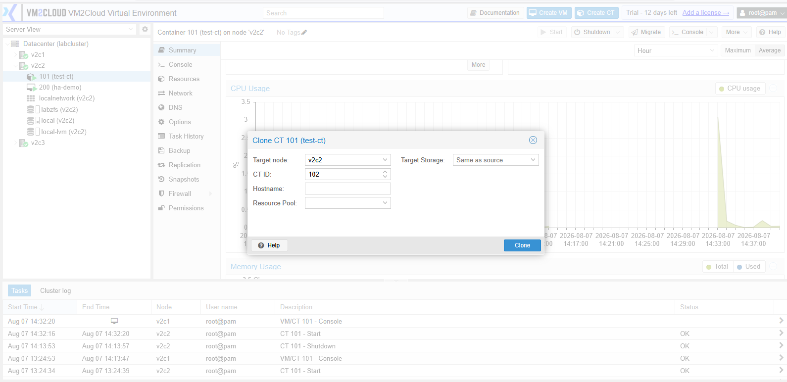
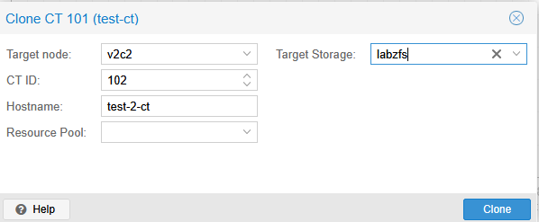
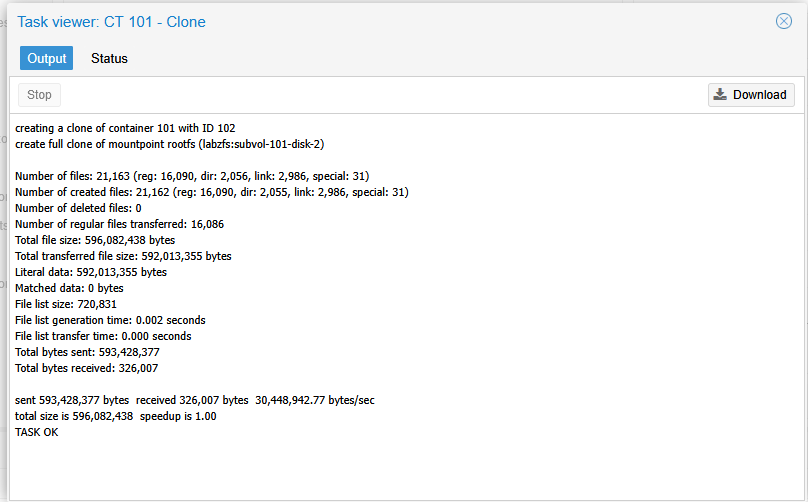
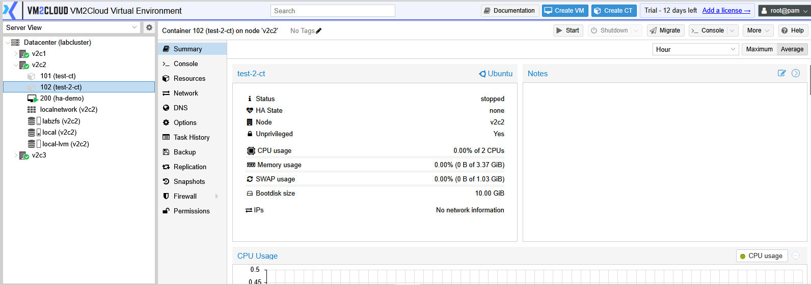

# Clone Container

---

## Overview

Cloning creates a copy of an existing container. The cloned container includes the same operating system, installed applications, configuration, and file system as the source container.

Cloning is commonly used to deploy multiple containers with similar configurations without repeating the entire setup process.

---

## When to Use

Clone a container when you need to:

* Deploy multiple containers with the same configuration.
* Create a testing or development environment.
* Duplicate an existing application server.
* Save time when deploying similar workloads.

---

## Prerequisites

Before cloning a container, ensure that:

* The source container exists.
* Sufficient storage space is available.
* You have permission to create containers.
* The container is in an appropriate state for cloning.

---

# Clone a Container

## Step 1: Select the Container

1. Log in to the VM2Cloud VE web interface.
2. Select the required node.
3. Select the container you want to clone.

---

---

## Step 2: Open the Clone Window

1. Click **More**.
2. Select **Clone**.

The Clone Container window opens.

---

---

## Step 3: Configure the Clone

Configure the required settings.

Typical options include:

* Target Node
* CT ID
* Hostname
* Target Storage
* Clone Mode (if available)

After reviewing the settings, click **Clone**.

---

---

## Step 4: Wait for Completion

The cloning task starts immediately.

Monitor the progress from **Recent Tasks**.

Once completed, the cloned container appears under the selected node.

---

---

# Verification

Verify that:

* The cloned container appears in the navigation panel.
* The new CT ID is correct.
* The hostname is correct.
* The cloning task completed successfully.
* The cloned container starts successfully.

---

# Common Issues

| Issue                       | Resolution                                                                  |
| --------------------------- | --------------------------------------------------------------------------- |
| Clone option is unavailable | Verify that you have permission to clone containers.                        |
| Clone task fails            | Confirm that sufficient storage space is available.                         |
| CT ID already exists        | Specify a unique Container ID.                                              |
| Target node is unavailable  | Verify that the selected node is online.                                    |
| Clone operation is slow     | Large containers may take longer to clone depending on storage performance. |

---

# Summary

Cloning allows administrators to quickly deploy new containers based on an existing one. This reduces deployment time and ensures consistent configurations across multiple Linux containers.
