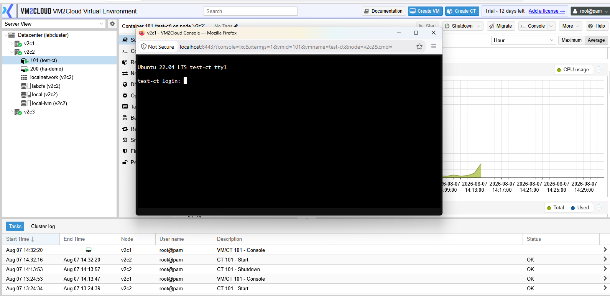
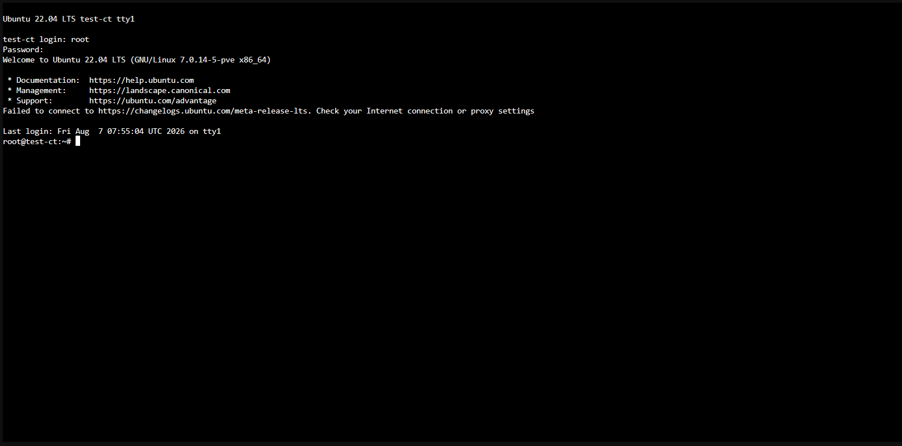
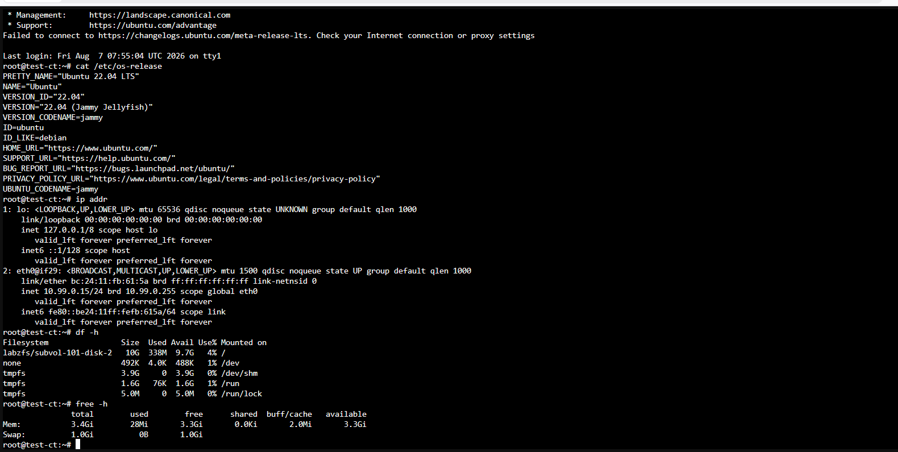

# Container Console

---

## Overview

The Container Console provides direct access to the command-line interface of a Linux container. It allows administrators to manage the container, execute commands, troubleshoot issues, and perform maintenance without using SSH.

The console is especially useful when configuring a newly created container or when network connectivity is unavailable.

---

## When to Use

Use the Container Console to:

* Access the container's command line.
* Configure the operating system.
* Install or update software packages.
* Troubleshoot system issues.
* Restart services.
* Perform routine administration tasks.

---

## Prerequisites

Before opening the console, ensure that:

* The container exists.
* The container is running.
* You have permission to access the container.

---

# Open the Container Console

## Step 1: Select the Container

1. Log in to the VM2Cloud VE web interface.
2. Select the required node.
3. Select the container.

---


---

## Step 2: Open the Console

1. Click **Console** from the container toolbar.

The console opens and displays the container's terminal.

---





---

# Use the Console

Once the console is open, you can perform administrative tasks inside the container.

Common tasks include:

* Log in as the root user.
* Install packages.
* Update the operating system.
* Create users.
* Configure networking.
* Manage services.
* View log files.

---





---

# Common Console Operations

The following are common examples of tasks performed from the console.

### Check the Operating System

```bash
cat /etc/os-release
```

---

### Check IP Address

```bash
ip addr
```

---

### Check Disk Usage

```bash
df -h
```

---

### Check Memory Usage

```bash
free -h
```

---

### Restart a Service

```bash
systemctl restart <service-name>
```

Example:

```bash
systemctl restart nginx
```

---

### Update Package Information (Ubuntu/Debian)

```bash
apt update
```

---





---

# Verification

Verify the following:

* The console opens successfully.
* The login prompt is displayed.
* Commands execute successfully.
* The expected command output is displayed.

---

# Common Issues

| Issue                 | Resolution                                                                              |
| --------------------- | --------------------------------------------------------------------------------------- |
| Console does not open | Verify that the container is running and that your account has permission to access it. |
| Login fails           | Confirm that the correct user credentials are being used.                               |
| Command not found     | Verify that the command is installed inside the container.                              |
| Console disconnects   | Refresh the browser and reopen the console.                                             |
| Permission denied     | Use an account with sufficient privileges or switch to the root user if appropriate.    |

---

# Summary

The Container Console provides direct command-line access to a running container, allowing administrators to perform configuration, maintenance, software installation, and troubleshooting without requiring an SSH connection.
