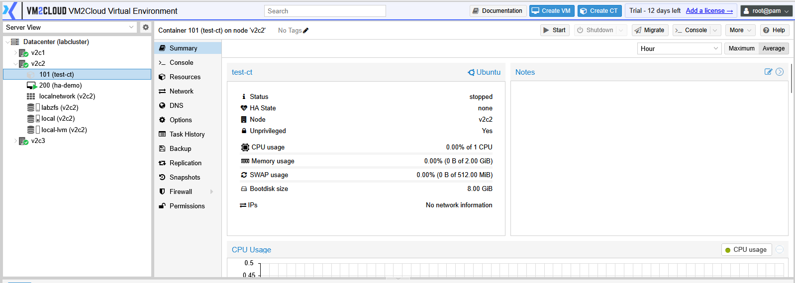
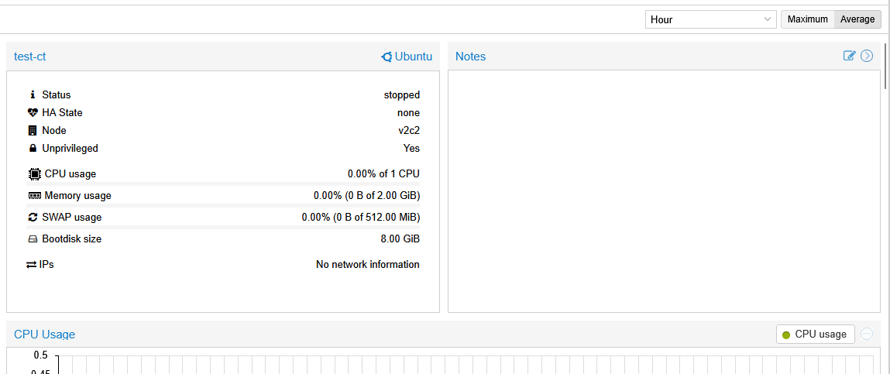
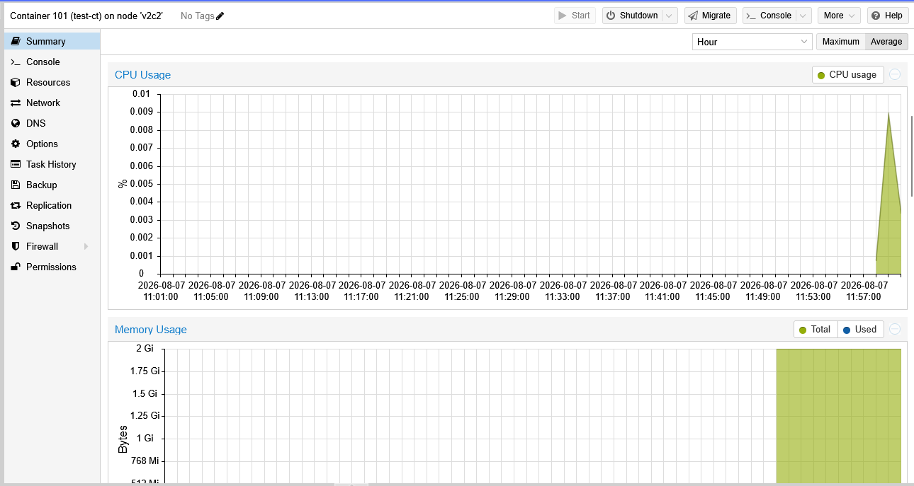
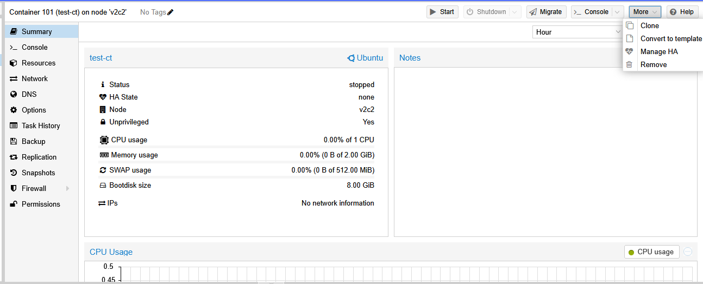
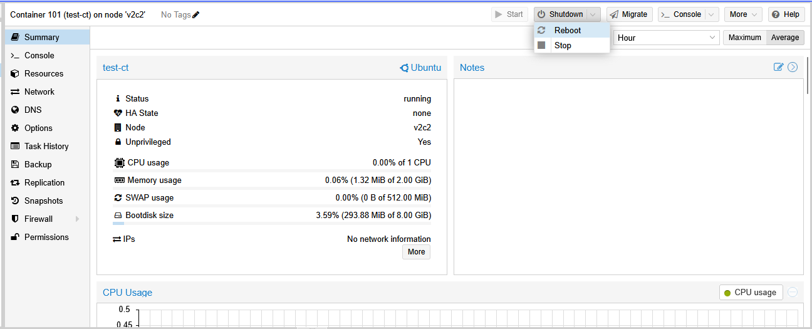
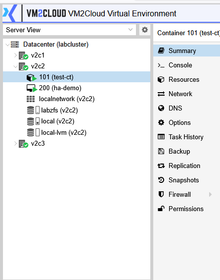

# Container Overview

---

## Overview

A Container (CT) is a lightweight virtualization technology that allows multiple isolated environments to run on a single VM2Cloud node while sharing the host operating system kernel. Unlike a Virtual Machine (VM), a container does not require its own kernel, making it faster to deploy and more efficient in resource usage.

Containers are commonly used to host applications, services, and development environments that require a Linux operating system.

---

## When to Use

Use a container when you need to:

* Deploy lightweight Linux workloads.
* Host web servers, databases, or application services.
* Create development or testing environments.
* Reduce resource consumption compared to a virtual machine.
* Start services quickly with minimal overhead.

> **Note:** Containers can run Linux operating systems only. If you need to run Windows or another operating system with its own kernel, create a Virtual Machine instead.

---

## Prerequisites

Before creating or managing a container, ensure that:

* A VM2Cloud node is available.
* Storage has been configured.
* A Linux Bridge or other network configuration is available.
* A Container Template has been downloaded or uploaded.
* You have permission to manage containers.

---

# Access Containers

To view existing containers:

1. Log in to the VM2Cloud web interface.
2. In the navigation panel, expand the required node.
3. Select the container.

If no containers exist, create one before continuing.

---

---

# Container Management Page

Selecting a container opens its management page.

Depending on your VM2Cloud configuration, the page provides tabs for monitoring resource usage, accessing the console, managing resources, configuring network settings, creating backups, and changing container settings.

---

---

# Common Container Information

The container management page displays information such as:

* Container ID (CT ID)
* Container Name
* Current Status
* Assigned Node
* CPU Allocation
* Memory Allocation
* Root File System
* Network Configuration
* Uptime

This information helps administrators quickly identify the container and review its current configuration.

---

---

# Available Actions

The toolbar at the top of the container page provides the actions available for managing the container.

Depending on the current state of the container, available actions may include:

* Start
* Shutdown
* Stop
* Reboot
* Console
* Clone
* Migrate
* Backup
* Snapshot
* Remove

The available actions may vary depending on the container status and your user permissions.

---

---

# Container Tabs

A container is managed through multiple tabs.

Common tabs include:

| Tab         | Description                                                       |
| ----------- | ----------------------------------------------------------------- |
| Summary     | Displays the current status and resource usage of the container.  |
| Console     | Opens the container console.                                      |
| Resources   | Displays CPU, memory, and storage configuration.                  |
| Network     | Displays the configured network interface.                        |
| Snapshots   | Used to create and manage snapshots.                              |
| Backup      | Displays backup information and allows backup-related operations. |
| Permissions | Displays user and permission settings for the container.          |

> **Note:** The available tabs may vary depending on your VM2Cloud version and configuration.

---

---

# Verification

Verify the following:

* The container appears under the selected node.
* The container management page opens successfully.
* The Summary page displays the container information.
* The available management tabs are visible.
* The management toolbar displays the available actions.

---

# Common Issues

| Issue                                   | Resolution                                                                          |
| --------------------------------------- | ----------------------------------------------------------------------------------- |
| Container is not visible                | Verify that the container exists and that your account has permission to access it. |
| Unable to open the container            | Confirm that the selected node is online and accessible.                            |
| Some management options are unavailable | Verify the current state of the container and your user permissions.                |
| Console cannot be opened                | Ensure the container is running before attempting to access the console.            |
| Resource information is missing         | Refresh the page and verify that the node is communicating normally.                |

---

# Summary

Containers provide a lightweight and efficient way to run Linux workloads in VM2Cloud. They share the host kernel while maintaining isolated environments, making them ideal for applications and services that require fast deployment and efficient resource utilization. The container management page provides centralized access to monitoring, resource management, backups, snapshots, networking, and console access.
