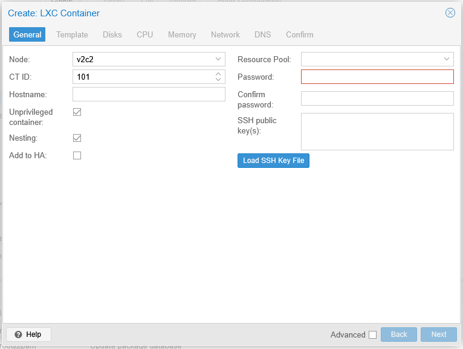
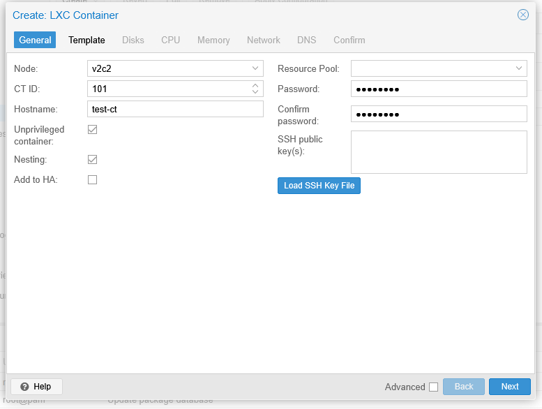
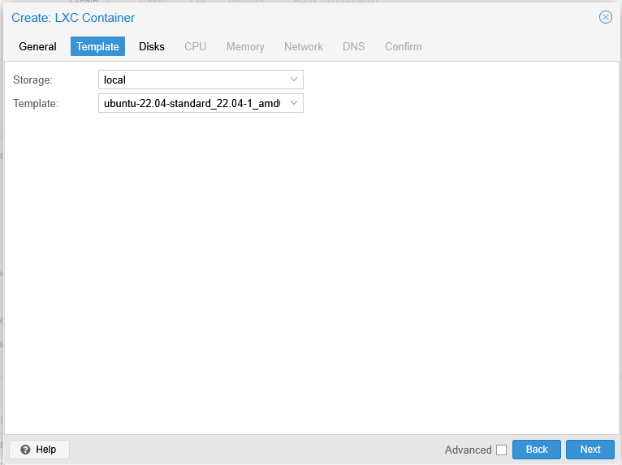
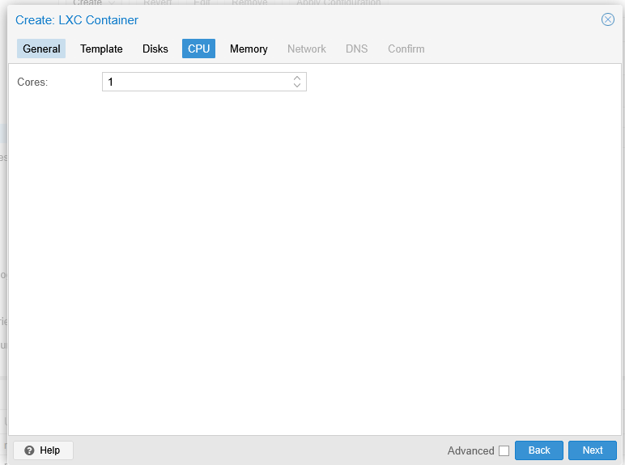
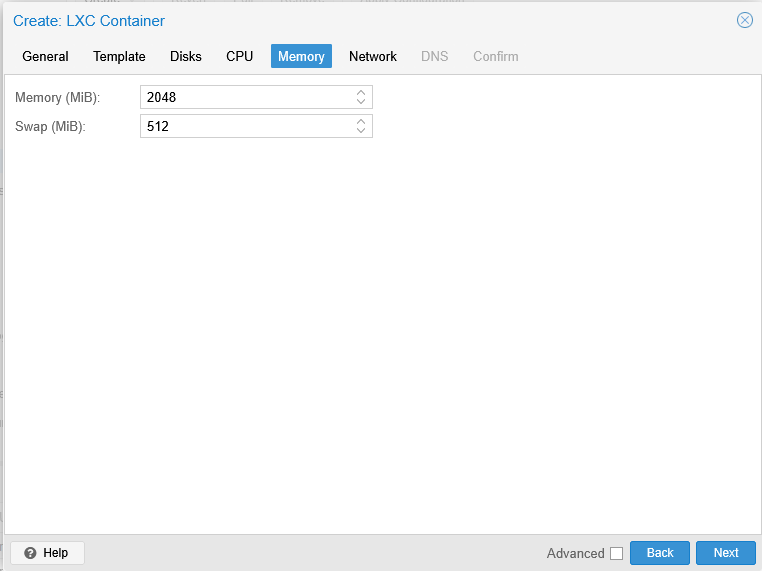
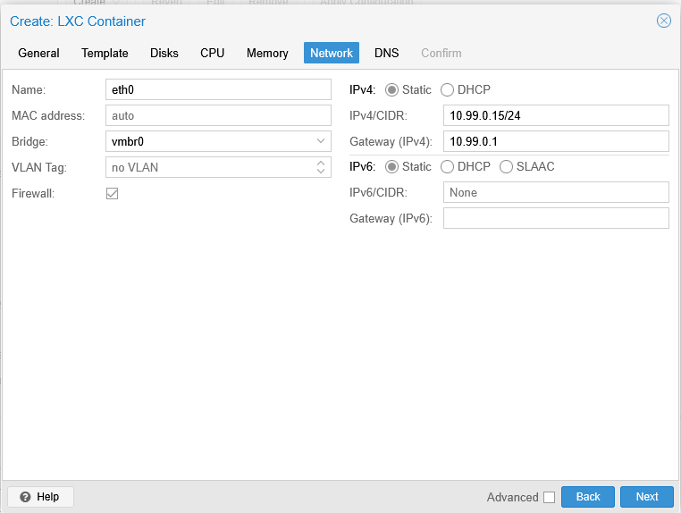
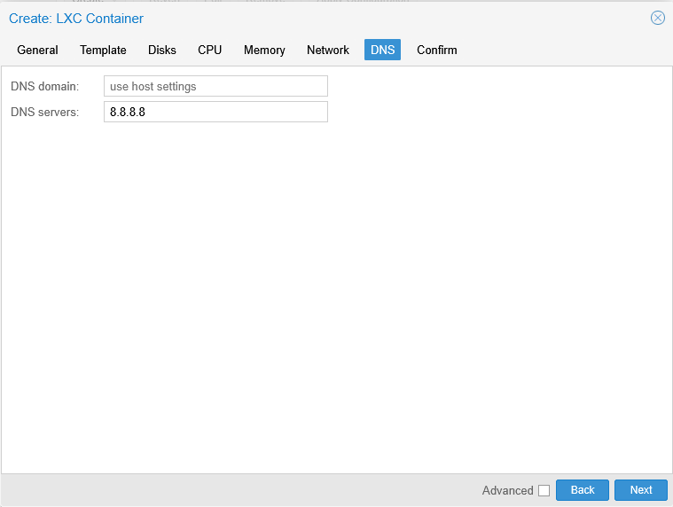

# Create Container

---

## Overview

A container is created using the **Create CT** wizard. During the creation process, you configure the container template, storage, root password, CPU, memory, network, and other basic settings required to deploy the container.

Once the wizard is completed, the container is added to the selected node and is ready to be started.

---

## When to Use

Create a container when you need to:

* Deploy a lightweight Linux environment.
* Host applications or services.
* Create development or testing environments.
* Run Linux workloads with minimal resource usage.

---

## Prerequisites

Before creating a container, ensure that:

* A VM2Cloud VE node is available.
* A container template is available on the selected storage.
* Storage has sufficient free space.
* A network bridge is available.
* You have permission to create containers.

---

# Create a Container

## Step 1: Open the Create Container Wizard

1. Log in to the VM2Cloud VE web interface.
2. Select the node where the container will be created.
3. Click **Create CT**.

The Create Container wizard opens.

---

---

## Step 2: General

Enter the basic container information.

| Field | What it does |
|---|---|
| **Node** | Which cluster node the container is created on. |
| **CT ID** | Unique numeric identifier. Shared with virtual machines, so no VM can hold the same number. |
| **Hostname** | The container's hostname, used inside the guest and in DNS. |
| **Password** / **Confirm password** | Root password inside the container. |
| **SSH public key** | Optional. Installs a key for root, so the container can be reached without a password. |
| **Resource Pool** | Optional. Places the container in a [pool](../02-Datacenter/Permissions/Pools.md) for permissions and pool-based backup selection. |
| **Unprivileged container** | Maps root inside the container to an unprivileged user on the host. |
| **Nesting** | Allows container-style workloads to run inside this container. |

> **Warning:** **Unprivileged container is decided here and cannot be changed later.** Converting afterwards means backing up, creating a new container, and restoring into it. Leave it enabled unless a specific workload requires privilege — a privileged container offers substantially weaker isolation from the host. See [Container Options](CT-Options.md).

Click **Next**.

---

---

## Step 3: Template

Select the container template.

| Field | What it does |
|---|---|
| **Storage** | Which storage holds the templates. Only storages with container-template content appear. |
| **Template** | The base image the container is built from. |

If the template list is empty, none have been downloaded yet — see [Manage Container Templates](Manage-Container-Templates.md).

The template determines the distribution inside the container. Unlike a virtual machine there is no installer: the container is created from this image and boots straight into a running system.

Click **Next**.

---

---

## Step 4: Disks

Configure the root disk.

Typical settings include:

* Storage
* Disk Size

Review the configuration and click **Next**.

---

---

## Step 5: CPU

Configure the CPU allocation.

Typical settings include:

* Cores
* CPU Limit (if required)

Click **Next**.

---

---

## Step 6: Memory

Configure the memory allocation.

Typical settings include:

* Memory
* Swap

Click **Next**.

---

---

## Step 7: Network

Configure the network interface.

Typical settings include:

* Bridge
* IPv4 Configuration
* IPv6 Configuration
* VLAN Tag (Optional)

Click **Next**.

---

---

## Step 8: DNS

Configure the DNS settings.

| Field | What it does |
|---|---|
| **DNS domain** | Search domain, so short names resolve. Leave empty to inherit the host's setting. |
| **DNS servers** | Nameservers the container uses. Leave empty to inherit the host's. |

Leaving both empty is the usual choice — the container then follows the node, and a nameserver change made once on the host applies everywhere. Set them explicitly only when this container must use different resolvers. See [CT DNS](CT-DNS.md).

Click **Next**.

---

---

## Step 9: Confirm

Review all configuration settings.

Verify:

* CT ID
* Hostname
* Template
* Storage
* Disk Size
* CPU
* Memory
* Network Configuration

Click **Finish** to create the container.

---

---

# Verification

After the wizard completes, verify that:

* The container appears under the selected node.
* The container status is displayed.
* The Summary page opens successfully.
* The configured CPU, memory, storage, and network settings are correct.

---

# Common Issues

| Issue                              | Resolution                                                             |
| ---------------------------------- | ---------------------------------------------------------------------- |
| No container template is available | Download or upload a container template before creating the container. |
| Insufficient storage               | Verify that the selected storage has enough free space.                |
| CT ID already exists               | Specify a unique Container ID.                                         |
| Network bridge is unavailable      | Verify that the required bridge exists and is active.                  |
| Finish button is unavailable       | Review the wizard for missing or invalid configuration values.         |

---

# Summary

The Create Container wizard provides a guided process for deploying Linux containers in VM2Cloud VE. By selecting a template and configuring storage, CPU, memory, and networking, administrators can quickly deploy lightweight workloads that are ready for use.
