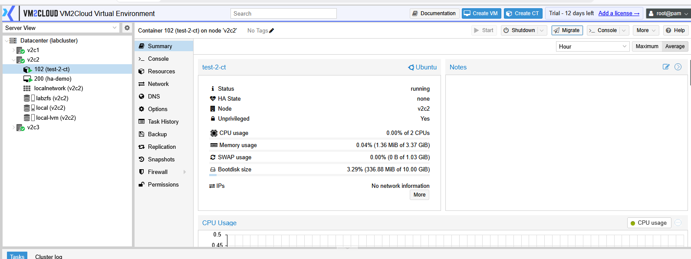
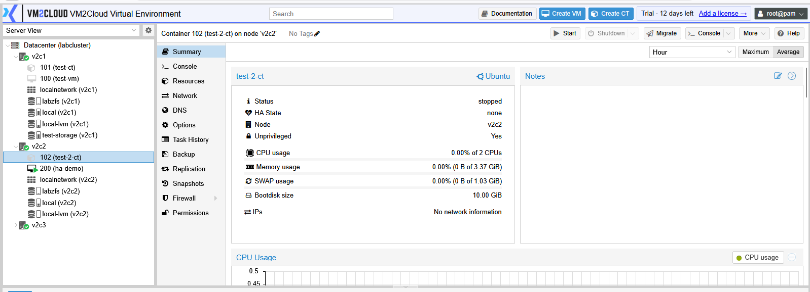
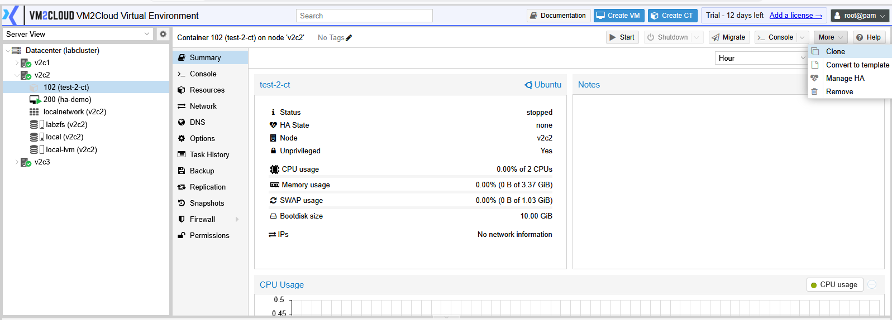
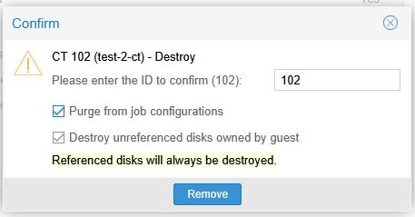
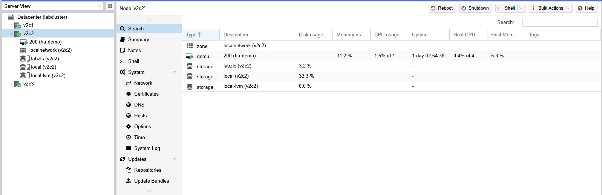

# Delete Container

---

## Overview

Deleting a container permanently removes it from VM2Cloud VE. Depending on the selected options, the container's root filesystem and associated data may also be deleted from storage.

This operation should only be performed when the container is no longer required.

> **Warning:** Deleting a container is irreversible if its storage is also removed. Ensure that a backup is available before proceeding.

---

## When to Use

Delete a container when you need to:

* Remove unused containers.
* Free storage resources.
* Clean up test or development environments.
* Remove containers that are no longer required.

---

## Prerequisites

Before deleting a container, ensure that:

* A backup has been created if the container needs to be recovered later.
* The container is no longer required.
* You have permission to delete containers.
* No critical applications are running inside the container.

---

# Delete a Container

## Step 1: Select the Container

1. Log in to the VM2Cloud VE web interface.
2. Select the required node.
3. Select the container.

---

---

## Step 2: Stop the Container

If the container is running:

1. Click **Shutdown** or **Stop**.
2. Wait until the container status changes to **Stopped**.

> **Note:** It is recommended to stop the container before deleting it to avoid unexpected issues.

---

---

## Step 3: Open the Remove Window

1. Click **More**.
2. Select **Remove**.

The Remove Container dialog opens.

---

---

## Step 4: Review the Removal Options

Review the available options before continuing.

Depending on your VM2Cloud VE configuration, you may see options such as:

* Remove Unreferenced Disks
* Purge Configuration

Select the required options.

---

---

## Step 5: Confirm the Deletion

1. Verify that the correct container has been selected.
2. Review the warning message.
3. Click **Remove**.

Wait for the removal task to complete.

---

---

# Verification

Verify the following after the deletion:

* The container no longer appears under the selected node.
* The removal task completed successfully.
* Associated storage has been removed if the corresponding option was selected.
* The released resources are available for reuse.

---

# Common Issues

| Issue                                  | Resolution                                                                                |
| -------------------------------------- | ----------------------------------------------------------------------------------------- |
| Remove option is unavailable           | Verify that your account has permission to delete containers.                             |
| Container cannot be removed            | Ensure that no backup, migration, snapshot, or other task is currently running.           |
| Storage was not deleted                | Verify whether the storage removal option was selected during the deletion process.       |
| Removal task fails                     | Review the **Recent Tasks** for detailed error information before retrying the operation. |
| Container still appears after deletion | Refresh the interface and verify that the removal task completed successfully.            |

---

# Summary

Deleting a container permanently removes it from VM2Cloud VE. Before proceeding, verify that the container is no longer required and that a backup has been created if the data must be retained. Review the removal options carefully to ensure that storage is deleted only when intended.
