# Manage Container Resources

---

## Overview

The **Resources** page allows you to view and manage the resources assigned to a container. From this page, you can modify CPU, memory, swap, root disk, mount points, and startup settings to meet the workload requirements of the container.

Changes made to the container resources take effect immediately or after the container is restarted, depending on the resource being modified.

---

## When to Use

Use the **Resources** page when you need to:

* Increase or decrease CPU resources.
* Modify memory allocation.
* Change swap size.
* Resize the root disk.
* Add or remove mount points.
* Configure startup and shutdown behavior.

---

## Prerequisites

Before modifying container resources, ensure that:

* The container exists.
* You have permission to manage containers.
* Some changes may require the container to be stopped.

---

# Access the Resources Page

1. Log in to the VM2Cloud VE web interface.
2. Select the required node.
3. Select the container.
4. Click **Resources**.

The Resources page displays all resources assigned to the container.

---

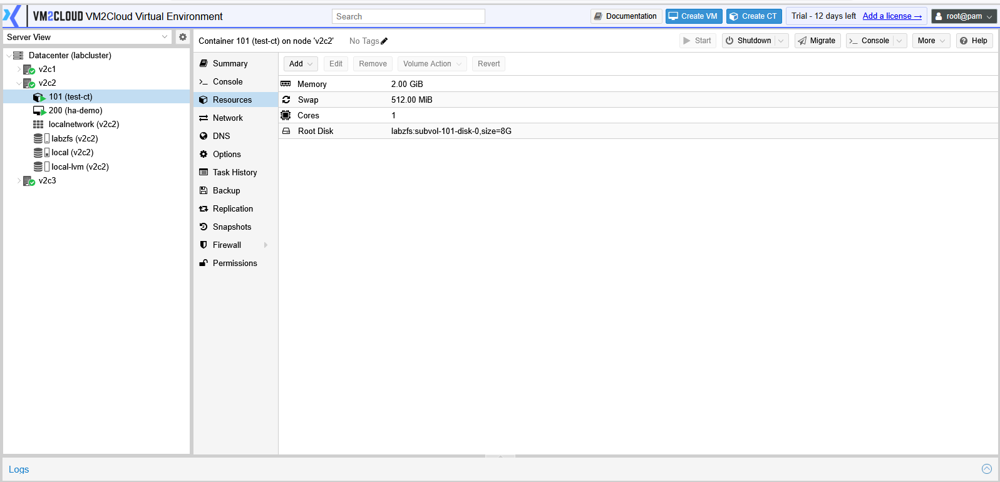

---

# Modify CPU

1. Select **CPU Limit** or **CPU Cores**.
2. Click **Edit**.
3. Update the required value.
4. Click **OK**.

---

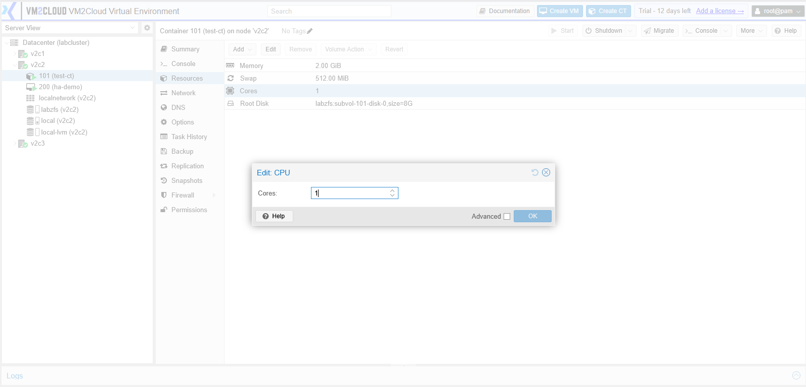
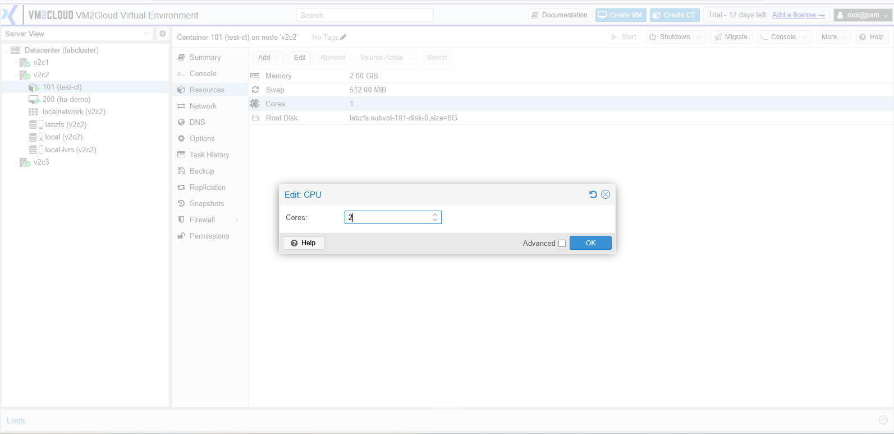

---

# Modify Memory

1. Select **Memory**.
2. Click **Edit**.
3. Enter the required memory size.
4. Click **OK**.

---

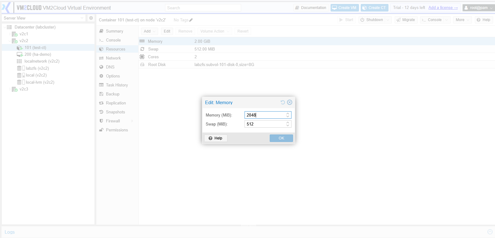
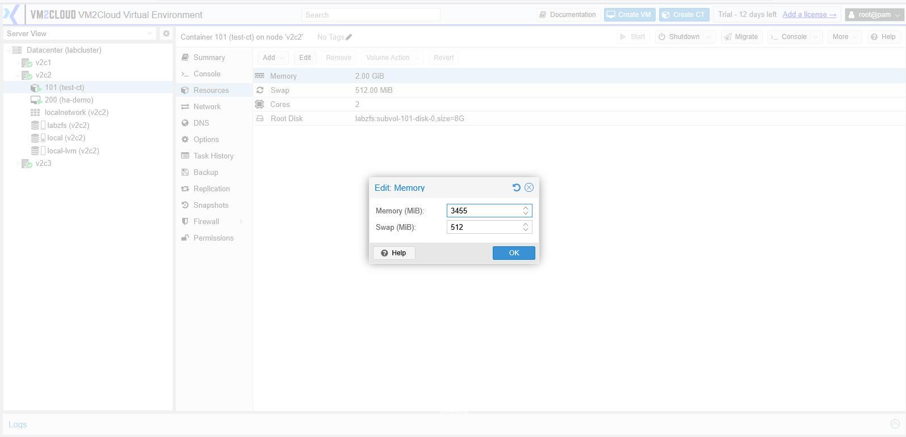

---

# Modify Swap

1. Select **Swap**.
2. Click **Edit**.
3. Enter the required swap size.
4. Click **OK**.

---

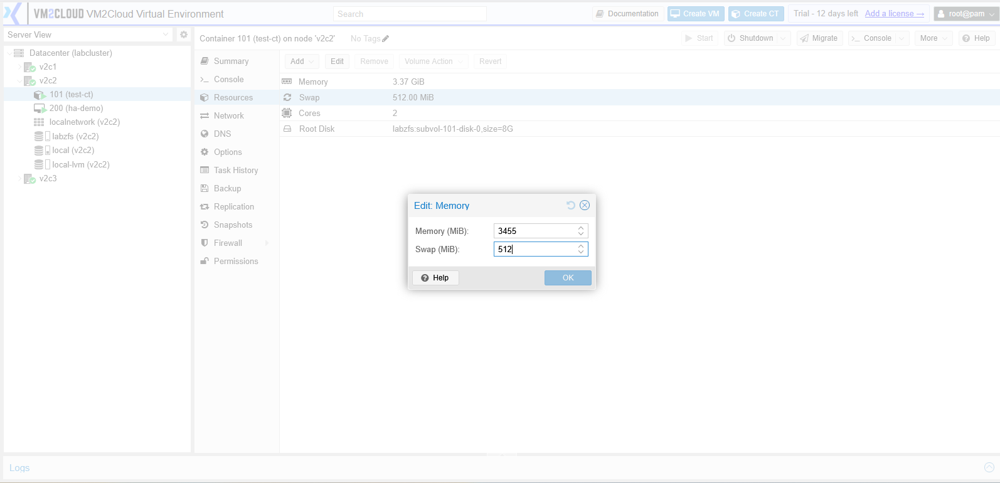

---

# Resize the Root Disk

> **Note:** The root disk can only be increased. Reducing the disk size is not supported.

1. Select **Root Disk**.
2. Click **Volume Action**.
3. Select **Resize**.
4. Enter the additional disk size.
5. Click **Resize Volume**.

---

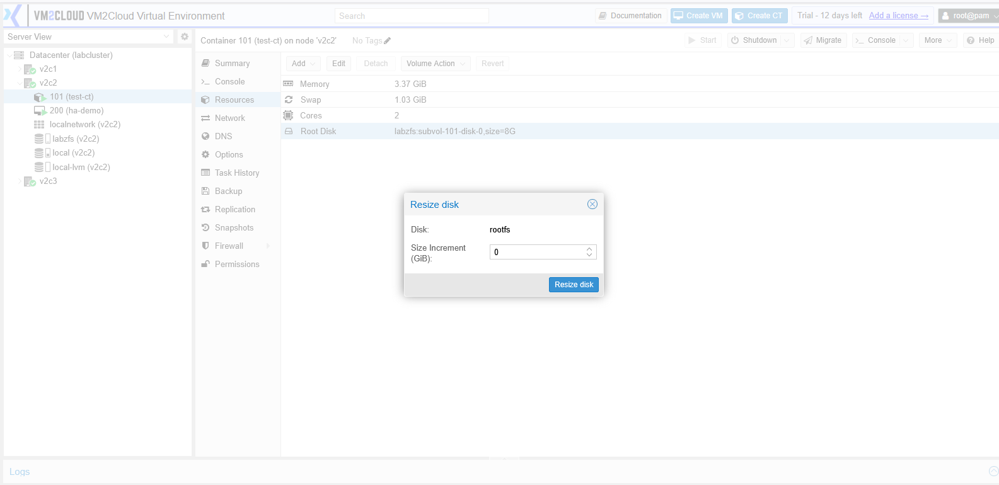

---

# Add a Mount Point

A mount point allows additional storage to be attached to the container.

1. Click **Add**.
2. Select **Mount Point**.
3. Configure the required settings.
4. Click **Add**.

Typical settings include:

* Storage
* Disk Size
* Mount Point
* ACL (Optional)
* Backup (Optional)
* Read Only (Optional)

---

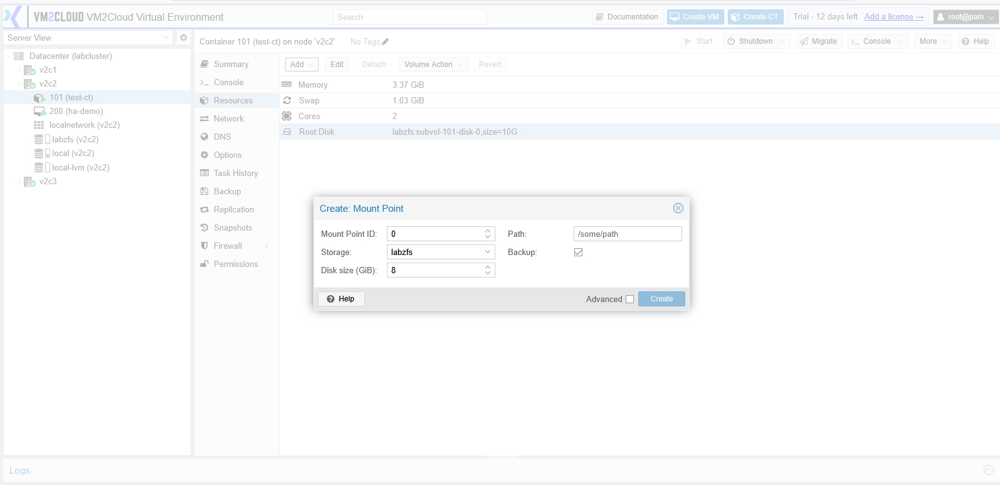
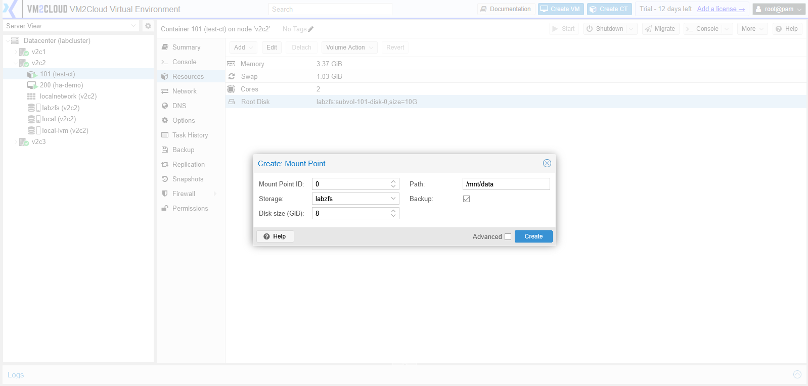

---

# Edit a Mount Point

1. Select the required mount point.
2. Click **Edit**.
3. Modify the required settings.
4. Click **OK**.

---

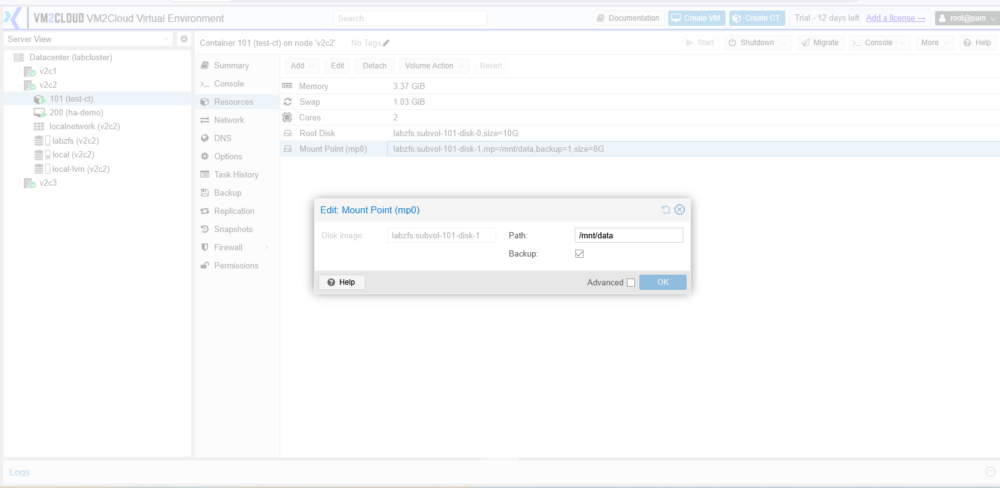
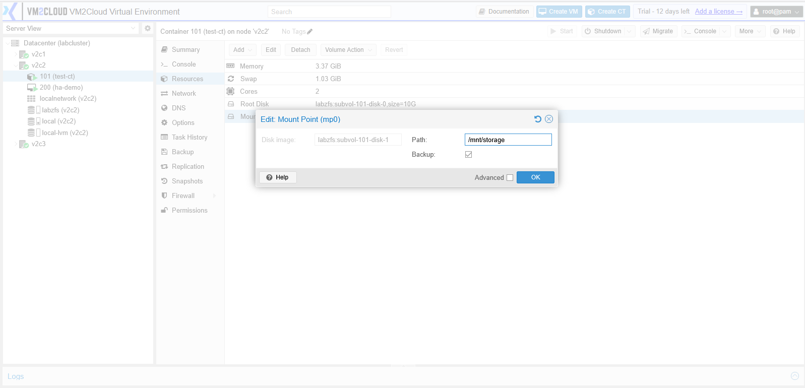

---

# Remove a Mount Point

1. Select the required mount point.
2. Click **Remove**.
3. Confirm the operation.

> **Warning:** Removing a mount point may result in data loss if it contains important files.

---

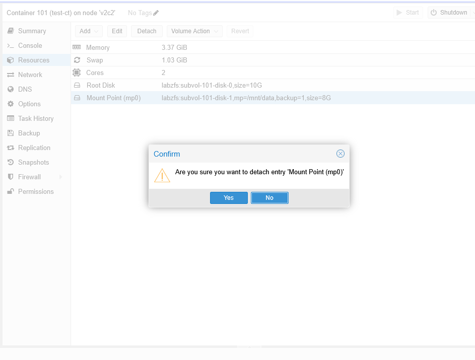

---

# Configure Startup and Shutdown

Configure how the container starts and stops during node boot or shutdown.

1. Select the required container.
2. Click **Options**.
3. Select **Start/Shutdown Order**.
4. Click **Edit**.
5. Configure the required options:
     - Start/Shutdown order
     - Startup delay
     - Shutdown timeout
6. Click **OK**.

---

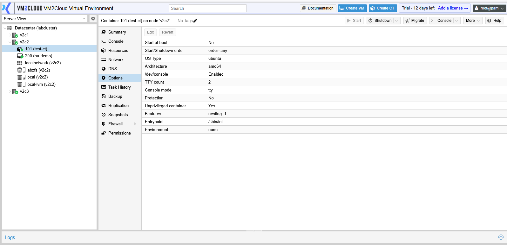
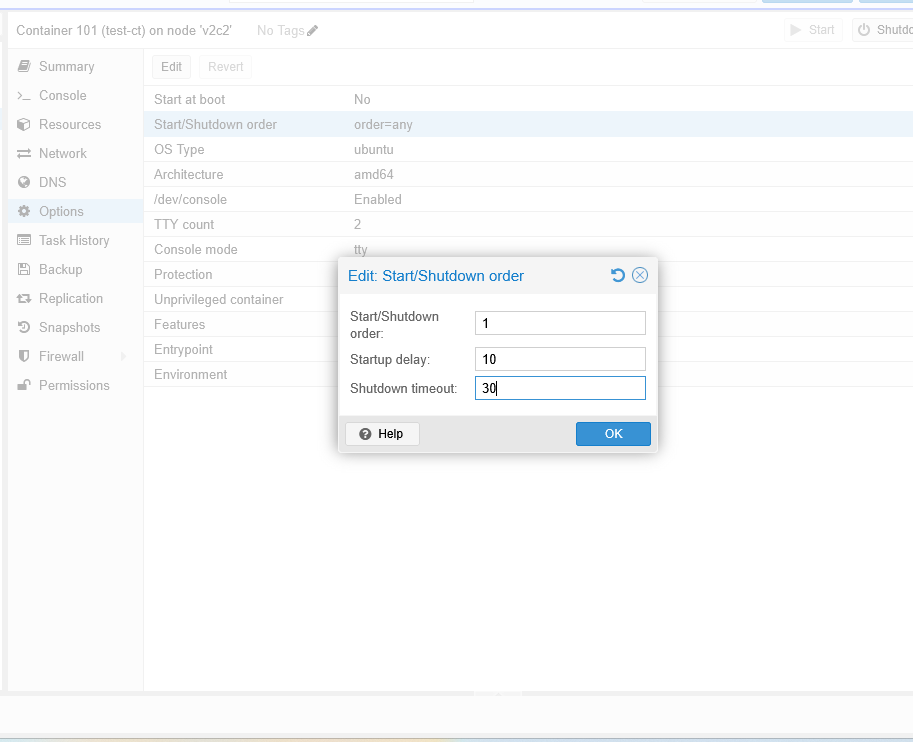

---

# Verification

Verify the following after making changes:

* The updated resource values are displayed on the Resources page.
* The container starts successfully.
* The operating system recognizes the updated resources.
* Any newly added mount points are available inside the container.

---

# Common Issues

| Issue                                  | Resolution                                                                                                            |
| -------------------------------------- | --------------------------------------------------------------------------------------------------------------------- |
| Unable to edit a resource              | Verify that the container is in the required state and that your account has sufficient permissions.                  |
| Root disk cannot be resized            | Confirm that the storage supports online resizing and that only an increase in size is being requested.               |
| Mount point cannot be added            | Verify that sufficient storage space is available on the selected storage.                                            |
| Updated memory or CPU is not reflected | Restart the container if required and verify the new values.                                                          |
| Startup configuration is not applied   | Confirm that the startup settings have been saved successfully and that the node has been restarted for verification. |

---

# Summary

The **Resources** page provides centralized management of the CPU, memory, storage, swap, mount points, and startup configuration assigned to a container. By adjusting these resources, administrators can optimize container performance and ensure that workloads have the resources they require.
