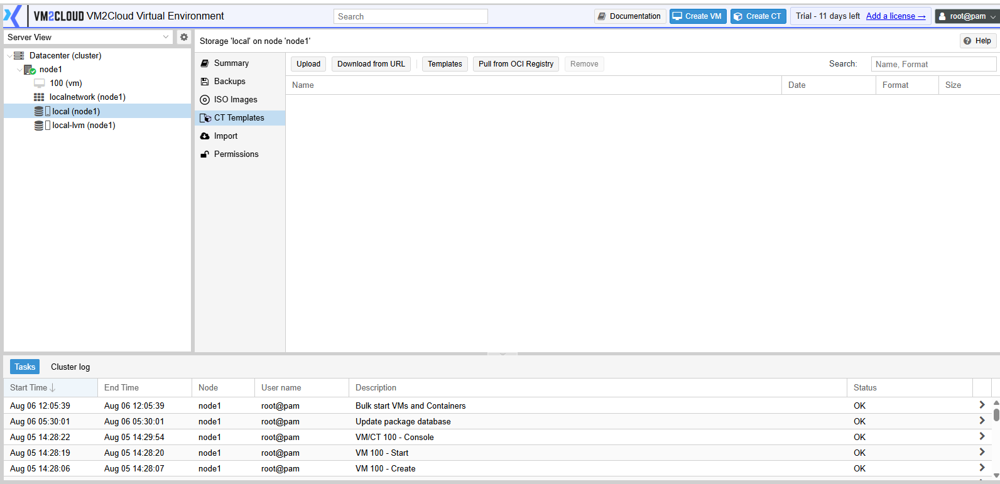
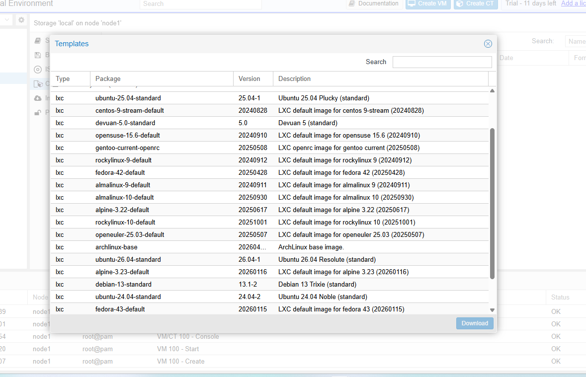
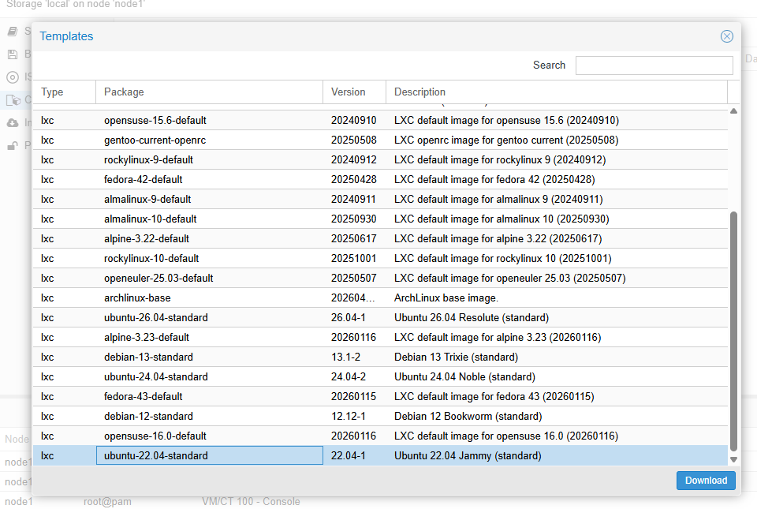
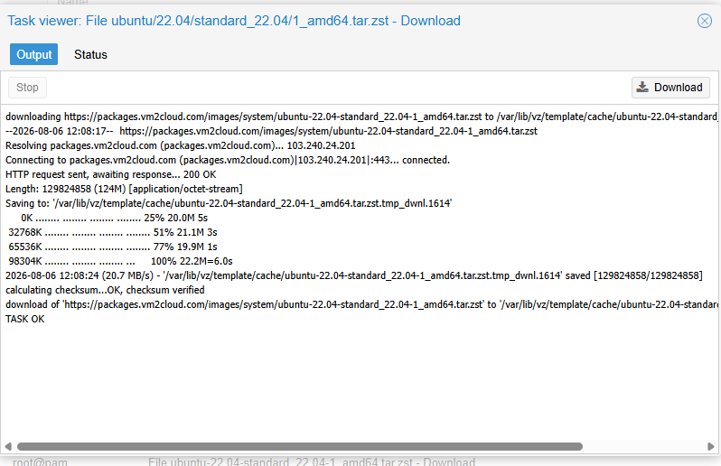
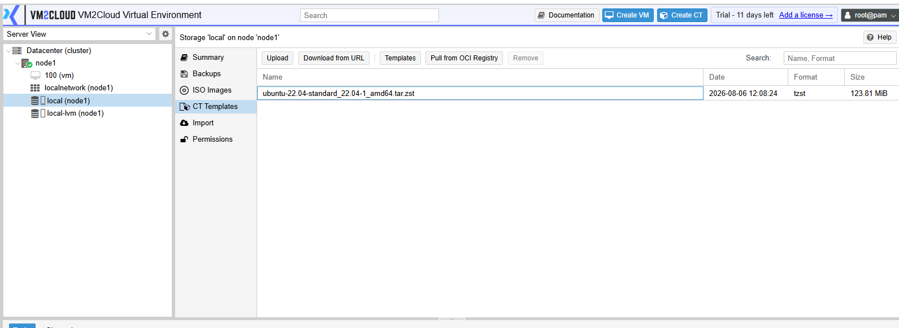

# Manage Container Templates

---

## Overview

Container Templates are prebuilt Linux operating system images used to create LXC containers. A template contains the base operating system and allows administrators to deploy new containers quickly without performing a manual operating system installation.

VM2Cloud VE allows administrators to download container templates from the online template repository and store them on supported storage.

---

## When to Use

Use container templates when you need to:

- Create a new Linux container.
- Deploy multiple containers using the same operating system.
- Standardize container deployments.
- Reduce deployment time.

---

## Prerequisites

Before managing container templates, ensure that:

- A VM2Cloud VE node is available.
- Storage that supports container templates is configured.
- The node has internet connectivity to download templates from the online repository.
- You have permission to manage storage content.

---

# Download a Container Template

## Step 1: Open Storage Content

1. Log in to the VM2Cloud VE web interface.
2. Select the required node.
3. Select the storage where the template will be stored.
4. Click **CT Templates**.

---

---

## Step 2: Open the Template Repository

1. Click **Templates**.

The Template Repository window opens and displays the list of available Linux container templates.

---

---

## Step 3: Select a Template

1. Browse the available templates.
2. Select the required Linux distribution.
3. Review the template name and version.

---

---

## Step 4: Download the Template

1. Click **Download**.
2. Wait for the download task to complete.

After the download finishes, the template is available in the **CT Templates** list.

---

---

# View Installed Container Templates

1. Select the required storage.
2. Click **CT Templates**.

The page displays all container templates stored on the selected storage.

Information typically includes:

- Template Name
- File Size
- Storage

---

---

# Remove a Container Template

> **Note:** Remove a template only if it is no longer required. Containers that have already been created from the template are not affected.

## Steps

1. Select the required storage.
2. Click **CT Templates**.
3. Select the template.
4. Click **Remove**.
5. Confirm the operation.

Wait for the task to complete.

---

---

# Verification

Verify the following:

- The downloaded template appears in the **CT Templates** list.
- The download task completed successfully.
- The template is available when creating a new container.
- Removed templates no longer appear in the template list.

---

# Common Issues

| Issue | Resolution |
|-------|------------|
| Template repository cannot be opened | Verify that the node has internet connectivity. |
| Download fails | Confirm that sufficient storage space is available and retry the download. |
| No templates are displayed | Refresh the template repository and verify the network connection. |
| Template is not available during container creation | Verify that the template was downloaded to the correct storage. |
| Unable to remove a template | Ensure that no task is currently using the template and verify that you have sufficient permissions. |

---

# Summary

Container Templates provide the base operating system required for creating Linux containers in VM2Cloud VE. Administrators can download templates from the online repository, store them on supported storage, and use them to rapidly deploy new containers. Managing templates helps maintain consistent and efficient container deployments across the environment.
