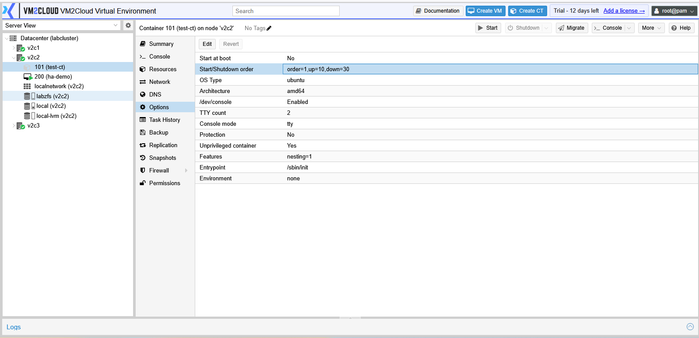
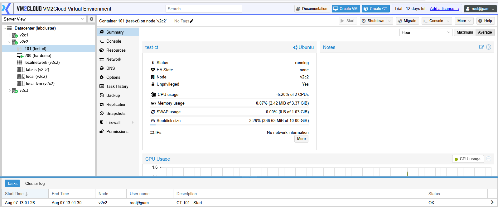
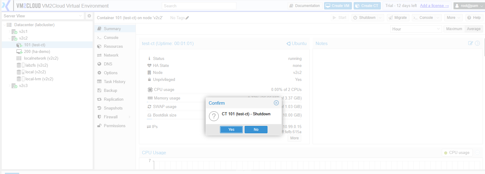
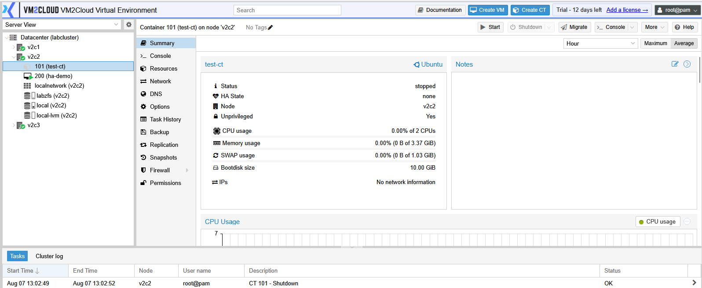
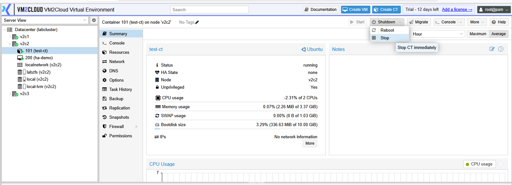
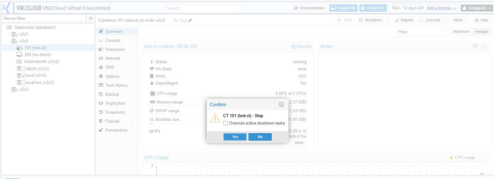
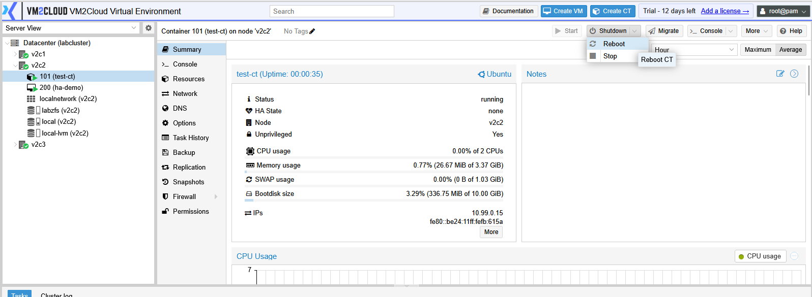
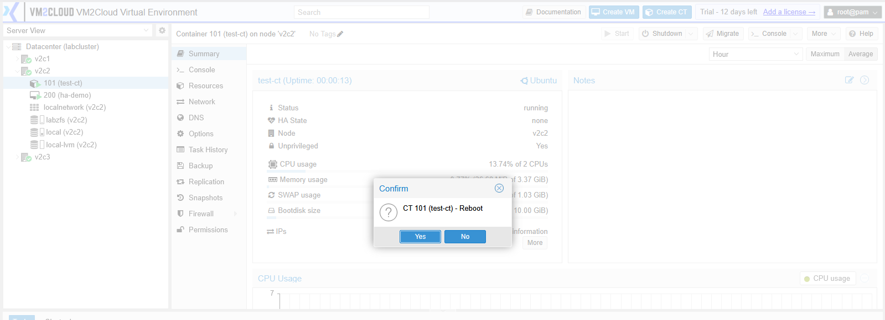

# Manage Container

---

## Overview

After a container is created, it can be managed using the actions available in the container toolbar. These actions allow administrators to control the container's power state during normal operation, maintenance, or troubleshooting.

---

## When to Use

Use the container management options to:

* Start a container.
* Shut down the container safely.
* Force stop an unresponsive container.
* Restart a container.
* Suspend a running container.
* Resume a suspended container.

---

## Prerequisites

Before performing any operation, ensure that:

* You have permission to manage containers.
* The container exists.
* The selected node is online.

---

# Start a Container

## Step 1: Select the Container

1. Log in to the VM2Cloud VE web interface.
2. Select the required node.
3. Select the container.

---

---

## Step 2: Start the Container

1. Click **Start**.
2. Wait for the operation to complete.

The container status changes from **Stopped** to **Running**.

---

---

# Shutdown a Container

A shutdown requests the operating system inside the container to stop gracefully.

## Steps

1. Select the container.
2. Click **Shutdown**.
3. Confirm the operation.

Wait until the container status changes to **Stopped**.

---

---

# Stop a Container

A stop operation immediately powers off the container.

> **Warning:** Unsaved data may be lost if applications inside the container are still running.

## Steps

1. Select the container.
2. Click **Stop**.
3. Confirm the operation.

---

---

# Reboot a Container

A reboot restarts the container.

## Steps

1. Select the container.
2. Click **Reboot**.
3. Confirm the operation.

Wait until the container starts again.

---

---

# Verification

Verify the following after performing any power operation:

* The container status has changed as expected.
* The operation completed successfully.
* The Recent Tasks panel shows the completed task.
* The container is accessible if it is running.

---

# Common Issues

| Issue                        | Resolution                                                                          |
| ---------------------------- | ----------------------------------------------------------------------------------- |
| Container does not start     | Verify that sufficient CPU, memory, and storage resources are available.            |
| Shutdown does not complete   | Check whether applications inside the container are preventing a graceful shutdown. |
| Stop operation fails         | Verify that no other task is currently running on the container.                    |
| Resume option is unavailable | Confirm that the container is currently in the **Suspended** state.                 |
| Reboot does not complete     | Review the Recent Tasks to identify the cause of the failure.                       |

---

# Summary

VM2Cloud VE provides several power management actions for containers, allowing administrators to start, stop, shut down, reboot, suspend, and resume containers directly from the management toolbar. These operations help manage Linux workloads during normal administration and maintenance.
