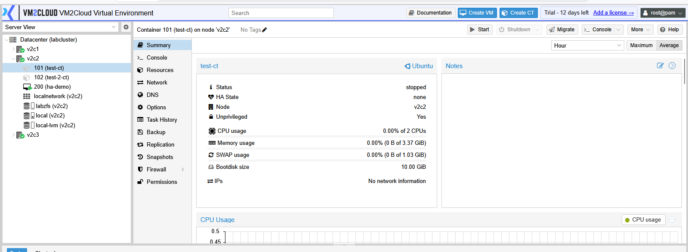
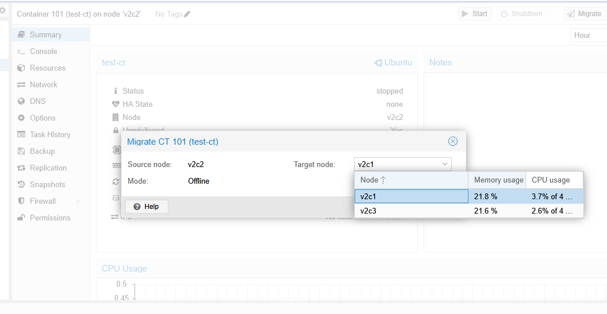
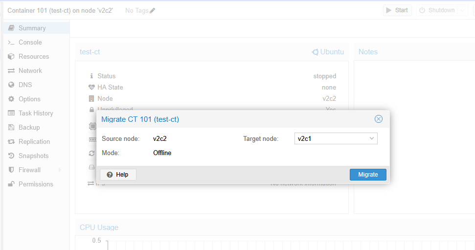
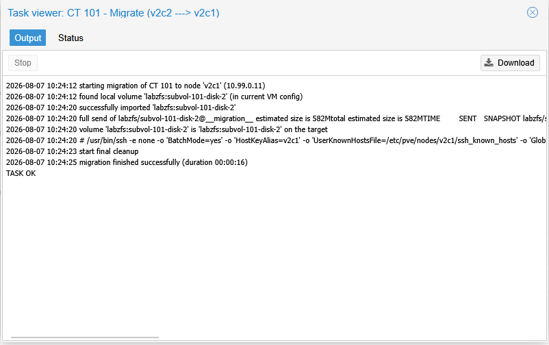
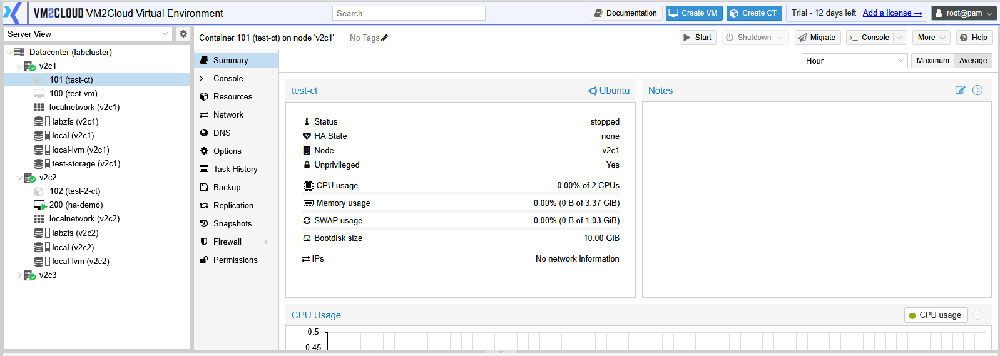

# Migrate Container

---

## Overview

Container migration allows you to move a container from one node to another within the same VM2Cloud VE cluster. This is useful when balancing workloads, performing maintenance, or relocating containers to a different node.

Depending on your cluster configuration, containers can be migrated while stopped or, if supported, while running.

---

## When to Use

Migrate a container when you need to:

* Perform maintenance on a node.
* Balance workloads across cluster nodes.
* Move a container to another server.
* Consolidate resources within the cluster.

---

## Prerequisites

Before migrating a container, ensure that:

* The source and target nodes belong to the same VM2Cloud VE cluster.
* The target node is online.
* Required storage is available on the destination node.
* You have permission to migrate containers.

---

# Migrate a Container

## Step 1: Select the Container

1. Log in to the VM2Cloud VE web interface.
2. Select the source node.
3. Select the container you want to migrate.

---

---

## Step 2: Open the Migration Window

1. Click **More**.
2. Select **Migrate**.

The migration window opens.

---

---

## Step 3: Configure the Migration

Select the required migration settings.

Typical options include:

* Target Node
* Target Storage (if applicable)
* Online Migration (if supported)

Review the configuration before continuing.

---

---

## Step 4: Start the Migration

1. Click **Migrate**.
2. Wait for the migration task to complete.

The progress can be monitored from **Recent Tasks**.

---

---

# Verification

After the migration completes:

* Verify that the container appears under the target node.
* Confirm that the migration task completed successfully.
* If the container was running, verify that it continues to operate normally.
* Open the Summary page and verify that the assigned node has been updated.

---

---

# Common Issues

| Issue                           | Resolution                                                                                                        |
| ------------------------------- | ----------------------------------------------------------------------------------------------------------------- |
| Target node is unavailable      | Verify that the destination node is online and is a member of the cluster.                                        |
| Migration option is unavailable | Confirm that the container is part of a clustered environment and that your account has the required permissions. |
| Migration fails                 | Verify that sufficient CPU, memory, and storage resources are available on the target node.                       |
| Storage-related migration error | Ensure that the destination storage is available and supports the migration.                                      |
| Migration task fails            | Review the **Recent Tasks** details to identify the cause before retrying the operation.                          |

---

# Summary

Container migration allows administrators to move Linux containers between nodes in a VM2Cloud VE cluster. It is commonly used for maintenance, workload balancing, and resource optimization while minimizing service interruption.
