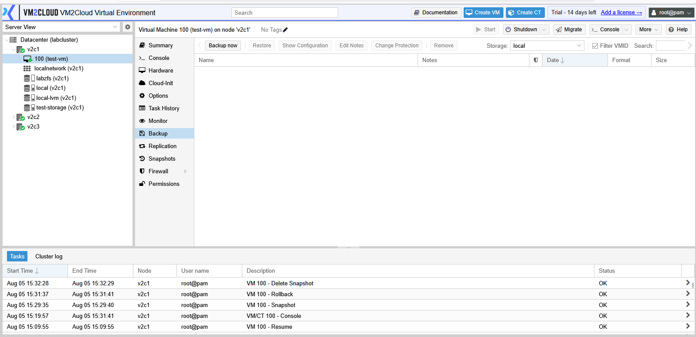
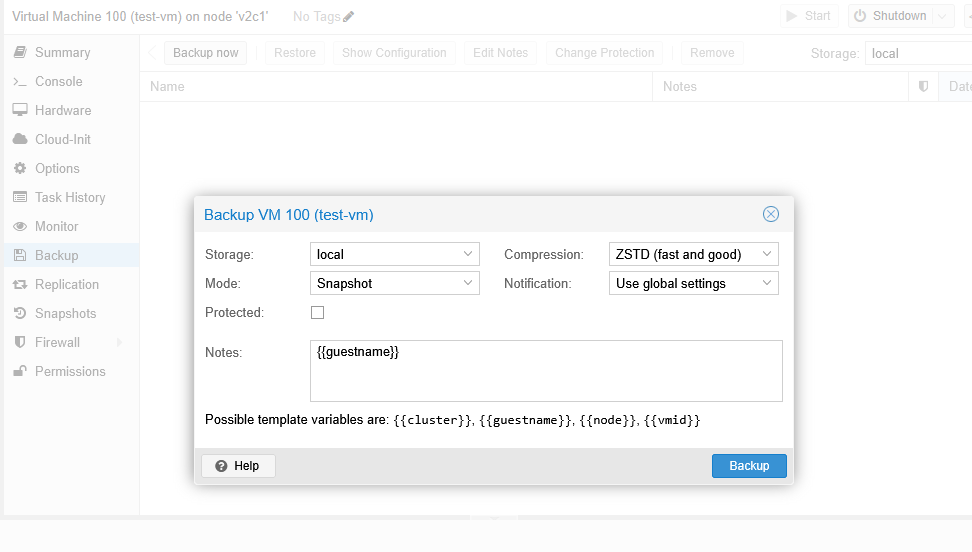
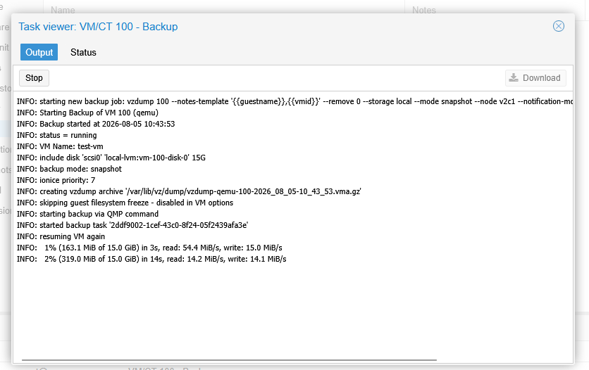
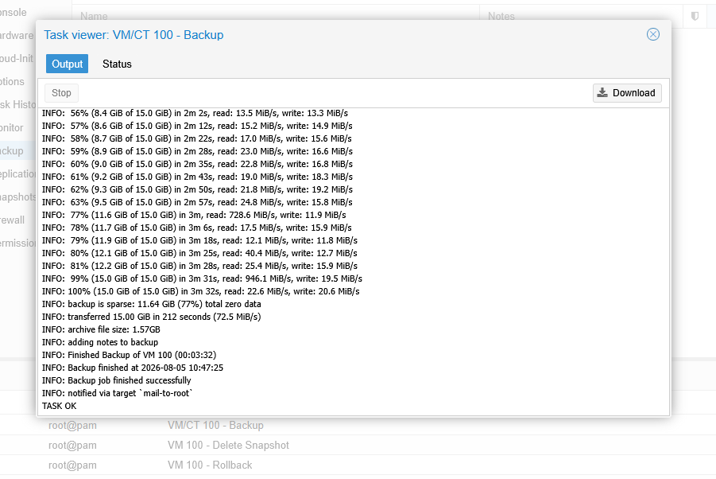
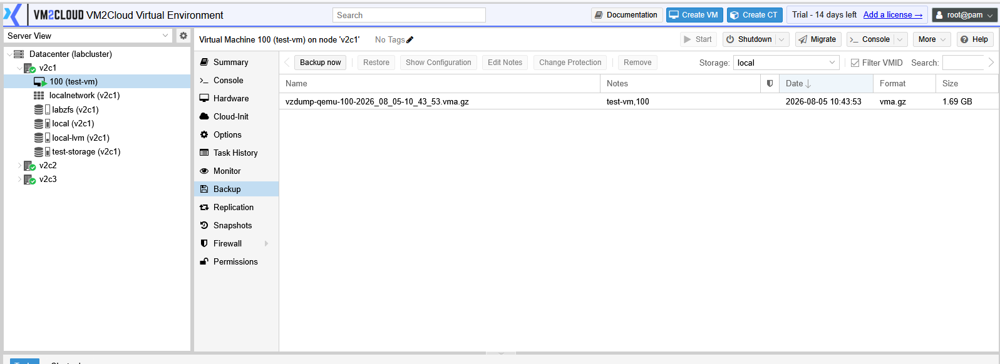
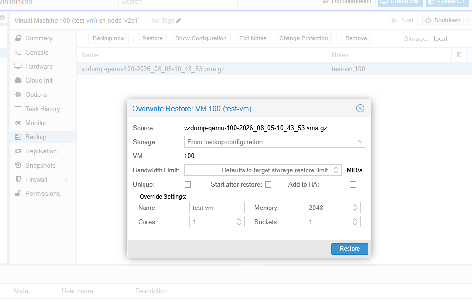
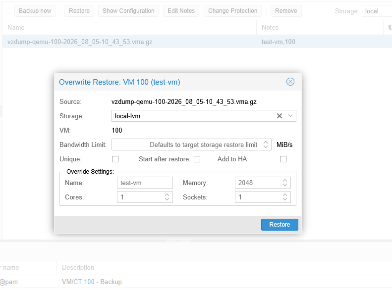
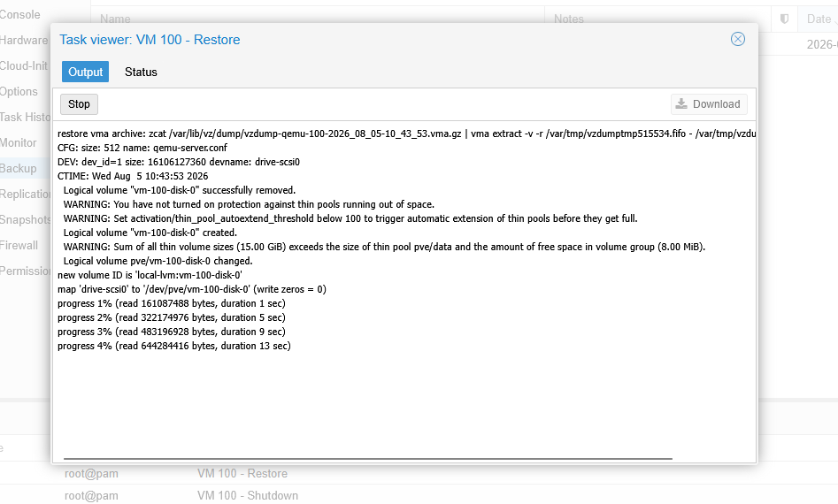

# Backup and Restore Virtual Machine

---

## Overview

Backing up a virtual machine creates a copy of its data and configuration that can be restored if the virtual machine is lost, corrupted, or needs to be recovered. Regular backups help protect workloads from hardware failures, accidental deletion, and other unexpected events.

VM2Cloud allows administrators to create backups manually and restore them when required.

---

## When to Use

Create a backup when you need to:

* Protect important virtual machines.
* Create a recovery point before major changes.
* Migrate workloads to another environment.
* Prepare for maintenance activities.

Restore a backup when you need to:

* Recover a deleted virtual machine.
* Restore a damaged virtual machine.
* Roll back to a previous backup.

---

## Prerequisites

Before creating or restoring a backup, ensure that:

* Backup storage is available.
* Sufficient free space exists on the backup storage.
* The virtual machine exists (for backup operations).
* You have permission to perform backup and restore operations.

---

# Create a Manual Backup

## Step 1: Select the Virtual Machine

1. Log in to the VM2Cloud web interface.
2. Select the required node.
3. Select the virtual machine.
4. Click **Backup**.

---

---

## Step 2: Start a Backup

1. Click **Backup Now**.

The backup configuration window opens.

---

---

## Step 3: Configure the Backup

Configure the required options.

Typical options include:

* Storage
* Mode
* Compression
* Protection (if available)

Review the configuration.

Click **Backup** to start the operation.

---

---

## Step 4: Monitor the Backup

The backup task starts immediately.

Monitor the progress from:

* Recent Tasks
* Task Viewer

Wait until the backup completes successfully.

---

---

# Restore a Virtual Machine

## Step 1: Open Backup Storage

1. Select the node that contains the backup storage.
2. Select the backup storage.
3. Open **Backups**.

The available backup files are displayed.

---

---

## Step 2: Select the Backup

1. Select the required backup.
2. Click **Restore**.

The restore window opens.

---

---

## Step 3: Configure the Restore

Configure the restore options.

Typical options include:

* Target Node
* VM ID
* Storage
* Restore as a new VM (if available)

Review the settings.

Click **Restore**.

---

---

## Step 4: Wait for Completion

Monitor the restore task until it completes successfully.

After the restore finishes, the virtual machine appears on the selected node.

---

---

# Verification

Verify the following:

### After Backup

* The backup task completed successfully.
* The backup file appears in the backup storage.
* No errors are reported in the task log.

### After Restore

* The virtual machine appears on the target node.
* The virtual machine starts successfully.
* Applications and data are accessible.
* Network connectivity functions correctly.

---

# Common Issues

| Issue                         | Resolution                                                                                                   |
| ----------------------------- | ------------------------------------------------------------------------------------------------------------ |
| Backup fails                  | Verify that sufficient space is available on the selected backup storage.                                    |
| Backup storage is unavailable | Confirm that the storage is online and accessible.                                                           |
| Restore option is unavailable | Verify that a valid backup file has been selected.                                                           |
| Restore fails                 | Ensure that the target storage has enough available space and that the selected VM ID is not already in use. |
| Backup task reports an error  | Review the **Recent Tasks** details to identify the cause before retrying the operation.                     |

---

# Summary

The Backup page allows administrators to create manual backups of virtual machines and restore them when needed. Regular backups are an essential part of system administration and help ensure that virtual machines can be recovered quickly in the event of data loss, hardware failure, or configuration issues.
