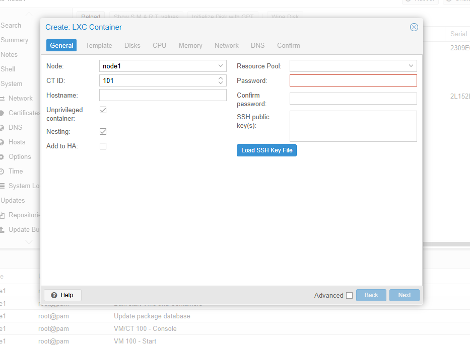
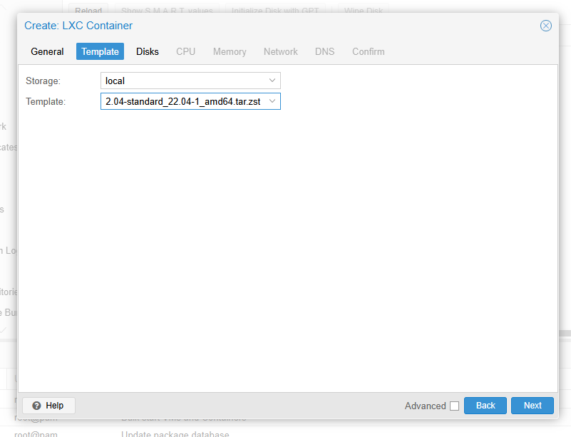
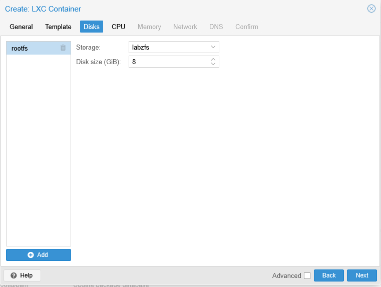
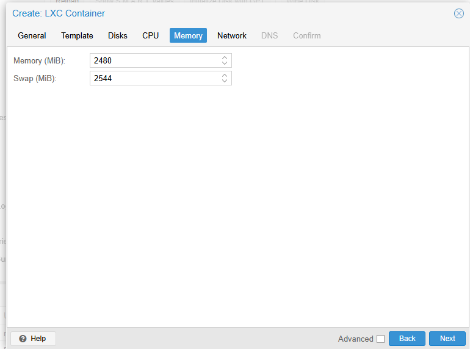
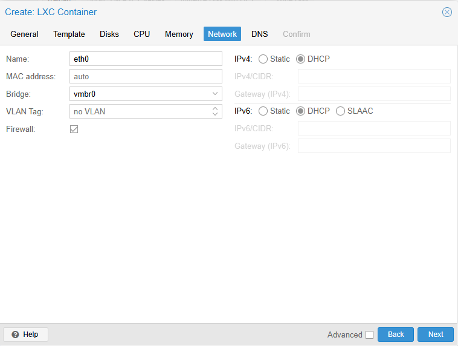
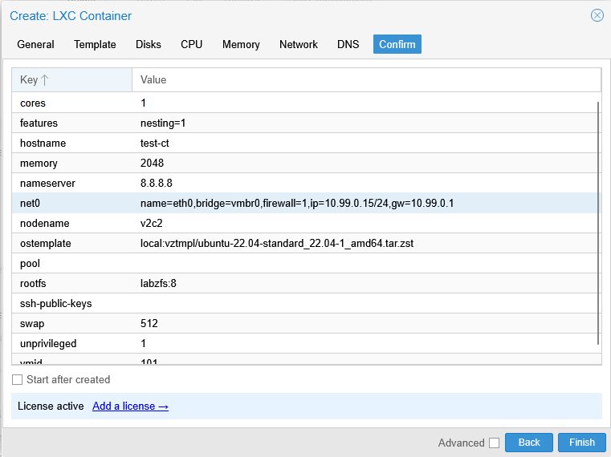

# Create Container

---

## Overview

A container is created using the **Create CT** wizard. During the creation process, you configure the container template, storage, root password, CPU, memory, network, and other basic settings required to deploy the container.

Once the wizard is completed, the container is added to the selected node and is ready to be started.

---

## When to Use

Create a container when you need to:

* Deploy a lightweight Linux environment.
* Host applications or services.
* Create development or testing environments.
* Run Linux workloads with minimal resource usage.

---

## Prerequisites

Before creating a container, ensure that:

* A VM2Cloud node is available.
* A container template is available on the selected storage.
* Storage has sufficient free space.
* A network bridge is available.
* You have permission to create containers.

---

# Create a Container

## Step 1: Open the Create Container Wizard

1. Log in to the VM2Cloud web interface.
2. Select the node where the container will be created.
3. Click **Create CT**.

The Create Container wizard opens.

---

---

## Step 2: General

Enter the basic container information.

Typical fields include:

* Node
* CT ID
* Hostname
* Password
* Confirm Password
* Unprivileged Container
* Features (if required)

After entering the required information, click **Next**.

---

---

## Step 3: Template

Select the container template.

Typical options include:

* Storage
* Template

Choose the required Linux container template and click **Next**.

---

---

## Step 4: Disks

Configure the root disk.

Typical settings include:

* Storage
* Disk Size

Review the configuration and click **Next**.

---

---

## Step 5: CPU

Configure the CPU allocation.

Typical settings include:

* Cores
* CPU Limit (if required)

Click **Next**.

---

---

## Step 6: Memory

Configure the memory allocation.

Typical settings include:

* Memory
* Swap

Click **Next**.

---

---

## Step 7: Network

Configure the network interface.

Typical settings include:

* Bridge
* IPv4 Configuration
* IPv6 Configuration
* VLAN Tag (Optional)

Click **Next**.

---

---

## Step 8: DNS

Configure the DNS settings.

Typical options include:

* DNS Domain
* DNS Server

Click **Next**.

---

[DNS](images/ct-dns.png)

---

## Step 9: Confirm

Review all configuration settings.

Verify:

* CT ID
* Hostname
* Template
* Storage
* Disk Size
* CPU
* Memory
* Network Configuration

Click **Finish** to create the container.

---

---

# Verification

After the wizard completes, verify that:

* The container appears under the selected node.
* The container status is displayed.
* The Summary page opens successfully.
* The configured CPU, memory, storage, and network settings are correct.

---

# Common Issues

| Issue                              | Resolution                                                             |
| ---------------------------------- | ---------------------------------------------------------------------- |
| No container template is available | Download or upload a container template before creating the container. |
| Insufficient storage               | Verify that the selected storage has enough free space.                |
| CT ID already exists               | Specify a unique Container ID.                                         |
| Network bridge is unavailable      | Verify that the required bridge exists and is active.                  |
| Finish button is unavailable       | Review the wizard for missing or invalid configuration values.         |

---

# Summary

The Create Container wizard provides a guided process for deploying Linux containers in VM2Cloud. By selecting a template and configuring storage, CPU, memory, and networking, administrators can quickly deploy lightweight workloads that are ready for use.
