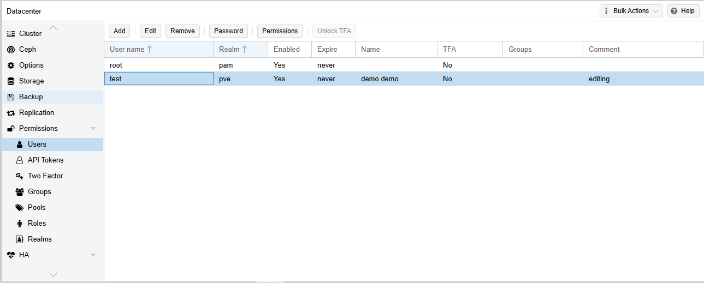

# Edit User

---

## Overview

The Edit User feature allows administrators to update the configuration of an existing user account. You can modify user information such as the user's name, email address, account expiration, account status, and comments without recreating the account.

> **Note:** The username and authentication realm cannot be changed after the user has been created. If these values need to be changed, create a new user account and assign the required permissions.

---

## When to Use

Edit a user when you need to:

- Update user information.
- Change the user's email address.
- Update the user's first or last name.
- Enable or disable a user account.
- Configure or modify the account expiration date.
- Update administrative comments.

---

## Prerequisites

Before editing a user, ensure that:

- You have administrator privileges.
- The user account already exists.
- The required user information is available.

---

# Edit a User

## Step 1: Open the Users Page

1. Log in to the VM2Cloud web interface.
2. Select **Datacenter**.
3. Click **Permissions**.
4. Click **Users**.

The Users page displays all configured user accounts.

---

---

## Step 2: Select the User

1. Select the user that you want to modify.
2. Click **Edit**.

The Edit User window opens.

---

---

## Step 3: Update the User Information

Modify the required settings.

Typical fields include:

- First Name
- Last Name
- Email
- Expire
- Comment
- Enable Account

Review the updated information.

---

---

## Step 4: Save the Changes

1. Click **OK**.

The updated user information is saved.

---

---

# Verification

Verify the following:

- The updated user information is displayed in the Users list.
- The account status reflects the configured settings.
- The expiration date is correct, if configured.
- The user can successfully authenticate if the account is enabled.
- Existing roles and permissions remain unchanged.

---

# Common Issues

| Issue | Resolution |
|-------|------------|
| Unable to save changes | Verify that all required fields contain valid values. |
| User account remains disabled | Confirm that the **Enable Account** option is selected before saving. |
| User cannot log in after editing | Verify that the account has not expired and that it is enabled. |
| Email address is incorrect | Edit the user again and update the email field with the correct value. |
| Username needs to be changed | Usernames cannot be modified. Create a new user with the required username and assign the appropriate permissions. |

---

# Summary

The Edit User feature allows administrators to update user account information while preserving the existing authentication realm, roles, and permissions. Regularly reviewing and maintaining user accounts helps ensure accurate user information and secure access management.
